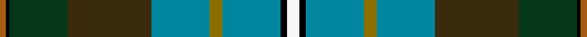

This is one **variant** — a specific cloth: this exact thread count and colourway, with its own
provenance below. It is one weaving of the [sett](/tartans/h/hu/hughes-interconnection-int/) (the scale-free proportion — the
same cloth at any scale or shade), whose colour order is pattern [RKGGBGBKW](/stripes/rkggbgbkw/).

Part of the [Hughes Interconnection Int.](/tartans/h/hu/hughes-interconnection-int/) tartan — the named design grouping this sett with its other cloths.

Sourced from register-of-tartans.  It is a [9 stripe tartan](/stripes/stripes9/).

Original link [https://www.tartanregister.gov.uk/tartanDetails.aspx?ref=1781](https://www.tartanregister.gov.uk/tartanDetails.aspx?ref=1781)

2 attestations — the source records this cloth was collapsed from (oldest owns this page)

<ul>
<li>01/01/2003 — Hughes Interconnection Int. (register-of-tartans, <a href="https://www.tartanregister.gov.uk/tartanDetails.aspx?ref=1781">record</a>)  <em>Requested name is Hughes Interconnection International. A modification of Hughes Personal tartan #2599 (original Scottish Tartans Authority reference). Designed as a family tartan for all of the name HUGHES but only available through Grace Hughes.</em></li>
<li>2003 — Hughes Interconnection Int. (Pers) (tartans-authority, <a href="https://web.archive.org/web/*/http://www.tartansauthority.com/tartan-ferret/display/6037/*">record</a>)  <em>Requested name is Hughes Interconnection International. A modification of Hughes Personal tartan #2599. Designed a s a family tartan for all of the name HUGHES but only available through Grace Hughes on hughesj204@aol.com. 2nd March 2004).</em></li>
</ul>

Dataset <small>— provenance for this record, inherited from the source manifest</small>

<dl class="dataset-prov">
<dt>source</dt><dd><a href="/sources/register-of-tartans/">Scottish Register of Tartans</a></dd>
<dt>data captured from</dt><dd><a href="https://github.com/thetartan/tartan-database/blob/master/data/register-of-tartans/data.csv">https://github.com/thetartan/tartan-database/blob/master/data/register-of-tartans/data.csv</a></dd>
<dt>data date</dt><dd>2003 <small>(this record)</small></dd>
<dt>licence</dt><dd><a href="https://www.tartanregister.gov.uk/copyright">Crown copyright</a></dd>
</dl>

Capture chain <small>— the hands this data passed through, oldest first; each capture carries its own licence</small>

<ol class="capture-chain">
<li><a href="https://www.tartanregister.gov.uk/">Scottish Register of Tartans</a> · <a href="https://www.tartanregister.gov.uk/copyright">Crown copyright</a> <small>the living register — still published by National Records of Scotland</small></li>
<li><a href="https://github.com/thetartan/tartan-database">thetartan/tartan-database</a> <small>2016-2017</small> · <a href="https://creativecommons.org/licenses/by-nc-nd/4.0/">CC BY-NC-ND 4.0</a> <small>Levko Kravets's frozen compilation — the capture we vendored, and where its CC licence text came from</small></li>
<li>this dictionary <small>captured 2026-06-10 · commit 5bf86c7566</small> <small>each re-capture is a git commit to data/sources</small></li>
</ol>

## Register references

External register numbers recorded for this tartan.

- Scottish Register of Tartans: [1781](https://www.tartanregister.gov.uk/tartanDetails.aspx?ref=1781)
- Scottish Tartans Authority (ITI): 6037

## Thread count
W/8 K4 T36 Y8 T36 DY52 DG36 K2 O/4

One full sett is **360 threads**.

The source recorded this cloth as O/4 K2 DG36 DY52 T36 Y8 T36 K4 W8 K4 T36 Y8 T36 DY52 DG36 K/2 — 714 threads; it folds to the canonical 360-thread sett above.

## Palette
<table><thead><tr><th>Colour</th><th>Shade</th><th>OKLCh</th></tr></thead><tbody><tr><td>T</td><td><code style="background-color:#00879F;">#00879F</code> <small style="color:#888">#00879F</small></td><td><small style="color:#888">oklch(57.4% 0.102 216.1)</small></td></tr><tr><td>B</td><td><code style="background-color:#466CC8;">#466CC8</code> <small style="color:#888">#466CC8</small></td><td><small style="color:#888">oklch(55.1% 0.149 265.0)</small></td></tr><tr><td>DG</td><td><code style="background-color:#053819;">#053819</code> <small style="color:#888">#053819</small></td><td><small style="color:#888">oklch(30.0% 0.075 151.3)</small></td></tr><tr><td>K</td><td><code style="background-color:#000000;">#000000</code> <small style="color:#888">#000000</small></td><td><small style="color:#888">oklch(0.0% 0.000 0.0)</small></td></tr><tr><td>O</td><td><code style="background-color:#A65C11;">#A65C11</code> <small style="color:#888">#A65C11</small></td><td><small style="color:#888">oklch(55.0% 0.125 58.3)</small></td></tr><tr><td>DY</td><td><code style="background-color:#3A2B0D;">#3A2B0D</code> <small style="color:#888">#3A2B0D</small></td><td><small style="color:#888">oklch(30.0% 0.049 82.0)</small></td></tr><tr><td>W</td><td><code style="background-color:#F7F7F7;">#F7F7F7</code> <small style="color:#888">#F7F7F7</small></td><td><small style="color:#888">oklch(97.6% 0.000 89.9)</small></td></tr><tr><td>Y</td><td><code style="background-color:#8B6E00;">#8B6E00</code> <small style="color:#888">#8B6E00</small></td><td><small style="color:#888">oklch(55.1% 0.113 90.4)</small></td></tr></tbody></table>

# Sample pattern

## Nearest tartan variants

The nearest existing variants by ΔTartan distance, with this cloth at the top so the swatches line up against it.

ΔTartan

Threads

Variant

Sett

—

714

<a href="/variants/s9/w4k2t18y4t18dy26dg18k1o2~x2/">Hughes Interconnection Int.</a>

<a href="/ttd/edit/#slug=k8dy4ly1db13dy13g29w2g29dy13db13ly1dy4k3~x2~db1406275-w3600000&amp;base=w4k2t18y4t18dy26dg18k1o2~x2" title="compare in the TTD">2.70</a>

510

<a href="/variants/s13/k8dy4ly1db13dy13g29w2g29dy13db13ly1dy4k3~x2~db1406275-w3600000/">Teviotdale District Tartan</a>

<a href="/ttd/edit/#slug=dr4g4k2g17do5g5do17g6lb1db22dr2~x2&amp;base=w4k2t18y4t18dy26dg18k1o2~x2" title="compare in the TTD">2.80</a>

328

<a href="/variants/s11/dr4g4k2g17do5g5do17g6lb1db22dr2~x2/">Adams (Name)</a>

<a href="/ttd/edit/#slug=dr4g4k2g15do5g5do15g6w1db19dr2~x2&amp;base=w4k2t18y4t18dy26dg18k1o2~x2" title="compare in the TTD">2.93</a>

300

<a href="/variants/s11/dr4g4k2g15do5g5do15g6w1db19dr2~x2/">Adams</a>

<a href="/ttd/edit/#slug=dy16k4dy8g2dg19w2g22db15k4w3dg3y4g30db25w5dg40db16~x2&amp;base=w4k2t18y4t18dy26dg18k1o2~x2" title="compare in the TTD">2.94</a>

808

<a href="/variants/s17/dy16k4dy8g2dg19w2g22db15k4w3dg3y4g30db25w5dg40db16~x2/">Les Cercles de Fermieres du Quebec</a>

<a href="/ttd/edit/#slug=db8k1w5k1r5dg13k2g4k2g11dg20dy7dg5~x2&amp;base=w4k2t18y4t18dy26dg18k1o2~x2" title="compare in the TTD">2.95</a>

310

<a href="/variants/s13/db8k1w5k1r5dg13k2g4k2g11dg20dy7dg5~x2/">Wild Geese</a>

<a href="/ttd/edit/#slug=y9k1dy31g30db36g3db3g3db36g30dy31k1w9~x2&amp;base=w4k2t18y4t18dy26dg18k1o2~x2" title="compare in the TTD">3.00</a>

856

<a href="/variants/s13/y9k1dy31g30db36g3db3g3db36g30dy31k1w9~x2/">Campbell, Brown (Personal)</a>

<a href="/ttd/edit/#slug=dt5t2dt9dp10k2dp4k2dg10g33w2g33dg10k2dp4k2dp10dt9t2dt5w3~x2~dt1204274-dg1806142-g2203152&amp;base=w4k2t18y4t18dy26dg18k1o2~x2" title="compare in the TTD">3.04</a>

620

<a href="/variants/s20/db5t2db9dp10k2dp4k2dg10g33w2g33dg10k2dp4k2dp10db9t2db5w3~x2~db1204274-dg1806142-g2203152/">Inverclyde Green</a>

<a href="/ttd/edit/#slug=db16dg40w5db25g30y4dg3w3k4db15g22w2dg19g2o8k4o16~x2&amp;base=w4k2t18y4t18dy26dg18k1o2~x2" title="compare in the TTD">3.08</a>

808

<a href="/variants/s17/db16dg40w5db25g30y4dg3w3k4db15g22w2dg19g2o8k4o16~x2/">Les Cercles de Fermieres du Quebec</a>

<a href="/ttd/edit/#slug=k5t3dy4ly1db13dy13g29w2~x2&amp;base=w4k2t18y4t18dy26dg18k1o2~x2" title="compare in the TTD">3.15</a>

266

<a href="/variants/s8/k5t3dy4ly1db13dy13g29w2~x2/">Teviotdale</a>

<a href="/ttd/edit/#slug=db12g24r5do20g4w2g4do21y5g24db12do4k2do4~x2&amp;base=w4k2t18y4t18dy26dg18k1o2~x2" title="compare in the TTD">3.20</a>

540

<a href="/variants/s14/db12g24r5do20g4w2g4do21y5g24db12do4k2do4~x2/">Hyndman (Personal)</a>

## Neighbour map

Every grey dot is one of 13656 variants placed by the first two principal components of the ΔTartan feature space (42% of its variance). Red is this tartan; blue dots are its nearest — click one to open its page. The map is a flat projection of a many-dimensional space — [how to read it](/posts/neighbourhood-maps/).

<svg viewBox="0 0 640 380" role="img" style="max-width:100%;height:auto;border:1px solid #e0e0e0;border-radius:4px;display:block" xmlns="http://www.w3.org/2000/svg"><image href="/nn/cloud.v1.png" width="640" height="380"/><a href="/variants/s13/k8dy4ly1db13dy13g29w2g29dy13db13ly1dy4k3~x2~db1406275-w3600000/"><circle cx="170.7" cy="80.5" r="4" fill="#3465a4"><title>Teviotdale District Tartan</title></circle></a><a href="/variants/s11/dr4g4k2g17do5g5do17g6lb1db22dr2~x2/"><circle cx="187.7" cy="131.3" r="4" fill="#3465a4"><title>Adams (Name)</title></circle></a><a href="/variants/s11/dr4g4k2g15do5g5do15g6w1db19dr2~x2/"><circle cx="175.1" cy="140.1" r="4" fill="#3465a4"><title>Adams</title></circle></a><a href="/variants/s17/dy16k4dy8g2dg19w2g22db15k4w3dg3y4g30db25w5dg40db16~x2/"><circle cx="93.6" cy="107.1" r="4" fill="#3465a4"><title>Les Cercles de Fermieres du Quebec</title></circle></a><a href="/variants/s13/db8k1w5k1r5dg13k2g4k2g11dg20dy7dg5~x2/"><circle cx="144.1" cy="108.2" r="4" fill="#3465a4"><title>Wild Geese</title></circle></a><a href="/variants/s13/y9k1dy31g30db36g3db3g3db36g30dy31k1w9~x2/"><circle cx="166.7" cy="108.0" r="4" fill="#3465a4"><title>Campbell, Brown (Personal)</title></circle></a><a href="/variants/s20/db5t2db9dp10k2dp4k2dg10g33w2g33dg10k2dp4k2dp10db9t2db5w3~x2~db1204274-dg1806142-g2203152/"><circle cx="157.9" cy="85.9" r="4" fill="#3465a4"><title>Inverclyde Green</title></circle></a><a href="/variants/s17/db16dg40w5db25g30y4dg3w3k4db15g22w2dg19g2o8k4o16~x2/"><circle cx="82.4" cy="101.2" r="4" fill="#3465a4"><title>Les Cercles de Fermieres du Quebec</title></circle></a><a href="/variants/s8/k5t3dy4ly1db13dy13g29w2~x2/"><circle cx="175.5" cy="105.5" r="4" fill="#3465a4"><title>Teviotdale</title></circle></a><a href="/variants/s14/db12g24r5do20g4w2g4do21y5g24db12do4k2do4~x2/"><circle cx="151.1" cy="139.1" r="4" fill="#3465a4"><title>Hyndman (Personal)</title></circle></a><circle cx="172.6" cy="104.4" r="5" fill="#c00000"/><text x="320" y="376" text-anchor="middle" font-size="11" fill="#999">ground</text><text x="11" y="190" text-anchor="middle" font-size="11" fill="#999" transform="rotate(-90 11 190)">complexity</text></svg>

ID: /variants/s9/w4k2t18y4t18dy26dg18k1o2~x2/
