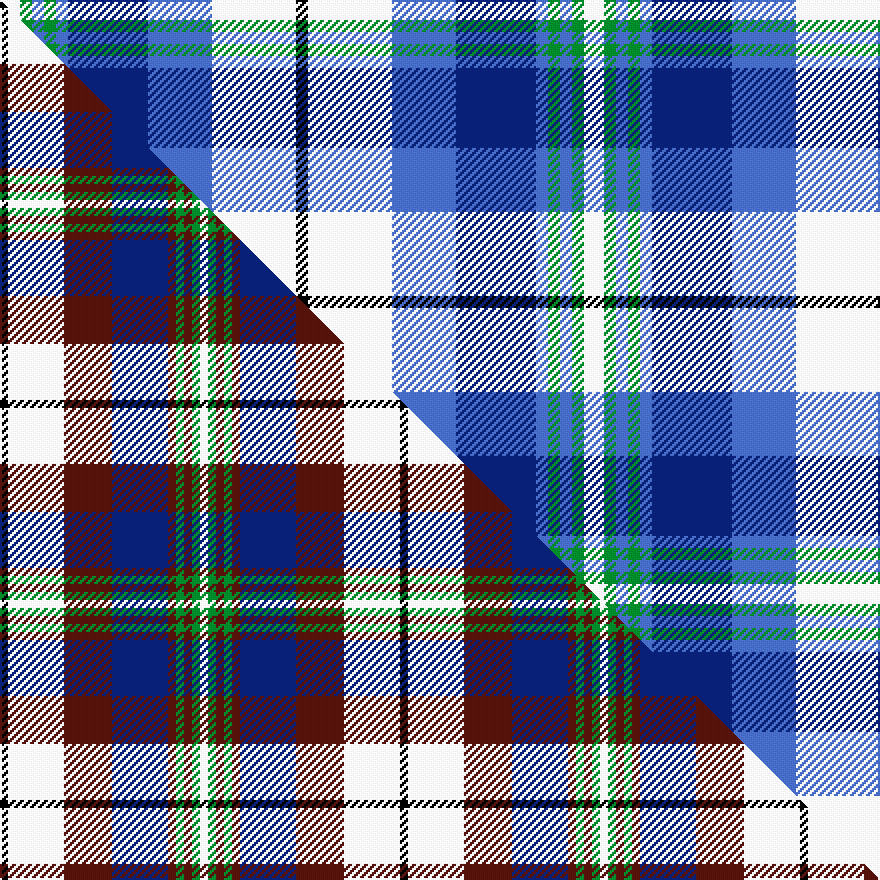

This page is one **sett** — a single exact thread-count. It belongs to the [tartan](/setts/w5g3b3g3b3db20b16w21k3/)
(the same proportion at any scale), whose colour order is pattern [KWBBBGBGW](/stripes/kwbbbgbgw/).

Part of the [Oliver Dress](/tartans/oliver-dress/) tartan — the named design grouping this sett with its other cloths.

Sourced from weddslist.  It is a [9 stripe tartan](/stripes/stripes9/).

Original link http://www.weddslist.com/cgi-bin/tartans/pg.pl?source=sts

## Thread count
W/10 G6 B6 G6 B6 DB40 B32 W42 K/6

One full sett is **292 threads**.

## Palette
<table><thead><tr><th>Colour</th><th>Shade</th><th>OKLCh</th></tr></thead><tbody><tr><td>DB</td><td><code style="background-color:#082077;">#082077</code> <small style="color:#888">#082077</small></td><td><small style="color:#888">oklch(30.0% 0.149 265.1)</small></td></tr><tr><td>G</td><td><code style="background-color:#008B2A;">#008B2A</code> <small style="color:#888">#008B2A</small></td><td><small style="color:#888">oklch(55.4% 0.170 145.9)</small></td></tr><tr><td>K</td><td><code style="background-color:#000000;">#000000</code> <small style="color:#888">#000000</small></td><td><small style="color:#888">oklch(0.0% 0.000 0.0)</small></td></tr><tr><td>W</td><td><code style="background-color:#F7F7F7;">#F7F7F7</code> <small style="color:#888">#F7F7F7</small></td><td><small style="color:#888">oklch(97.6% 0.000 89.9)</small></td></tr><tr><td>B</td><td><code style="background-color:#466CC8;">#466CC8</code> <small style="color:#888">#466CC8</small></td><td><small style="color:#888">oklch(55.1% 0.149 265.0)</small></td></tr></tbody></table>

# Sample pattern

## Compared to the master

This cloth is one sett of its design; the master sett (the exemplar the design is anchored on) is below for comparison.

Its **ΔTartan distance** from the master is **3.24** — the same measure the nearest-tartans table ranks by (0 is identical; a re-scale of the same cloth is near 0, a recolour or a different proportion further).

<figure class="master-compare" style="margin:0">

this sett
master sett ★

<figcaption style="color:#888;font-size:smaller">One weave of this sett against the <a href="/setts/k1w7dr6db7dr1g1dr1g1w1/">master sett ★</a>, split on the diagonal: a shared proportion runs seamlessly across it with only the shades shifting; a different proportion breaks on it.</figcaption>
</figure>

## Nearest tartan variants

The nearest existing variants by ΔTartan distance, with this cloth at the top so the swatches line up against it.

ΔTartan

Threads

Variant

Sett

—

292

<a href="/variants/s9/w5g3b3g3b3db20b16w21k3~x2/">Oliver, dress</a>

<a href="/ttd/edit/#slug=k1dbi6lb1db6lb6k1w1~x6~dbi1406275-db1404245&amp;base=w5g3b3g3b3db20b16w21k3~x2" title="compare in the TTD">2.61</a>

252

<a href="/variants/s7/k1dbi6lb1db6lb6k1w1~x6~dbi1406275-db1404245/">Mary Washington</a>

<a href="/ttd/edit/#slug=lb16w2db16w15k2w2k2w15db16w2lb16k2~x2~lb3103284&amp;base=w5g3b3g3b3db20b16w21k3~x2" title="compare in the TTD">2.68</a>

388

<a href="/variants/s12/lb16w2db16w15k2w2k2w15db16w2lb16k2~x2~lb3103284/">Strathclyde (Official)</a>

<a href="/ttd/edit/#slug=lb12k1lb1k1lb1db8w9n2~x4&amp;base=w5g3b3g3b3db20b16w21k3~x2" title="compare in the TTD">2.70</a>

224

<a href="/variants/s8/lb12k1lb1k1lb1db8w9n2~x4/">Arran - 1989 (Fashion)</a>

<a href="/ttd/edit/#slug=g5lb2g16lb10k2w3db6lb14w2db4w2~x2&amp;base=w5g3b3g3b3db20b16w21k3~x2" title="compare in the TTD">2.74</a>

250

<a href="/variants/s11/g5lb2g16lb10k2w3db6lb14w2db4w2~x2/">Scottish Motor Trade Assoc. (Corp)</a>

<a href="/ttd/edit/#slug=k4db9y6db22g4w20g6w4&amp;base=w5g3b3g3b3db20b16w21k3~x2" title="compare in the TTD">2.76</a>

142

<a href="/variants/s8/k4db9y6db22g4w20g6w4/">Ship Hector</a>

<a href="/ttd/edit/#slug=k2lb16w2db16w15k2w2~x2&amp;base=w5g3b3g3b3db20b16w21k3~x2" title="compare in the TTD">2.78</a>

212

<a href="/variants/s7/k2lb16w2db16w15k2w2~x2/">Strathclyde 1975 (District)</a>

<a href="/ttd/edit/#slug=k2b16w2ki16w15k2w2~x2~ki0604259&amp;base=w5g3b3g3b3db20b16w21k3~x2" title="compare in the TTD">2.84</a>

212

<a href="/variants/s7/k2b16w2ki16w15k2w2~x2~ki0604259/">Strathclyde</a>

<a href="/ttd/edit/#slug=db4lb16db4dr2db2k2db2w5db3y2db2lb2~x2&amp;base=w5g3b3g3b3db20b16w21k3~x2" title="compare in the TTD">2.94</a>

172

<a href="/variants/s12/db4lb16db4dr2db2k2db2w5db3y2db2lb2~x2/">Manchester City Football Club &quot;Blue Moon&quot;</a>

<a href="/ttd/edit/#slug=db1lb9w3y3db9y1g1r1~x4&amp;base=w5g3b3g3b3db20b16w21k3~x2" title="compare in the TTD">2.94</a>

216

<a href="/variants/s8/db1lb9w3y3db9y1g1r1~x4/">Curd (2013)</a>

<a href="/ttd/edit/#slug=db4t13r2db2k2db2w5db2ly2db2t2~x2&amp;base=w5g3b3g3b3db20b16w21k3~x2" title="compare in the TTD">2.97</a>

140

<a href="/variants/s11/db4t13r2db2k2db2w5db2ly2db2t2~x2/">Manchester City Football Club &quot;Blue</a>

## Neighbour map

Every grey dot is one of 13620 variants placed by the first two principal components of the ΔTartan feature space (42% of its variance). Red is this tartan; blue dots are its nearest — click one to open its page.

<svg viewBox="0 0 640 380" role="img" style="max-width:100%;height:auto;border:1px solid #e0e0e0;border-radius:4px;display:block" xmlns="http://www.w3.org/2000/svg"><image href="/nn/cloud.v1.png" width="640" height="380"/><a href="/variants/s7/k1dbi6lb1db6lb6k1w1~x6~dbi1406275-db1404245/"><circle cx="101.1" cy="204.8" r="4" fill="#3465a4"><title>Mary Washington</title></circle></a><a href="/variants/s12/lb16w2db16w15k2w2k2w15db16w2lb16k2~x2~lb3103284/"><circle cx="121.8" cy="186.3" r="4" fill="#3465a4"><title>Strathclyde (Official)</title></circle></a><a href="/variants/s8/lb12k1lb1k1lb1db8w9n2~x4/"><circle cx="157.6" cy="157.9" r="4" fill="#3465a4"><title>Arran - 1989 (Fashion)</title></circle></a><a href="/variants/s11/g5lb2g16lb10k2w3db6lb14w2db4w2~x2/"><circle cx="140.2" cy="183.0" r="4" fill="#3465a4"><title>Scottish Motor Trade Assoc. (Corp)</title></circle></a><a href="/variants/s8/k4db9y6db22g4w20g6w4/"><circle cx="111.6" cy="200.2" r="4" fill="#3465a4"><title>Ship Hector</title></circle></a><a href="/variants/s7/k2lb16w2db16w15k2w2~x2/"><circle cx="137.4" cy="198.8" r="4" fill="#3465a4"><title>Strathclyde 1975 (District)</title></circle></a><a href="/variants/s7/k2b16w2ki16w15k2w2~x2~ki0604259/"><circle cx="127.4" cy="193.4" r="4" fill="#3465a4"><title>Strathclyde</title></circle></a><a href="/variants/s12/db4lb16db4dr2db2k2db2w5db3y2db2lb2~x2/"><circle cx="121.8" cy="137.8" r="4" fill="#3465a4"><title>Manchester City Football Club &quot;Blue Moon&quot;</title></circle></a><a href="/variants/s8/db1lb9w3y3db9y1g1r1~x4/"><circle cx="133.1" cy="168.4" r="4" fill="#3465a4"><title>Curd (2013)</title></circle></a><a href="/variants/s11/db4t13r2db2k2db2w5db2ly2db2t2~x2/"><circle cx="110.4" cy="158.5" r="4" fill="#3465a4"><title>Manchester City Football Club &quot;Blue</title></circle></a><circle cx="107.3" cy="182.9" r="5" fill="#c00000"/><text x="320" y="376" text-anchor="middle" font-size="11" fill="#999">ground</text><text x="11" y="190" text-anchor="middle" font-size="11" fill="#999" transform="rotate(-90 11 190)">complexity</text></svg>

ID: /variants/s9/w5g3b3g3b3db20b16w21k3~x2/
