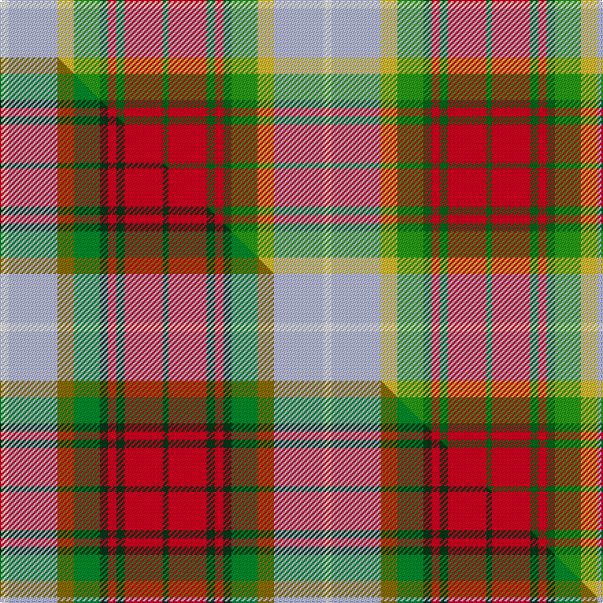

This page is one **sett** — a single exact thread-count. It belongs to the [tartan](/setts/w6lb36ly12g19dg6r6dg6r28dg4/)
(the same proportion at any scale), whose colour order is pattern [GRGRGGYWW](/stripes/grgrggyww/).

Part of the [Derry](/tartans/derry/) tartan — the named design grouping this sett with its other cloths.

Sourced from tartans-authority.  It is a [9 stripe tartan](/stripes/stripes9/).

Original link http://www.tartansauthority.com/tartan-ferret/display/10377/

## Register references

External register numbers recorded for this tartan.

- Scottish Register of Tartans: [10377](https://www.tartanregister.gov.uk/tartanDetails?ref=10377)
- Scottish Tartans Authority (ITI): 10377

## Thread count
W/6 LB36 LY12 G19 DG6 R6 DG6 R28 DG/4

One full sett is **236 threads**.

## Palette
<table><thead><tr><th>Colour</th><th>Shade</th><th>OKLCh</th></tr></thead><tbody><tr><td>LB</td><td><code style="background-color:#B5BBDE;">#B5BBDE</code> <small style="color:#888">#B5BBDE</small></td><td><small style="color:#888">oklch(79.9% 0.050 277.6)</small></td></tr><tr><td>LY</td><td><code style="background-color:#DCBC32;">#DCBC32</code> <small style="color:#888">#DCBC32</small></td><td><small style="color:#888">oklch(80.0% 0.150 95.2)</small></td></tr><tr><td>G</td><td><code style="background-color:#289C18;">#289C18</code> <small style="color:#888">#289C18</small></td><td><small style="color:#888">oklch(60.6% 0.191 141.6)</small></td></tr><tr><td>DG</td><td><code style="background-color:#006818;">#006818</code> <small style="color:#888">#006818</small></td><td><small style="color:#888">oklch(45.0% 0.142 145.0)</small></td></tr><tr><td>W</td><td><code style="background-color:#F7F7F7;">#F7F7F7</code> <small style="color:#888">#F7F7F7</small></td><td><small style="color:#888">oklch(97.6% 0.000 89.9)</small></td></tr><tr><td>R</td><td><code style="background-color:#D60020;">#D60020</code> <small style="color:#888">#D60020</small></td><td><small style="color:#888">oklch(55.2% 0.224 25.5)</small></td></tr></tbody></table>

# Sample pattern

## Compared to the master

This cloth is one sett of its design; the master sett (the exemplar the design is anchored on) is below for comparison.

Its **ΔTartan distance** from the master is **0.11** — the same measure the nearest-tartans table ranks by (0 is identical; a re-scale of the same cloth is near 0, a recolour or a different proportion further).

<figure class="master-compare" style="margin:0">

this sett
master sett ★

<figcaption style="color:#888;font-size:smaller">One weave of this sett against the <a href="/setts/w6lb36y12g19dg6r6dg6r28dg4/">master sett ★</a>, split on the diagonal: a shared proportion runs seamlessly across it with only the shades shifting; a different proportion breaks on it.</figcaption>
</figure>

## Nearest tartan variants

The nearest existing variants by ΔTartan distance, with this cloth at the top so the swatches line up against it.

ΔTartan

Threads

Variant

Sett

—

236

<a href="/variants/s9/w6lb36ly12g19dg6r6dg6r28dg4~g2408144-dg1806142/">Derry Family (Personal)</a>

<a href="/ttd/edit/#slug=w6lb36y12g19dg6r6dg6r28dg4&amp;base=w6lb36ly12g19dg6r6dg6r28dg4~g2408144-dg1806142" title="compare in the TTD">0.11</a>

236

<a href="/variants/s9/w6lb36y12g19dg6r6dg6r28dg4/">Derry Family (Olney, Buckinghamshire) (Personal)</a>

<a href="/ttd/edit/#slug=w2r8o5y6w5g21w6r8b4w2&amp;base=w6lb36ly12g19dg6r6dg6r28dg4~g2408144-dg1806142" title="compare in the TTD">1.29</a>

130

<a href="/variants/s10/w2r8o5y6w5g21w6r8b4w2/">Jacobite, Silk sash</a>

<a href="/ttd/edit/#slug=w2ri8dy5y6w5g21w6ri8r4w2~ri2209032-r2208029&amp;base=w6lb36ly12g19dg6r6dg6r28dg4~g2408144-dg1806142" title="compare in the TTD">1.82</a>

130

<a href="/variants/s10/w2ri8dy5y6w5g21w6ri8r4w2~ri2209032-r2208029/">Jacobite Silk sash</a>

<a href="/ttd/edit/#slug=g21lb21ly3r21n3dp5n3~x2&amp;base=w6lb36ly12g19dg6r6dg6r28dg4~g2408144-dg1806142" title="compare in the TTD">1.93</a>

260

<a href="/variants/s7/g21lb21ly3r21n3dp5n3~x2/">Falardeau-Murphy (Canada) (Personal)</a>

<a href="/ttd/edit/#slug=o17n5db2w12db2y4g7~x2&amp;base=w6lb36ly12g19dg6r6dg6r28dg4~g2408144-dg1806142" title="compare in the TTD">1.95</a>

148

<a href="/variants/s7/o17n5db2w12db2y4g7~x2/">Ontario, Northern</a>

<a href="/ttd/edit/#slug=r19lb5t2w12t2y4g8~x2&amp;base=w6lb36ly12g19dg6r6dg6r28dg4~g2408144-dg1806142" title="compare in the TTD">2.43</a>

154

<a href="/variants/s7/r19lb5t2w12t2y4g8~x2/">Northern Ontario (District)</a>

<a href="/ttd/edit/#slug=o10n3db1lb8db1lo2g5~x4&amp;base=w6lb36ly12g19dg6r6dg6r28dg4~g2408144-dg1806142" title="compare in the TTD">2.54</a>

180

<a href="/variants/s7/o10n3db1lb8db1lo2g5~x4/">Porcupine City of</a>

<a href="/ttd/edit/#slug=r19lb5t2w12t2y4g8~x2~g2203152&amp;base=w6lb36ly12g19dg6r6dg6r28dg4~g2408144-dg1806142" title="compare in the TTD">2.64</a>

154

<a href="/variants/s7/r19lb5t2w12t2y4g8~x2~g2203152/">Ontario, Northern</a>

<a href="/ttd/edit/#slug=r22lb6db10y4r4w4g22db8y3&amp;base=w6lb36ly12g19dg6r6dg6r28dg4~g2408144-dg1806142" title="compare in the TTD">2.70</a>

141

<a href="/variants/s9/r22lb6db10y4r4w4g22db8y3/">Unidentified No 14</a>

<a href="/ttd/edit/#slug=w3r10o6y8lb8g32b8r10b6w3~x4&amp;base=w6lb36ly12g19dg6r6dg6r28dg4~g2408144-dg1806142" title="compare in the TTD">2.71</a>

728

<a href="/variants/s10/w3r10o6y8lb8g32b8r10b6w3~x4/">Unidentified, Silk scarf</a>

## Neighbour map

Every grey dot is one of 13620 variants placed by the first two principal components of the ΔTartan feature space (42% of its variance). Red is this tartan; blue dots are its nearest — click one to open its page.

<svg viewBox="0 0 640 380" role="img" style="max-width:100%;height:auto;border:1px solid #e0e0e0;border-radius:4px;display:block" xmlns="http://www.w3.org/2000/svg"><image href="/nn/cloud.v1.png" width="640" height="380"/><a href="/variants/s9/w6lb36y12g19dg6r6dg6r28dg4/"><circle cx="110.0" cy="182.1" r="4" fill="#3465a4"><title>Derry Family (Olney, Buckinghamshire) (Personal)</title></circle></a><a href="/variants/s10/w2r8o5y6w5g21w6r8b4w2/"><circle cx="112.1" cy="173.7" r="4" fill="#3465a4"><title>Jacobite, Silk sash</title></circle></a><a href="/variants/s10/w2ri8dy5y6w5g21w6ri8r4w2~ri2209032-r2208029/"><circle cx="106.1" cy="171.1" r="4" fill="#3465a4"><title>Jacobite Silk sash</title></circle></a><a href="/variants/s7/g21lb21ly3r21n3dp5n3~x2/"><circle cx="125.4" cy="209.4" r="4" fill="#3465a4"><title>Falardeau-Murphy (Canada) (Personal)</title></circle></a><a href="/variants/s7/o17n5db2w12db2y4g7~x2/"><circle cx="125.4" cy="200.2" r="4" fill="#3465a4"><title>Ontario, Northern</title></circle></a><a href="/variants/s7/r19lb5t2w12t2y4g8~x2/"><circle cx="141.1" cy="187.7" r="4" fill="#3465a4"><title>Northern Ontario (District)</title></circle></a><a href="/variants/s7/o10n3db1lb8db1lo2g5~x4/"><circle cx="170.1" cy="205.8" r="4" fill="#3465a4"><title>Porcupine City of</title></circle></a><a href="/variants/s7/r19lb5t2w12t2y4g8~x2~g2203152/"><circle cx="147.4" cy="188.8" r="4" fill="#3465a4"><title>Ontario, Northern</title></circle></a><a href="/variants/s9/r22lb6db10y4r4w4g22db8y3/"><circle cx="107.2" cy="188.8" r="4" fill="#3465a4"><title>Unidentified No 14</title></circle></a><a href="/variants/s10/w3r10o6y8lb8g32b8r10b6w3~x4/"><circle cx="127.6" cy="162.1" r="4" fill="#3465a4"><title>Unidentified, Silk scarf</title></circle></a><circle cx="119.0" cy="186.8" r="5" fill="#c00000"/><text x="320" y="376" text-anchor="middle" font-size="11" fill="#999">ground</text><text x="11" y="190" text-anchor="middle" font-size="11" fill="#999" transform="rotate(-90 11 190)">complexity</text></svg>

ID: /variants/s9/w6lb36ly12g19dg6r6dg6r28dg4~g2408144-dg1806142/
