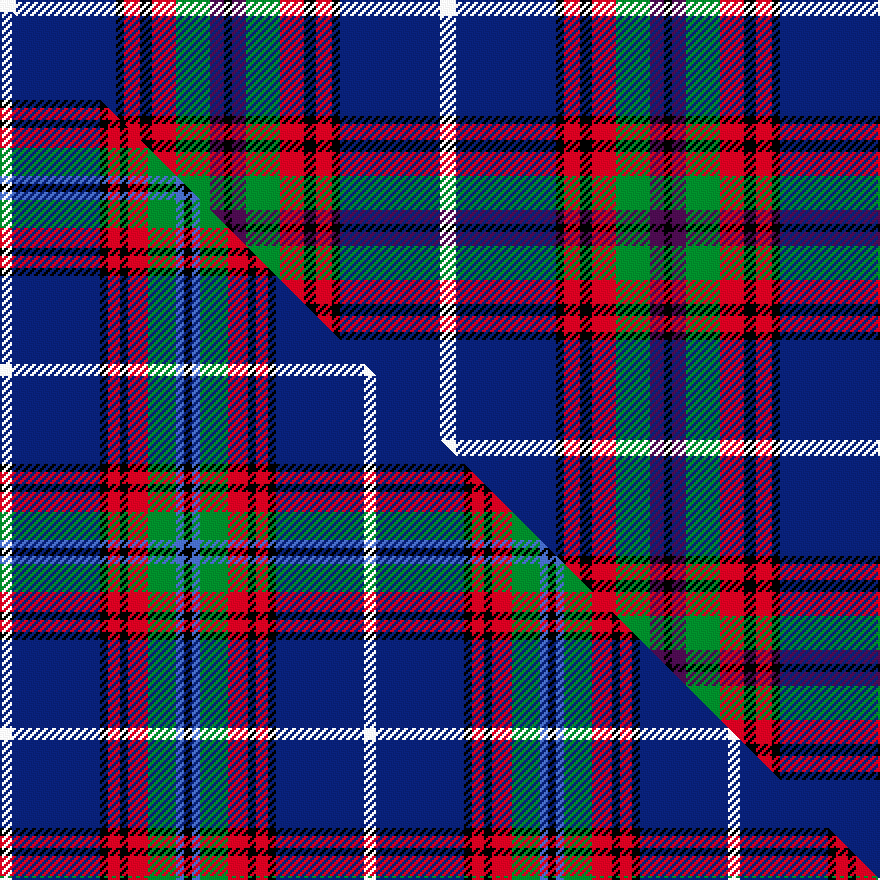

This is one **variant** — a specific cloth: this exact thread count and colourway, with its own
provenance below. It is one weaving of the [sett](/tartans/e/ed/edinburgh/) (the scale-free proportion — the
same cloth at any scale or shade), whose colour order is pattern [KBGRKRKBW](/stripes/kbgrkrkbw/).

Part of the [Edinburgh](/tartans/e/ed/edinburgh/) tartan — the named design grouping this sett with its other cloths.

Sourced from weddslist.  It is a [9 stripe tartan](/stripes/stripes9/).

Original link [http://www.weddslist.com/cgi-bin/tartans/pg.pl?source=sts](http://www.weddslist.com/cgi-bin/tartans/pg.pl?source=sts)

Dataset <small>— provenance for this record, inherited from the source manifest</small>

<dl class="dataset-prov">
<dt>source</dt><dd><a href="/sources/weddslist/">Weddslist</a></dd>
<dt>data captured from</dt><dd><a href="https://github.com/thetartan/tartan-database/blob/master/data/weddslist/data.csv">https://github.com/thetartan/tartan-database/blob/master/data/weddslist/data.csv</a></dd>
<dt>data date</dt><dd>2016-11-17 <small>(dataset default)</small></dd>
<dt>licence</dt><dd><a href="https://creativecommons.org/licenses/by-nc-nd/4.0/">CC BY-NC-ND 4.0</a></dd>
</dl>

Capture chain <small>— the hands this data passed through, oldest first; each capture carries its own licence</small>

<ol class="capture-chain">
<li><a href="https://www.weddslist.com/tartans/">Weddslist</a> <small>the living privately compiled reference</small></li>
<li><a href="https://github.com/thetartan/tartan-database">thetartan/tartan-database</a> <small>2016-2017</small> · <a href="https://creativecommons.org/licenses/by-nc-nd/4.0/">CC BY-NC-ND 4.0</a> <small>Levko Kravets's frozen compilation — the capture we vendored, and where its CC licence text came from</small></li>
<li>this dictionary <small>captured 2026-06-10 · commit 5bf86c7566</small> <small>each re-capture is a git commit to data/sources</small></li>
</ol>

## Thread count
W/8 DB50 K4 R8 K6 R12 G17 DP7 K/4

One full sett is **220 threads**.

## Palette
<table><thead><tr><th>Colour</th><th>Shade</th><th>OKLCh</th></tr></thead><tbody><tr><td>DB</td><td><code style="background-color:#082077;">#082077</code> <small style="color:#888">#082077</small></td><td><small style="color:#888">oklch(30.0% 0.149 265.1)</small></td></tr><tr><td>G</td><td><code style="background-color:#008B2A;">#008B2A</code> <small style="color:#888">#008B2A</small></td><td><small style="color:#888">oklch(55.4% 0.170 145.9)</small></td></tr><tr><td>K</td><td><code style="background-color:#000000;">#000000</code> <small style="color:#888">#000000</small></td><td><small style="color:#888">oklch(0.0% 0.000 0.0)</small></td></tr><tr><td>W</td><td><code style="background-color:#F7F7F7;">#F7F7F7</code> <small style="color:#888">#F7F7F7</small></td><td><small style="color:#888">oklch(97.6% 0.000 89.9)</small></td></tr><tr><td>DP</td><td><code style="background-color:#4B0B4F;">#4B0B4F</code> <small style="color:#888">#4B0B4F</small></td><td><small style="color:#888">oklch(30.1% 0.125 325.4)</small></td></tr><tr><td>R</td><td><code style="background-color:#D60020;">#D60020</code> <small style="color:#888">#D60020</small></td><td><small style="color:#888">oklch(55.2% 0.224 25.5)</small></td></tr></tbody></table>

# Sample pattern

[Sample sheet (PDF)](swatch.pdf) — the woven sample, thread count and palette on one printable A4, rendered on demand (the same sheet the TTD print page downloads).

## Compared to the master

This cloth is one sett of its design; the master sett (the exemplar the design is anchored on) is below for comparison.

Its **ΔTartan distance** from the master is **0.55** — the same measure the nearest-tartans table ranks by (0 is identical; a re-scale of the same cloth is near 0, a recolour or a different proportion further).

<figure class="master-compare" style="margin:0">

this sett
master sett ★

<figcaption style="color:#888;font-size:smaller">One weave of this sett against the <a href="/setts/w3db22k2r3k2r5g7b2k2/">master sett ★</a>, split on the diagonal: a shared proportion runs seamlessly across it with only the shades shifting; a different proportion breaks on it.</figcaption>
</figure>

## Nearest tartan variants

The nearest existing variants by ΔTartan distance, with this cloth at the top so the swatches line up against it.

ΔTartan

Threads

Variant

Sett

—

220

<a href="/variants/s9/w8db50k4r8k6r12g17dp7k4/">Edinburgh</a>

<a href="/ttd/edit/#slug=w3db22k2r3k2r5g7b2k2~x2&amp;base=w8db50k4r8k6r12g17dp7k4" title="compare in the TTD">0.55</a>

182

<a href="/variants/s9/w3db22k2r3k2r5g7b2k2~x2/">Edinburgh</a>

<a href="/ttd/edit/#slug=k3ri3g21r8ri3r4k3db26w3~x2~ri5021030-r4116015&amp;base=w8db50k4r8k6r12g17dp7k4" title="compare in the TTD">1.19</a>

284

<a href="/variants/s9/k3ri3g21r8ri3r4k3db26w3~x2~ri5021030-r4116015/">Dunedin</a>

<a href="/ttd/edit/#slug=g5o2g2o9k9lr9db30w5~x2~lr70&amp;base=w8db50k4r8k6r12g17dp7k4" title="compare in the TTD">1.58</a>

264

<a href="/variants/s8/g5o2g2o9k9lr9db30w5~x2~lr70/">Alexander of Menstry</a>

<a href="/ttd/edit/#slug=y4g22r3k17r3db37w3~x2&amp;base=w8db50k4r8k6r12g17dp7k4" title="compare in the TTD">1.65</a>

342

<a href="/variants/s7/y4g22r3k17r3db37w3~x2/">Souza Nery</a>

<a href="/ttd/edit/#slug=ly4g22r3k17r3db37w3~x2&amp;base=w8db50k4r8k6r12g17dp7k4" title="compare in the TTD">1.65</a>

342

<a href="/variants/s7/ly4g22r3k17r3db37w3~x2/">Souza Nery (Personal)</a>

<a href="/ttd/edit/#slug=g5o2g2o9k9lb9db30w5~x2&amp;base=w8db50k4r8k6r12g17dp7k4" title="compare in the TTD">1.67</a>

264

<a href="/variants/s8/g5o2g2o9k9lb9db30w5~x2/">Alexander of Menstry (Personal)</a>

<a href="/ttd/edit/#slug=db40r4k16w3dy8dr4dy3dr8k10~x2&amp;base=w8db50k4r8k6r12g17dp7k4" title="compare in the TTD">1.88</a>

284

<a href="/variants/s9/db40r4k16w3dy8dr4dy3dr8k10~x2/">United Arrows House Check</a>

<a href="/ttd/edit/#slug=w2r5k2ly3k4db28r4dg14k4w2~x2&amp;base=w8db50k4r8k6r12g17dp7k4" title="compare in the TTD">1.93</a>

264

<a href="/variants/s10/w2r5k2ly3k4db28r4dg14k4w2~x2/">Loch Lomond &amp; the Trossachs (Fashion</a>

<a href="/ttd/edit/#slug=dg4lb2db18r2k4r6lb1w1~x4&amp;base=w8db50k4r8k6r12g17dp7k4" title="compare in the TTD">1.96</a>

284

<a href="/variants/s8/dg4lb2db18r2k4r6lb1w1~x4/">Glenn</a>

<a href="/ttd/edit/#slug=db53g10k20y5k5w5k7r18db10k6db6w6&amp;base=w8db50k4r8k6r12g17dp7k4" title="compare in the TTD">1.97</a>

243

<a href="/variants/s12/db53g10k20y5k5w5k7r18db10k6db6w6/">Broager (Name)</a>

## Neighbour map

Every grey dot is one of 13662 variants placed by the first two principal components of the ΔTartan feature space (42% of its variance). Red is this tartan; blue dots are its nearest — click one to open its page. The map is a flat projection of a many-dimensional space — [how to read it](/posts/neighbourhood-maps/).

<svg viewBox="0 0 640 380" role="img" style="max-width:100%;height:auto;border:1px solid #e0e0e0;border-radius:4px;display:block" xmlns="http://www.w3.org/2000/svg"><image href="/nn/cloud.v1.png" width="640" height="380"/><a href="/variants/s9/w3db22k2r3k2r5g7b2k2~x2/"><circle cx="155.9" cy="119.1" r="4" fill="#3465a4"><title>Edinburgh</title></circle></a><a href="/variants/s9/k3ri3g21r8ri3r4k3db26w3~x2~ri5021030-r4116015/"><circle cx="109.8" cy="144.2" r="4" fill="#3465a4"><title>Dunedin</title></circle></a><a href="/variants/s8/g5o2g2o9k9lr9db30w5~x2~lr70/"><circle cx="134.8" cy="128.8" r="4" fill="#3465a4"><title>Alexander of Menstry</title></circle></a><a href="/variants/s7/y4g22r3k17r3db37w3~x2/"><circle cx="143.1" cy="142.5" r="4" fill="#3465a4"><title>Souza Nery</title></circle></a><a href="/variants/s7/ly4g22r3k17r3db37w3~x2/"><circle cx="138.2" cy="141.1" r="4" fill="#3465a4"><title>Souza Nery (Personal)</title></circle></a><a href="/variants/s8/g5o2g2o9k9lb9db30w5~x2/"><circle cx="130.5" cy="127.4" r="4" fill="#3465a4"><title>Alexander of Menstry (Personal)</title></circle></a><a href="/variants/s9/db40r4k16w3dy8dr4dy3dr8k10~x2/"><circle cx="175.8" cy="129.6" r="4" fill="#3465a4"><title>United Arrows House Check</title></circle></a><a href="/variants/s10/w2r5k2ly3k4db28r4dg14k4w2~x2/"><circle cx="145.2" cy="109.9" r="4" fill="#3465a4"><title>Loch Lomond &amp; the Trossachs (Fashion</title></circle></a><a href="/variants/s8/dg4lb2db18r2k4r6lb1w1~x4/"><circle cx="193.2" cy="109.0" r="4" fill="#3465a4"><title>Glenn</title></circle></a><a href="/variants/s12/db53g10k20y5k5w5k7r18db10k6db6w6/"><circle cx="144.3" cy="114.7" r="4" fill="#3465a4"><title>Broager (Name)</title></circle></a><circle cx="141.0" cy="119.9" r="5" fill="#c00000"/><text x="320" y="376" text-anchor="middle" font-size="11" fill="#999">ground</text><text x="11" y="190" text-anchor="middle" font-size="11" fill="#999" transform="rotate(-90 11 190)">complexity</text></svg>

ID: /variants/s9/w8db50k4r8k6r12g17dp7k4/
