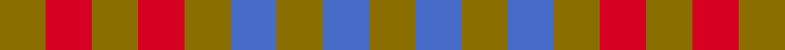

This page is one **sett** — a single exact thread-count. It belongs to the [tartan](/setts/y1r1y1r1y1b1y1b1y1/)
(the same proportion at any scale), whose colour order is pattern [GBGBGRGRG](/stripes/gbgbgrgrg/).

Sourced from weddslist.  It is a [9 stripe tartan](/stripes/stripes9/).

Original link http://www.weddslist.com/cgi-bin/tartans/pg.pl?source=sts

## Thread count
Y/6 R6 Y6 R6 Y6 B6 Y6 B6 Y/6

One full sett is **96 threads**.

## Palette
<table><thead><tr><th>Colour</th><th>Shade</th><th>OKLCh</th></tr></thead><tbody><tr><td>B</td><td><code style="background-color:#466CC8;">#466CC8</code> <small style="color:#888">#466CC8</small></td><td><small style="color:#888">oklch(55.1% 0.149 265.0)</small></td></tr><tr><td>R</td><td><code style="background-color:#D60020;">#D60020</code> <small style="color:#888">#D60020</small></td><td><small style="color:#888">oklch(55.2% 0.224 25.5)</small></td></tr><tr><td>Y</td><td><code style="background-color:#8B6E00;">#8B6E00</code> <small style="color:#888">#8B6E00</small></td><td><small style="color:#888">oklch(55.1% 0.113 90.4)</small></td></tr></tbody></table>

# Sample pattern

## Nearest variants

The nearest existing variants by ΔTartan distance, with this cloth at the top so the swatches line up against it.

ΔTartan

Threads

Variant

Sett

—

96

<a href="/variants/s9/y1r1y1r1y1b1y1b1y1~x6/">Compaq</a>

<a href="/ttd/edit/#slug=y1r1y1r1y1lo1y1lo1y1~x6&amp;base=y1r1y1r1y1b1y1b1y1~x6" title="compare in the TTD">2.00</a>

96

<a href="/variants/s9/y1r1y1r1y1lo1y1lo1y1~x6/">Compaq Check (Corporate)</a>

## Neighbour map

Every grey dot is one of 13620 variants placed by the first two principal components of the ΔTartan feature space (42% of its variance). Red is this tartan; blue dots are its nearest — click one to open its page.

<svg viewBox="0 0 640 380" role="img" style="max-width:100%;height:auto;border:1px solid #e0e0e0;border-radius:4px;display:block" xmlns="http://www.w3.org/2000/svg"><image href="/nn/cloud.v1.png" width="640" height="380"/><a href="/variants/s9/y1r1y1r1y1lo1y1lo1y1~x6/"><circle cx="244.6" cy="366.0" r="4" fill="#3465a4"><title>Compaq Check (Corporate)</title></circle></a><circle cx="222.3" cy="366.0" r="5" fill="#c00000"/><text x="320" y="376" text-anchor="middle" font-size="11" fill="#999">ground</text><text x="11" y="190" text-anchor="middle" font-size="11" fill="#999" transform="rotate(-90 11 190)">complexity</text></svg>

ID: /variants/s9/y1r1y1r1y1b1y1b1y1~x6/
