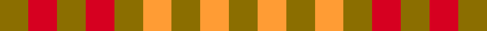

This page is one **sett** — a single exact thread-count. It belongs to the [tartan](/setts/y1r1y1r1y1lo1y1lo1y1/)
(the same proportion at any scale), whose colour order is pattern [GRGRGYGYG](/stripes/grgrgygyg/).

Sourced from tartans-authority.  It is a [9 stripe tartan](/stripes/stripes9/).

Original link [https://www.tartanregister.gov.uk/tartanDetails.aspx?ref=1888](https://www.tartanregister.gov.uk/tartanDetails.aspx?ref=1888)

## Provenance

Earliest known date: 1987 Used in the uniforms of Games Officials.

2 attestations — the source records this cloth was collapsed from (oldest owns this page)

<ul>
<li>pre 2002 — Compaq Check (Corporate) (tartans-authority, <a href="https://www.tartanregister.gov.uk/tartanDetails.aspx?ref=1888">record</a>)  <em>No details. Too small to be regarded as a tartan, thus the suffix of 'Check'</em></li>
<li>undated — Compaq Corporate Tartan (house-of-tartan, <a href="http://www.house-of-tartan.scotland.net/house/TartanViewjs.asp?colr=Def&tnam=1888">record</a>) </li>
</ul>

Dataset <small>— provenance for this record, inherited from the source manifest</small>

<dl class="dataset-prov">
<dt>source</dt><dd><a href="/sources/tartans-authority/">Scottish Tartans Authority</a></dd>
<dt>data captured from</dt><dd><a href="https://github.com/thetartan/tartan-database/blob/master/data/tartans-authority/data.csv">https://github.com/thetartan/tartan-database/blob/master/data/tartans-authority/data.csv</a></dd>
<dt>data date</dt><dd>pre 2002 <small>(this record)</small></dd>
<dt>licence</dt><dd><a href="https://creativecommons.org/licenses/by-nc-nd/4.0/">CC BY-NC-ND 4.0</a></dd>
</dl>

Capture chain <small>— the hands this data passed through, oldest first; each capture carries its own licence</small>

<ol class="capture-chain">
<li><a href="https://www.tartansauthority.com/">Scottish Tartans Authority</a> <small>the heritage body's archive — its tartan-ferret record browser is retired (links repaired to the SRT, above)</small></li>
<li><a href="https://github.com/thetartan/tartan-database">thetartan/tartan-database</a> <small>2016-2017</small> · <a href="https://creativecommons.org/licenses/by-nc-nd/4.0/">CC BY-NC-ND 4.0</a> <small>Levko Kravets's frozen compilation — the capture we vendored, and where its CC licence text came from</small></li>
<li>this dictionary <small>captured 2026-06-10 · commit 5bf86c7566</small> <small>each re-capture is a git commit to data/sources</small></li>
</ol>

## Register references

External register numbers recorded for this tartan.

- Scottish Tartans Authority (ITI): 1888

## Thread count
Y/6 R6 Y6 R6 Y6 LO6 Y6 LO6 Y/6

One full sett is **96 threads**.

## Palette
<table><thead><tr><th>Colour</th><th>Shade</th><th>OKLCh</th></tr></thead><tbody><tr><td>LO</td><td><code style="background-color:#FF9C34;">#FF9C34</code> <small style="color:#888">#FF9C34</small></td><td><small style="color:#888">oklch(77.9% 0.161 61.8)</small></td></tr><tr><td>R</td><td><code style="background-color:#D60020;">#D60020</code> <small style="color:#888">#D60020</small></td><td><small style="color:#888">oklch(55.2% 0.224 25.5)</small></td></tr><tr><td>Y</td><td><code style="background-color:#8B6E00;">#8B6E00</code> <small style="color:#888">#8B6E00</small></td><td><small style="color:#888">oklch(55.1% 0.113 90.4)</small></td></tr></tbody></table>

# Sample pattern

## Nearest tartan variants

The nearest existing variants by ΔTartan distance, with this cloth at the top so the swatches line up against it.

ΔTartan

Threads

Variant

Sett

—

96

<a href="/variants/s9/y1r1y1r1y1lo1y1lo1y1~x6/">Compaq Check (Corporate)</a>

<a href="/ttd/edit/#slug=y1r1y1r1y1b1y1b1y1~x6&amp;base=y1r1y1r1y1lo1y1lo1y1~x6" title="compare in the TTD">2.00</a>

96

<a href="/variants/s9/y1r1y1r1y1b1y1b1y1~x6/">Compaq</a>

2.78

180

<a href="/variants/s16/y1lo1y1lo1y1r1y1r1y1r1y1r1y1lo1y1lo1~x6/">Compaq</a>

## Neighbour map

Every grey dot is one of 13621 variants placed by the first two principal components of the ΔTartan feature space (42% of its variance). Red is this tartan; blue dots are its nearest — click one to open its page.

<svg viewBox="0 0 640 380" role="img" style="max-width:100%;height:auto;border:1px solid #e0e0e0;border-radius:4px;display:block" xmlns="http://www.w3.org/2000/svg"><image href="/nn/cloud.v1.png" width="640" height="380"/><a href="/variants/s9/y1r1y1r1y1b1y1b1y1~x6/"><circle cx="222.8" cy="366.0" r="4" fill="#3465a4"><title>Compaq</title></circle></a><a href="/variants/s16/y1lo1y1lo1y1r1y1r1y1r1y1r1y1lo1y1lo1~x6/"><circle cx="198.9" cy="366.0" r="4" fill="#3465a4"><title>Compaq</title></circle></a><circle cx="245.1" cy="366.0" r="5" fill="#c00000"/><text x="320" y="376" text-anchor="middle" font-size="11" fill="#999">ground</text><text x="11" y="190" text-anchor="middle" font-size="11" fill="#999" transform="rotate(-90 11 190)">complexity</text></svg>

ID: /variants/s9/y1r1y1r1y1lo1y1lo1y1~x6/
