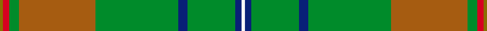

This is one **variant** — a specific cloth: this exact thread count and colourway, with its own
provenance below. It is one weaving of the [sett](/setts/y1r2g3o24g26db3g15db2w1/) (the scale-free proportion — the
same cloth at any scale or shade), whose colour order is pattern [GRGRGBGBW](/stripes/grgrgbgbw/).

Part of the [Canuck Place](/tartans/canuck-place/) tartan — the named design grouping this sett with its other cloths.

Sourced from register-of-tartans.  It is a [9 stripe tartan](/stripes/stripes9/).

Original link [https://www.tartanregister.gov.uk/tartanDetails.aspx?ref=555](https://www.tartanregister.gov.uk/tartanDetails.aspx?ref=555)

Dataset <small>— provenance for this record, inherited from the source manifest</small>

<dl class="dataset-prov">
<dt>source</dt><dd><a href="/sources/register-of-tartans/">Scottish Register of Tartans</a></dd>
<dt>data captured from</dt><dd><a href="https://github.com/thetartan/tartan-database/blob/master/data/register-of-tartans/data.csv">https://github.com/thetartan/tartan-database/blob/master/data/register-of-tartans/data.csv</a></dd>
<dt>data date</dt><dd>2007 <small>(this record)</small></dd>
<dt>licence</dt><dd><a href="https://www.tartanregister.gov.uk/copyright">Crown copyright</a></dd>
</dl>

Capture chain <small>— the hands this data passed through, oldest first; each capture carries its own licence</small>

<ol class="capture-chain">
<li><a href="https://www.tartanregister.gov.uk/">Scottish Register of Tartans</a> · <a href="https://www.tartanregister.gov.uk/copyright">Crown copyright</a> <small>the living register — still published by National Records of Scotland</small></li>
<li><a href="https://github.com/thetartan/tartan-database">thetartan/tartan-database</a> <small>2016-2017</small> · <a href="https://creativecommons.org/licenses/by-nc-nd/4.0/">CC BY-NC-ND 4.0</a> <small>Levko Kravets's frozen compilation — the capture we vendored, and where its CC licence text came from</small></li>
<li>this dictionary <small>captured 2026-06-10 · commit 5bf86c7566</small> <small>each re-capture is a git commit to data/sources</small></li>
</ol>

## Register references

External register numbers recorded for this tartan.

- Scottish Register of Tartans: [555](https://www.tartanregister.gov.uk/tartanDetails.aspx?ref=555)
- Scottish Tartans Authority (ITI): 7182

## Thread count
Y/2 R4 G6 O48 G52 DB6 G30 DB4 W/2

One full sett is **304 threads**.

## Palette
<table><thead><tr><th>Colour</th><th>Shade</th><th>OKLCh</th></tr></thead><tbody><tr><td>DB</td><td><code style="background-color:#082077;">#082077</code> <small style="color:#888">#082077</small></td><td><small style="color:#888">oklch(30.0% 0.149 265.1)</small></td></tr><tr><td>R</td><td><code style="background-color:#D60020;">#D60020</code> <small style="color:#888">#D60020</small></td><td><small style="color:#888">oklch(55.2% 0.224 25.5)</small></td></tr><tr><td>Y</td><td><code style="background-color:#8B6E00;">#8B6E00</code> <small style="color:#888">#8B6E00</small></td><td><small style="color:#888">oklch(55.1% 0.113 90.4)</small></td></tr><tr><td>W</td><td><code style="background-color:#F7F7F7;">#F7F7F7</code> <small style="color:#888">#F7F7F7</small></td><td><small style="color:#888">oklch(97.6% 0.000 89.9)</small></td></tr><tr><td>O</td><td><code style="background-color:#A65C11;">#A65C11</code> <small style="color:#888">#A65C11</small></td><td><small style="color:#888">oklch(55.0% 0.125 58.3)</small></td></tr><tr><td>G</td><td><code style="background-color:#008B2A;">#008B2A</code> <small style="color:#888">#008B2A</small></td><td><small style="color:#888">oklch(55.4% 0.170 145.9)</small></td></tr></tbody></table>

# Sample pattern

## Nearest tartan variants

The nearest existing variants by ΔTartan distance, with this cloth at the top so the swatches line up against it.

ΔTartan

Threads

Variant

Sett

—

304

<a href="/variants/s9/y1r2g3o24g26db3g15db2w1~x2/">Canuck Place</a>

<a href="/ttd/edit/#slug=w1db2g15db3g26o24g3r2ly1~x2&amp;base=y1r2g3o24g26db3g15db2w1~x2" title="compare in the TTD">0.01</a>

304

<a href="/variants/s9/w1db2g15db3g26o24g3r2ly1~x2/">Canuck Place (Corporate)</a>

<a href="/ttd/edit/#slug=y2r6g1ri2g12lb1g1lb2~x2~r1707016-ri2008029&amp;base=y1r2g3o24g26db3g15db2w1~x2" title="compare in the TTD">2.37</a>

100

<a href="/variants/s8/y2r6g1ri2g12lb1g1lb2~x2~r1707016-ri2008029/">Manitoba</a>

<a href="/ttd/edit/#slug=y2r6g1ri2g12lb1g1lb2~x2~r1707016-ri2209032&amp;base=y1r2g3o24g26db3g15db2w1~x2" title="compare in the TTD">2.37</a>

100

<a href="/variants/s8/y2r6g1ri2g12lb1g1lb2~x2~r1707016-ri2209032/">Manitoba Red</a>

<a href="/ttd/edit/#slug=y2r6g1ri2g12lb1g1lb2~x2~r1807008-ri2109032&amp;base=y1r2g3o24g26db3g15db2w1~x2" title="compare in the TTD">2.37</a>

100

<a href="/variants/s8/y2r6g1ri2g12lb1g1lb2~x2~r1807008-ri2109032/">Manitoba District Tartan</a>

<a href="/ttd/edit/#slug=g15y3g27r2g2r33t2w1t4~x2&amp;base=y1r2g3o24g26db3g15db2w1~x2" title="compare in the TTD">2.60</a>

318

<a href="/variants/s9/g15y3g27r2g2r33t2w1t4~x2/">Longmore (Name)</a>

<a href="/ttd/edit/#slug=dg62n3dg3n31k4g5lb5r3~x2~dg1806142-g2408144&amp;base=y1r2g3o24g26db3g15db2w1~x2" title="compare in the TTD">3.42</a>

334

<a href="/variants/s8/dg62n3dg3n31k4g5lb5r3~x2~dg1806142-g2408144/">Sheffield, City of (District)</a>

<a href="/ttd/edit/#slug=y40dt10o2dt2w2dt3g8y6dt2y4w2~x2&amp;base=y1r2g3o24g26db3g15db2w1~x2" title="compare in the TTD">3.46</a>

240

<a href="/variants/s11/y40dt10o2dt2w2dt3g8y6dt2y4w2~x2/">Cavalier, Blue</a>

<a href="/ttd/edit/#slug=dg43dp3o3dp2o4r3g2dg13g2o9dg1ly2~x2~dg1806142-g2408144&amp;base=y1r2g3o24g26db3g15db2w1~x2" title="compare in the TTD">3.50</a>

258

<a href="/variants/s12/dg43dp3o3dp2o4r3g2dg13g2o9dg1ly2~x2~dg1806142-g2408144/">Berry Tribute</a>

<a href="/ttd/edit/#slug=r4db10g2db2g24o2g2o16g2w1~x2&amp;base=y1r2g3o24g26db3g15db2w1~x2" title="compare in the TTD">3.60</a>

250

<a href="/variants/s10/r4db10g2db2g24o2g2o16g2w1~x2/">Kinfauns Castle</a>

<a href="/ttd/edit/#slug=g3o2g40dg2g4dg8w1o4g2dy4y4w2~x2&amp;base=y1r2g3o24g26db3g15db2w1~x2" title="compare in the TTD">3.65</a>

294

<a href="/variants/s12/g3o2g40dg2g4dg8w1o4g2dy4y4w2~x2/">Springbok</a>

## Neighbour map

Every grey dot is one of 13621 variants placed by the first two principal components of the ΔTartan feature space (42% of its variance). Red is this tartan; blue dots are its nearest — click one to open its page.

<svg viewBox="0 0 640 380" role="img" style="max-width:100%;height:auto;border:1px solid #e0e0e0;border-radius:4px;display:block" xmlns="http://www.w3.org/2000/svg"><image href="/nn/cloud.v1.png" width="640" height="380"/><a href="/variants/s9/w1db2g15db3g26o24g3r2ly1~x2/"><circle cx="383.0" cy="141.7" r="4" fill="#3465a4"><title>Canuck Place (Corporate)</title></circle></a><a href="/variants/s8/y2r6g1ri2g12lb1g1lb2~x2~r1707016-ri2008029/"><circle cx="296.6" cy="178.7" r="4" fill="#3465a4"><title>Manitoba</title></circle></a><a href="/variants/s8/y2r6g1ri2g12lb1g1lb2~x2~r1707016-ri2209032/"><circle cx="296.9" cy="178.6" r="4" fill="#3465a4"><title>Manitoba Red</title></circle></a><a href="/variants/s8/y2r6g1ri2g12lb1g1lb2~x2~r1807008-ri2109032/"><circle cx="296.3" cy="178.1" r="4" fill="#3465a4"><title>Manitoba District Tartan</title></circle></a><a href="/variants/s9/g15y3g27r2g2r33t2w1t4~x2/"><circle cx="348.0" cy="128.6" r="4" fill="#3465a4"><title>Longmore (Name)</title></circle></a><a href="/variants/s8/dg62n3dg3n31k4g5lb5r3~x2~dg1806142-g2408144/"><circle cx="374.2" cy="135.1" r="4" fill="#3465a4"><title>Sheffield, City of (District)</title></circle></a><a href="/variants/s11/y40dt10o2dt2w2dt3g8y6dt2y4w2~x2/"><circle cx="406.4" cy="132.0" r="4" fill="#3465a4"><title>Cavalier, Blue</title></circle></a><a href="/variants/s12/dg43dp3o3dp2o4r3g2dg13g2o9dg1ly2~x2~dg1806142-g2408144/"><circle cx="466.6" cy="92.0" r="4" fill="#3465a4"><title>Berry Tribute</title></circle></a><a href="/variants/s10/r4db10g2db2g24o2g2o16g2w1~x2/"><circle cx="287.9" cy="140.6" r="4" fill="#3465a4"><title>Kinfauns Castle</title></circle></a><a href="/variants/s12/g3o2g40dg2g4dg8w1o4g2dy4y4w2~x2/"><circle cx="425.5" cy="87.9" r="4" fill="#3465a4"><title>Springbok</title></circle></a><circle cx="388.7" cy="143.7" r="5" fill="#c00000"/><text x="320" y="376" text-anchor="middle" font-size="11" fill="#999">ground</text><text x="11" y="190" text-anchor="middle" font-size="11" fill="#999" transform="rotate(-90 11 190)">complexity</text></svg>

ID: /variants/s9/y1r2g3o24g26db3g15db2w1~x2/
