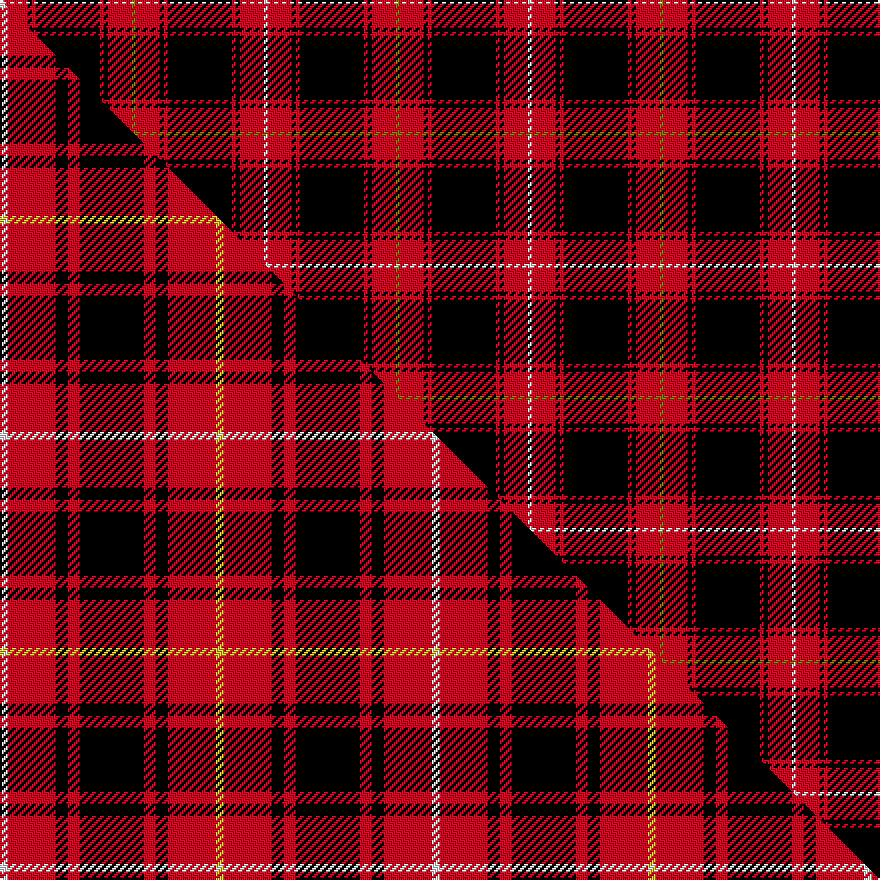

This page is one **sett** — a single exact thread-count. It belongs to the [tartan](/setts/y1r6k1r1k16r1k1r6w1/)
(the same proportion at any scale), whose colour order is pattern [GRKRKRKRW](/stripes/grkrkrkrw/).

Part of the [MacIver](/tartans/maciver/) tartan — the named design grouping this sett with its other cloths.

Sourced from weddslist.  It is a [9 stripe tartan](/stripes/stripes9/).

Original link http://www.weddslist.com/cgi-bin/tartans/pg.pl?source=x

## Thread count
W/2 R12 K2 R2 K32 R2 K2 R12 Y/2

One full sett is **132 threads**.

## Palette
<table><thead><tr><th>Colour</th><th>Shade</th><th>OKLCh</th></tr></thead><tbody><tr><td>R</td><td><code style="background-color:#D60020;">#D60020</code> <small style="color:#888">#D60020</small></td><td><small style="color:#888">oklch(55.2% 0.224 25.5)</small></td></tr><tr><td>K</td><td><code style="background-color:#000000;">#000000</code> <small style="color:#888">#000000</small></td><td><small style="color:#888">oklch(0.0% 0.000 0.0)</small></td></tr><tr><td>Y</td><td><code style="background-color:#8B6E00;">#8B6E00</code> <small style="color:#888">#8B6E00</small></td><td><small style="color:#888">oklch(55.1% 0.113 90.4)</small></td></tr><tr><td>W</td><td><code style="background-color:#F7F7F7;">#F7F7F7</code> <small style="color:#888">#F7F7F7</small></td><td><small style="color:#888">oklch(97.6% 0.000 89.9)</small></td></tr></tbody></table>

# Sample pattern

## Compared to the master

This cloth is one sett of its design; the master sett (the exemplar the design is anchored on) is below for comparison.

Its **ΔTartan distance** from the master is **0.62** — the same measure the nearest-tartans table ranks by (0 is identical; a re-scale of the same cloth is near 0, a recolour or a different proportion further).

<figure class="master-compare" style="margin:0">

this sett
master sett ★

<figcaption style="color:#888;font-size:smaller">One weave of this sett against the <a href="/setts/w2r12k3r3k16r3k3r12ly2/">master sett ★</a>, split on the diagonal: a shared proportion runs seamlessly across it with only the shades shifting; a different proportion breaks on it.</figcaption>
</figure>

## Nearest tartan variants

The nearest existing variants by ΔTartan distance, with this cloth at the top so the swatches line up against it.

ΔTartan

Threads

Variant

Sett

—

132

<a href="/variants/s9/y1r6k1r1k16r1k1r6w1~x2/">MacIver</a>

<a href="/ttd/edit/#slug=y1r9k2r2k12r2k2r9w1~x4&amp;base=y1r6k1r1k16r1k1r6w1~x2" title="compare in the TTD">0.65</a>

312

<a href="/variants/s9/y1r9k2r2k12r2k2r9w1~x4/">MacIver</a>

<a href="/ttd/edit/#slug=y1r12k2r2k16r2k2r12w1&amp;base=y1r6k1r1k16r1k1r6w1~x2" title="compare in the TTD">0.66</a>

98

<a href="/variants/s9/y1r12k2r2k16r2k2r12w1/">MacIvor</a>

<a href="/ttd/edit/#slug=y1r12k2r2k16r2k2r12w1~x2&amp;base=y1r6k1r1k16r1k1r6w1~x2" title="compare in the TTD">0.66</a>

196

<a href="/variants/s9/y1r12k2r2k16r2k2r12w1~x2/">MacIver</a>

<a href="/ttd/edit/#slug=y3r27k5r5k32r5k5r27w3~x2&amp;base=y1r6k1r1k16r1k1r6w1~x2" title="compare in the TTD">0.71</a>

436

<a href="/variants/s9/y3r27k5r5k32r5k5r27w3~x2/">MacIver #2</a>

<a href="/ttd/edit/#slug=k4r4k19r9k9r19k2r2w2~x2&amp;base=y1r6k1r1k16r1k1r6w1~x2" title="compare in the TTD">1.71</a>

268

<a href="/variants/s9/k4r4k19r9k9r19k2r2w2~x2/">Pink MacLeod (Personal)</a>

<a href="/ttd/edit/#slug=r6w3r17k3r3k25r3~x2&amp;base=y1r6k1r1k16r1k1r6w1~x2" title="compare in the TTD">1.86</a>

222

<a href="/variants/s7/r6w3r17k3r3k25r3~x2/">Bon Accord</a>

<a href="/ttd/edit/#slug=db1r1k2r7k7r1k2w1~x6&amp;base=y1r6k1r1k16r1k1r6w1~x2" title="compare in the TTD">1.88</a>

252

<a href="/variants/s8/db1r1k2r7k7r1k2w1~x6/">Nakayama (Personal)</a>

<a href="/ttd/edit/#slug=b1r1k2r7k7r1k2w1~x6&amp;base=y1r6k1r1k16r1k1r6w1~x2" title="compare in the TTD">1.88</a>

252

<a href="/variants/s8/b1r1k2r7k7r1k2w1~x6/">Nakayama (Fashion)</a>

<a href="/ttd/edit/#slug=k3r2k30r28k2r2w3~x2&amp;base=y1r6k1r1k16r1k1r6w1~x2" title="compare in the TTD">1.89</a>

268

<a href="/variants/s7/k3r2k30r28k2r2w3~x2/">Cunningham #2</a>

<a href="/ttd/edit/#slug=k3r1k30r28k1r1w3~x2&amp;base=y1r6k1r1k16r1k1r6w1~x2" title="compare in the TTD">1.93</a>

256

<a href="/variants/s7/k3r1k30r28k1r1w3~x2/">Cunningham</a>

## Neighbour map

Every grey dot is one of 13620 variants placed by the first two principal components of the ΔTartan feature space (42% of its variance). Red is this tartan; blue dots are its nearest — click one to open its page.

<svg viewBox="0 0 640 380" role="img" style="max-width:100%;height:auto;border:1px solid #e0e0e0;border-radius:4px;display:block" xmlns="http://www.w3.org/2000/svg"><image href="/nn/cloud.v1.png" width="640" height="380"/><a href="/variants/s9/y1r9k2r2k12r2k2r9w1~x4/"><circle cx="267.0" cy="143.5" r="4" fill="#3465a4"><title>MacIver</title></circle></a><a href="/variants/s9/y1r12k2r2k16r2k2r12w1/"><circle cx="289.5" cy="124.8" r="4" fill="#3465a4"><title>MacIvor</title></circle></a><a href="/variants/s9/y1r12k2r2k16r2k2r12w1~x2/"><circle cx="289.5" cy="124.8" r="4" fill="#3465a4"><title>MacIver</title></circle></a><a href="/variants/s9/y3r27k5r5k32r5k5r27w3~x2/"><circle cx="273.7" cy="145.3" r="4" fill="#3465a4"><title>MacIver #2</title></circle></a><a href="/variants/s9/k4r4k19r9k9r19k2r2w2~x2/"><circle cx="253.2" cy="173.0" r="4" fill="#3465a4"><title>Pink MacLeod (Personal)</title></circle></a><a href="/variants/s7/r6w3r17k3r3k25r3~x2/"><circle cx="253.2" cy="177.6" r="4" fill="#3465a4"><title>Bon Accord</title></circle></a><a href="/variants/s8/db1r1k2r7k7r1k2w1~x6/"><circle cx="218.1" cy="170.4" r="4" fill="#3465a4"><title>Nakayama (Personal)</title></circle></a><a href="/variants/s8/b1r1k2r7k7r1k2w1~x6/"><circle cx="217.2" cy="170.2" r="4" fill="#3465a4"><title>Nakayama (Fashion)</title></circle></a><a href="/variants/s7/k3r2k30r28k2r2w3~x2/"><circle cx="291.7" cy="139.5" r="4" fill="#3465a4"><title>Cunningham #2</title></circle></a><a href="/variants/s7/k3r1k30r28k1r1w3~x2/"><circle cx="318.3" cy="109.2" r="4" fill="#3465a4"><title>Cunningham</title></circle></a><circle cx="280.4" cy="110.8" r="5" fill="#c00000"/><text x="320" y="376" text-anchor="middle" font-size="11" fill="#999">ground</text><text x="11" y="190" text-anchor="middle" font-size="11" fill="#999" transform="rotate(-90 11 190)">complexity</text></svg>

ID: /variants/s9/y1r6k1r1k16r1k1r6w1~x2/
