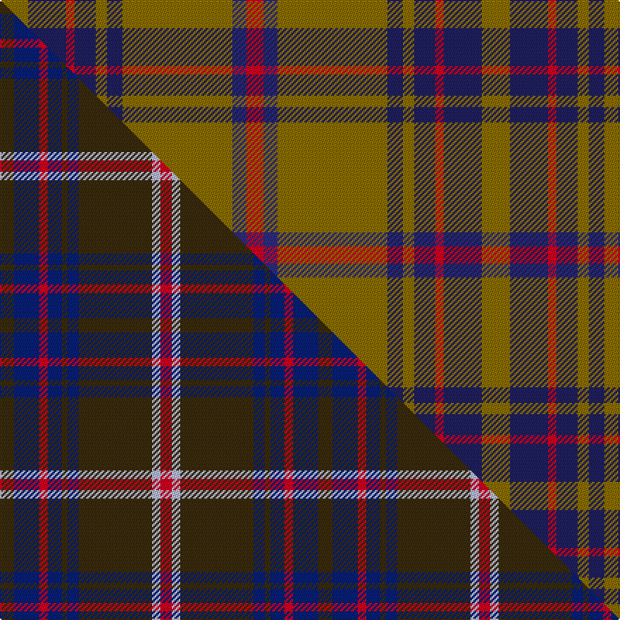

This is one **variant** — a specific cloth: this exact thread count and colourway, with its own
provenance below. It is one weaving of the [sett](/setts/y20db27r6db15y8db11y78dbi10r12/) (the scale-free proportion — the
same cloth at any scale or shade), whose colour order is pattern [GBRBGBGBR](/stripes/gbrbgbgbr/).

Part of the [Bracken](/tartans/bracken/) tartan — the named design grouping this sett with its other cloths.

Sourced from house-of-tartan.  It is a [9 stripe tartan](/stripes/stripes9/).

Original link [http://www.house-of-tartan.scotland.net/house/TartanViewjs.asp?colr=Def&tnam=1449](http://www.house-of-tartan.scotland.net/house/TartanViewjs.asp?colr=Def&tnam=1449)

## Provenance

Earliest known date: pre 1992 Originally spelt 'Braken'.

Dataset <small>— provenance for this record, inherited from the source manifest</small>

<dl class="dataset-prov">
<dt>source</dt><dd><a href="/sources/house-of-tartan/">House of Tartan</a></dd>
<dt>data captured from</dt><dd><a href="https://github.com/thetartan/tartan-database/blob/master/data/house-of-tartan/data.csv">https://github.com/thetartan/tartan-database/blob/master/data/house-of-tartan/data.csv</a></dd>
<dt>data date</dt><dd>pre 1992 <small>(this record)</small></dd>
<dt>licence</dt><dd><a href="https://creativecommons.org/licenses/by-nc-nd/4.0/">CC BY-NC-ND 4.0</a></dd>
</dl>

Capture chain <small>— the hands this data passed through, oldest first; each capture carries its own licence</small>

<ol class="capture-chain">
<li><a href="http://www.house-of-tartan.scotland.net/">House of Tartan</a> <small>the weaver/retailer's database — the site is now offline; the URL is kept as the ultimate source's identity</small></li>
<li><a href="https://github.com/thetartan/tartan-database">thetartan/tartan-database</a> <small>2016-2017</small> · <a href="https://creativecommons.org/licenses/by-nc-nd/4.0/">CC BY-NC-ND 4.0</a> <small>Levko Kravets's frozen compilation — the capture we vendored, and where its CC licence text came from</small></li>
<li>this dictionary <small>captured 2026-06-10 · commit 5bf86c7566</small> <small>each re-capture is a git commit to data/sources</small></li>
</ol>

## Thread count
Y/20 DB27 R6 DB15 Y8 DB11 Y78 DBi10 R/12

One full sett is **342 threads**.

## Palette
<table><thead><tr><th>Colour</th><th>Shade</th><th>OKLCh</th></tr></thead><tbody><tr><td>DB</td><td><code style="background-color:#2C2C80;">#2C2C80</code> <small style="color:#888">#2C2C80</small></td><td><small style="color:#888">oklch(35.0% 0.138 276.6)</small></td></tr><tr><td>DB</td><td><code style="background-color:#202060;">#202060</code> <small style="color:#888">#202060</small></td><td><small style="color:#888">oklch(28.9% 0.111 276.9)</small></td></tr><tr><td>R</td><td><code style="background-color:#D60020;">#D60020</code> <small style="color:#888">#D60020</small></td><td><small style="color:#888">oklch(55.2% 0.224 25.5)</small></td></tr><tr><td>Y</td><td><code style="background-color:#8B6E00;">#8B6E00</code> <small style="color:#888">#8B6E00</small></td><td><small style="color:#888">oklch(55.1% 0.113 90.4)</small></td></tr></tbody></table>

# Sample pattern

## Compared to the master

This cloth is one sett of its design; the master sett (the exemplar the design is anchored on) is below for comparison.

Its **ΔTartan distance** from the master is **0.31** — the same measure the nearest-tartans table ranks by (0 is identical; a re-scale of the same cloth is near 0, a recolour or a different proportion further).

<figure class="master-compare" style="margin:0">

this sett
master sett ★

<figcaption style="color:#888;font-size:smaller">One weave of this sett against the <a href="/setts/dy5db9r3db5dy2db4dy26lb3r4/">master sett ★</a>, split on the diagonal: a shared proportion runs seamlessly across it with only the shades shifting; a different proportion breaks on it.</figcaption>
</figure>

## Nearest tartan variants

The nearest existing variants by ΔTartan distance, with this cloth at the top so the swatches line up against it.

ΔTartan

Threads

Variant

Sett

—

342

<a href="/variants/s9/y20db27r6db15y8db11y78dbi10r12~db1204274-dbi1406275/">Braken Tartan</a>

<a href="/ttd/edit/#slug=y20db27r6db15y8db11y78n10r12~db0805267-n1604274&amp;base=y20db27r6db15y8db11y78dbi10r12~db1204274-dbi1406275" title="compare in the TTD">0.07</a>

342

<a href="/variants/s9/y20db27r6db15y8db11y78dbi10r12~db0805267-dbi1604274/">Bracken</a>

<a href="/ttd/edit/#slug=dy5dt9r3dt5dy2dt4dy26lb3r4~x2~dt1204274&amp;base=y20db27r6db15y8db11y78dbi10r12~db1204274-dbi1406275" title="compare in the TTD">0.31</a>

226

<a href="/variants/s9/dy5db9r3db5dy2db4dy26lb3r4~x2~db1204274/">Bracken</a>

<a href="/ttd/edit/#slug=dy5db9r3db5dy2db4dy26lb3r4~x2&amp;base=y20db27r6db15y8db11y78dbi10r12~db1204274-dbi1406275" title="compare in the TTD">0.32</a>

226

<a href="/variants/s9/dy5db9r3db5dy2db4dy26lb3r4~x2/">Bracken (Fashion)</a>

<a href="/ttd/edit/#slug=r7ri2db2r2g32r6db12r41g2r5ri2g5~x2~r1707016-ri2208029&amp;base=y20db27r6db15y8db11y78dbi10r12~db1204274-dbi1406275" title="compare in the TTD">2.74</a>

448

<a href="/variants/s12/r7ri2db2r2g32r6db12r41g2r5ri2g5~x2~r1707016-ri2208029/">MacDougall #5</a>

<a href="/ttd/edit/#slug=o5b12dg4r4dg27b3dg4o5&amp;base=y20db27r6db15y8db11y78dbi10r12~db1204274-dbi1406275" title="compare in the TTD">2.75</a>

118

<a href="/variants/s8/o5b12dg4r4dg27b3dg4o5/">Daks, Muted Loden</a>

<a href="/ttd/edit/#slug=dy3g1dy15r2dy1r2dy1g7w1g2~x4&amp;base=y20db27r6db15y8db11y78dbi10r12~db1204274-dbi1406275" title="compare in the TTD">2.76</a>

260

<a href="/variants/s10/dy3g1dy15r2dy1r2dy1g7w1g2~x4/">Seton Htg (Clan)</a>

<a href="/ttd/edit/#slug=r3dg14r3ly1r3dp8r3ly1r3dg14r3ly1~x4~r2109032-dg1605139-dp1105325&amp;base=y20db27r6db15y8db11y78dbi10r12~db1204274-dbi1406275" title="compare in the TTD">2.76</a>

440

<a href="/variants/s12/r3dg14r3ly1r3dp8r3ly1r3dg14r3ly1~x4~r2109032-dg1605139-dp1105325/">Wilson's No.213</a>

<a href="/ttd/edit/#slug=o10lb2g3lb2do24lb4do4o34do2lb3do2~x2&amp;base=y20db27r6db15y8db11y78dbi10r12~db1204274-dbi1406275" title="compare in the TTD">2.78</a>

336

<a href="/variants/s11/o10lb2g3lb2do24lb4do4o34do2lb3do2~x2/">Fort William (Fashion)</a>

<a href="/ttd/edit/#slug=o15r5o30db32o4y3~x2&amp;base=y20db27r6db15y8db11y78dbi10r12~db1204274-dbi1406275" title="compare in the TTD">2.78</a>

320

<a href="/variants/s6/o15r5o30db32o4y3~x2/">Cameron, hunting</a>

<a href="/ttd/edit/#slug=db18y2o6y2o19r3~x2&amp;base=y20db27r6db15y8db11y78dbi10r12~db1204274-dbi1406275" title="compare in the TTD">2.85</a>

158

<a href="/variants/s6/db18y2o6y2o19r3~x2/">Balfour blue &amp; brown</a>

## Neighbour map

Every grey dot is one of 13621 variants placed by the first two principal components of the ΔTartan feature space (42% of its variance). Red is this tartan; blue dots are its nearest — click one to open its page.

<svg viewBox="0 0 640 380" role="img" style="max-width:100%;height:auto;border:1px solid #e0e0e0;border-radius:4px;display:block" xmlns="http://www.w3.org/2000/svg"><image href="/nn/cloud.v1.png" width="640" height="380"/><a href="/variants/s9/y20db27r6db15y8db11y78dbi10r12~db0805267-dbi1604274/"><circle cx="325.0" cy="173.3" r="4" fill="#3465a4"><title>Bracken</title></circle></a><a href="/variants/s9/dy5db9r3db5dy2db4dy26lb3r4~x2~db1204274/"><circle cx="361.9" cy="187.0" r="4" fill="#3465a4"><title>Bracken</title></circle></a><a href="/variants/s9/dy5db9r3db5dy2db4dy26lb3r4~x2/"><circle cx="347.3" cy="182.7" r="4" fill="#3465a4"><title>Bracken (Fashion)</title></circle></a><a href="/variants/s12/r7ri2db2r2g32r6db12r41g2r5ri2g5~x2~r1707016-ri2208029/"><circle cx="344.5" cy="134.1" r="4" fill="#3465a4"><title>MacDougall #5</title></circle></a><a href="/variants/s8/o5b12dg4r4dg27b3dg4o5/"><circle cx="321.9" cy="207.3" r="4" fill="#3465a4"><title>Daks, Muted Loden</title></circle></a><a href="/variants/s10/dy3g1dy15r2dy1r2dy1g7w1g2~x4/"><circle cx="351.3" cy="158.0" r="4" fill="#3465a4"><title>Seton Htg (Clan)</title></circle></a><a href="/variants/s12/r3dg14r3ly1r3dp8r3ly1r3dg14r3ly1~x4~r2109032-dg1605139-dp1105325/"><circle cx="300.3" cy="172.2" r="4" fill="#3465a4"><title>Wilson's No.213</title></circle></a><a href="/variants/s11/o10lb2g3lb2do24lb4do4o34do2lb3do2~x2/"><circle cx="342.6" cy="153.8" r="4" fill="#3465a4"><title>Fort William (Fashion)</title></circle></a><a href="/variants/s6/o15r5o30db32o4y3~x2/"><circle cx="339.7" cy="215.1" r="4" fill="#3465a4"><title>Cameron, hunting</title></circle></a><a href="/variants/s6/db18y2o6y2o19r3~x2/"><circle cx="312.7" cy="217.3" r="4" fill="#3465a4"><title>Balfour blue &amp; brown</title></circle></a><circle cx="357.8" cy="183.5" r="5" fill="#c00000"/><text x="320" y="376" text-anchor="middle" font-size="11" fill="#999">ground</text><text x="11" y="190" text-anchor="middle" font-size="11" fill="#999" transform="rotate(-90 11 190)">complexity</text></svg>

ID: /variants/s9/y20db27r6db15y8db11y78dbi10r12~db1204274-dbi1406275/
