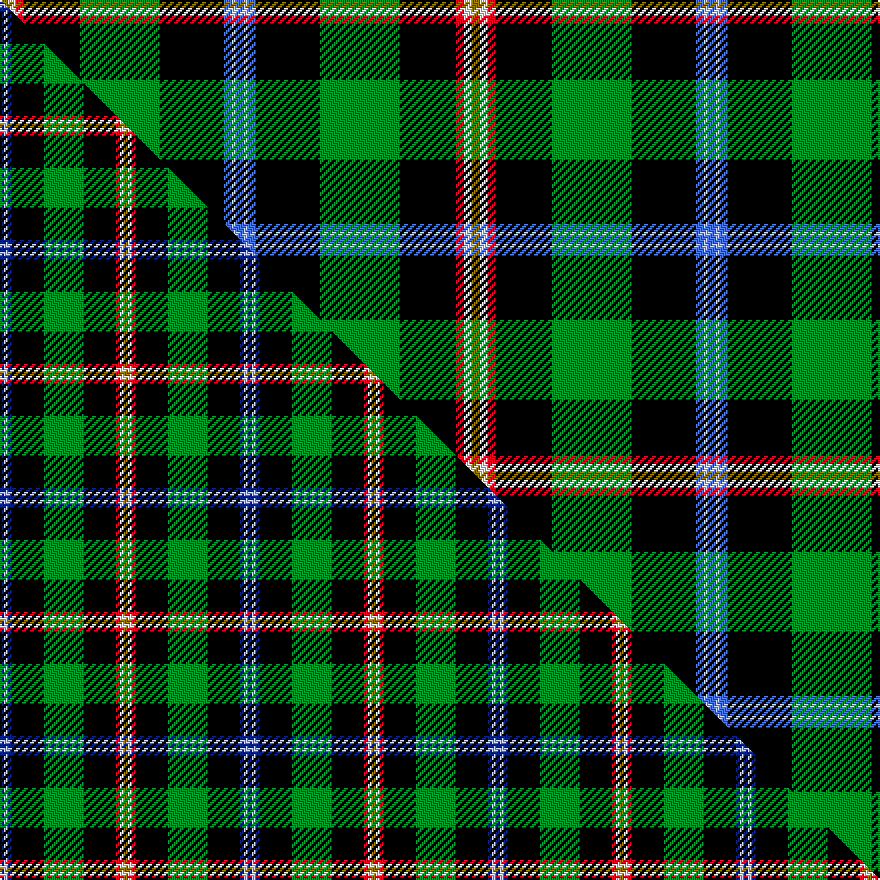

This is one **variant** — a specific cloth: this exact thread count and colourway, with its own
provenance below. It is one weaving of the [sett](/tartans/b/br/brooke/) (the scale-free proportion — the
same cloth at any scale or shade), whose colour order is pattern [BWBKGKRWG](/stripes/bwbkgkrwg/).

Part of the [Brooke](/tartans/b/br/brooke/) tartan — the named design grouping this sett with its other cloths.

Sourced from register-of-tartans.  It is a [9 stripe tartan](/stripes/stripes9/).

Original link [https://www.tartanregister.gov.uk/tartanDetails.aspx?ref=380](https://www.tartanregister.gov.uk/tartanDetails.aspx?ref=380)

2 attestations — the source records this cloth was collapsed from (oldest owns this page)

<ul>
<li>01/01/1993 — Brooke (register-of-tartans, <a href="https://www.tartanregister.gov.uk/tartanDetails.aspx?ref=380">record</a>)  <em>A 2001 D C Dalgliesh version of Brooke (STR #381) supplied in May 2006 by Phil Smith. Brooke entry reads: An 'Irish' tartan. Sindex notes compiled by the Scottish Tartans Society say suggest this is a 17th century Irish tartan obtained from A W Geddes of Kinloch Anderson, Edinburgh.</em></li>
<li>pre 1993 — Brooke (Name) (tartans-authority, <a href="https://web.archive.org/web/*/http://www.tartansauthority.com/tartan-ferret/display/48/*">record</a>)  <em>An "Irish" tartan. J Dalgety letter 26/3/93. Other source states that it was devised by 'historian', Angela Nisbett, to give some impression of this rare example of an Irish tartan. Sindex notes say that this is allegedly a 17th century Irish tartan the sett of which was obtained from A W Geddes of Kinloch Anderson, Edinburgh. An extremely dubious claim since there is no historical evidence of any Irish clan/family tartans. An interesting note in YTom Sinclair's Scrapbook: "In the 17th century Lord Montgomery in Armagh (who had an interest in Scottish Woollen Mills) started a factory in N. Ireland weaving tartans at a cheaper rate (lower wages) and some of his Irish and Anglo Irish friends desired some, so he invented such as Duke of Leinster, Brooke, Montgomery etc." The accompanying graphic of the Brooke shows only one white line on the blue. The note says that the Brooke was the same as the old Montgomery sett but none of them appear close to this except a West Coast Woolen Mill pattern - #5670.</em></li>
</ul>

Dataset <small>— provenance for this record, inherited from the source manifest</small>

<dl class="dataset-prov">
<dt>source</dt><dd><a href="/sources/register-of-tartans/">Scottish Register of Tartans</a></dd>
<dt>data captured from</dt><dd><a href="https://github.com/thetartan/tartan-database/blob/master/data/register-of-tartans/data.csv">https://github.com/thetartan/tartan-database/blob/master/data/register-of-tartans/data.csv</a></dd>
<dt>data date</dt><dd>1993 <small>(this record)</small></dd>
<dt>licence</dt><dd><a href="https://www.tartanregister.gov.uk/copyright">Crown copyright</a></dd>
</dl>

Capture chain <small>— the hands this data passed through, oldest first; each capture carries its own licence</small>

<ol class="capture-chain">
<li><a href="https://www.tartanregister.gov.uk/">Scottish Register of Tartans</a> · <a href="https://www.tartanregister.gov.uk/copyright">Crown copyright</a> <small>the living register — still published by National Records of Scotland</small></li>
<li><a href="https://github.com/thetartan/tartan-database">thetartan/tartan-database</a> <small>2016-2017</small> · <a href="https://creativecommons.org/licenses/by-nc-nd/4.0/">CC BY-NC-ND 4.0</a> <small>Levko Kravets's frozen compilation — the capture we vendored, and where its CC licence text came from</small></li>
<li>this dictionary <small>captured 2026-06-10 · commit 5bf86c7566</small> <small>each re-capture is a git commit to data/sources</small></li>
</ol>

## Register references

External register numbers recorded for this tartan.

- Scottish Register of Tartans: [380](https://www.tartanregister.gov.uk/tartanDetails.aspx?ref=380)
- Scottish Tartans Authority (ITI): 48
- Scottish Tartans World Register: 48

## Thread count
Y/4 W4 R4 K28 G40 K32 B4 LB2 B/4

One full sett is **236 threads**.

## Palette
<table><thead><tr><th>Colour</th><th>Shade</th><th>OKLCh</th></tr></thead><tbody><tr><td>B</td><td><code style="background-color:#466CC8;">#466CC8</code> <small style="color:#888">#466CC8</small></td><td><small style="color:#888">oklch(55.1% 0.149 265.0)</small></td></tr><tr><td>R</td><td><code style="background-color:#D60020;">#D60020</code> <small style="color:#888">#D60020</small></td><td><small style="color:#888">oklch(55.2% 0.224 25.5)</small></td></tr><tr><td>G</td><td><code style="background-color:#008B2A;">#008B2A</code> <small style="color:#888">#008B2A</small></td><td><small style="color:#888">oklch(55.4% 0.170 145.9)</small></td></tr><tr><td>K</td><td><code style="background-color:#000000;">#000000</code> <small style="color:#888">#000000</small></td><td><small style="color:#888">oklch(0.0% 0.000 0.0)</small></td></tr><tr><td>LB</td><td><code style="background-color:#B5BBDE;">#B5BBDE</code> <small style="color:#888">#B5BBDE</small></td><td><small style="color:#888">oklch(79.9% 0.050 277.6)</small></td></tr><tr><td>W</td><td><code style="background-color:#F7F7F7;">#F7F7F7</code> <small style="color:#888">#F7F7F7</small></td><td><small style="color:#888">oklch(97.6% 0.000 89.9)</small></td></tr><tr><td>Y</td><td><code style="background-color:#8B6E00;">#8B6E00</code> <small style="color:#888">#8B6E00</small></td><td><small style="color:#888">oklch(55.1% 0.113 90.4)</small></td></tr></tbody></table>

# Sample pattern

## Compared to the master

This cloth is one sett of its design; the master sett (the exemplar the design is anchored on) is below for comparison.

Its **ΔTartan distance** from the master is **0.53** — the same measure the nearest-tartans table ranks by (0 is identical; a re-scale of the same cloth is near 0, a recolour or a different proportion further).

<figure class="master-compare" style="margin:0">

this sett
master sett ★

<figcaption style="color:#888;font-size:smaller">One weave of this sett against the <a href="/setts/db1lb1db1k8g10k8r1w1y1/">master sett ★</a>, split on the diagonal: a shared proportion runs seamlessly across it with only the shades shifting; a different proportion breaks on it.</figcaption>
</figure>

## Nearest tartan variants

The nearest existing variants by ΔTartan distance, with this cloth at the top so the swatches line up against it.

ΔTartan

Threads

Variant

Sett

—

236

<a href="/variants/s9/y2w2r2k14g20k16b2lb1b2~x2/">Brooke</a>

<a href="/ttd/edit/#slug=db1lb1db1k8g10k8r1w1y1~x2&amp;base=y2w2r2k14g20k16b2lb1b2~x2" title="compare in the TTD">0.53</a>

124

<a href="/variants/s9/db1lb1db1k8g10k8r1w1y1~x2/">Brooke (D.C.Dalgliesh version)</a>

<a href="/ttd/edit/#slug=dp6k2ly6k60g60r6k25y4k2w6&amp;base=y2w2r2k14g20k16b2lb1b2~x2" title="compare in the TTD">1.86</a>

342

<a href="/variants/s10/dp6k2ly6k60g60r6k25y4k2w6/">US Army Civil Affairs</a>

<a href="/ttd/edit/#slug=g32r3do12t3ly3t3k48lb2k4~x2&amp;base=y2w2r2k14g20k16b2lb1b2~x2" title="compare in the TTD">1.99</a>

368

<a href="/variants/s9/g32r3do12t3ly3t3k48lb2k4~x2/">Webster (Name)</a>

<a href="/ttd/edit/#slug=g32r3do12t3ly3t3k48lb2k4~x2~lb3300000&amp;base=y2w2r2k14g20k16b2lb1b2~x2" title="compare in the TTD">2.00</a>

368

<a href="/variants/s9/g32r3do12t3ly3t3k48lb2k4~x2~lb3300000/">Webster</a>

<a href="/ttd/edit/#slug=y1k6g32k12dr12dp9db6w1~x2&amp;base=y2w2r2k14g20k16b2lb1b2~x2" title="compare in the TTD">2.10</a>

312

<a href="/variants/s8/y1k6g32k12dr12dp9db6w1~x2/">Fujitsu</a>

<a href="/ttd/edit/#slug=w5k26ly2g24db8k4r3~x2&amp;base=y2w2r2k14g20k16b2lb1b2~x2" title="compare in the TTD">2.41</a>

272

<a href="/variants/s7/w5k26ly2g24db8k4r3~x2/">Cornish Htg (District)</a>

<a href="/ttd/edit/#slug=r3k11dg29k28g19y2db1~x2~dg1504144-g2408144&amp;base=y2w2r2k14g20k16b2lb1b2~x2" title="compare in the TTD">2.44</a>

364

<a href="/variants/s7/r3k11dg29k28g19y2db1~x2~dg1504144-g2408144/">PMMC</a>

<a href="/ttd/edit/#slug=r3k11dg29k28g19ly2db1~x2~dg1806142-g2408144&amp;base=y2w2r2k14g20k16b2lb1b2~x2" title="compare in the TTD">2.45</a>

364

<a href="/variants/s7/r3k11dg29k28g19ly2db1~x2~dg1806142-g2408144/">PMMC</a>

<a href="/ttd/edit/#slug=w5k26y2dg24db7k3r3~x2&amp;base=y2w2r2k14g20k16b2lb1b2~x2" title="compare in the TTD">2.48</a>

264

<a href="/variants/s7/w5k26y2dg24db7k3r3~x2/">Cornish Hunting District Tartan</a>

<a href="/ttd/edit/#slug=w5k26y2dg24ki7k3r3~x2~ki0604259&amp;base=y2w2r2k14g20k16b2lb1b2~x2" title="compare in the TTD">2.49</a>

264

<a href="/variants/s7/w5k26y2dg24ki7k3r3~x2~ki0604259/">Cornish, hunting</a>

## Neighbour map

Every grey dot is one of 13656 variants placed by the first two principal components of the ΔTartan feature space (42% of its variance). Red is this tartan; blue dots are its nearest — click one to open its page. The map is a flat projection of a many-dimensional space — [how to read it](/posts/neighbourhood-maps/).

<svg viewBox="0 0 640 380" role="img" style="max-width:100%;height:auto;border:1px solid #e0e0e0;border-radius:4px;display:block" xmlns="http://www.w3.org/2000/svg"><image href="/nn/cloud.v1.png" width="640" height="380"/><a href="/variants/s9/db1lb1db1k8g10k8r1w1y1~x2/"><circle cx="154.6" cy="116.3" r="4" fill="#3465a4"><title>Brooke (D.C.Dalgliesh version)</title></circle></a><a href="/variants/s10/dp6k2ly6k60g60r6k25y4k2w6/"><circle cx="200.6" cy="56.5" r="4" fill="#3465a4"><title>US Army Civil Affairs</title></circle></a><a href="/variants/s9/g32r3do12t3ly3t3k48lb2k4~x2/"><circle cx="182.4" cy="72.0" r="4" fill="#3465a4"><title>Webster (Name)</title></circle></a><a href="/variants/s9/g32r3do12t3ly3t3k48lb2k4~x2~lb3300000/"><circle cx="182.2" cy="71.9" r="4" fill="#3465a4"><title>Webster</title></circle></a><a href="/variants/s8/y1k6g32k12dr12dp9db6w1~x2/"><circle cx="147.7" cy="94.7" r="4" fill="#3465a4"><title>Fujitsu</title></circle></a><a href="/variants/s7/w5k26ly2g24db8k4r3~x2/"><circle cx="133.0" cy="139.3" r="4" fill="#3465a4"><title>Cornish Htg (District)</title></circle></a><a href="/variants/s7/r3k11dg29k28g19y2db1~x2~dg1504144-g2408144/"><circle cx="175.2" cy="122.2" r="4" fill="#3465a4"><title>PMMC</title></circle></a><a href="/variants/s7/r3k11dg29k28g19ly2db1~x2~dg1806142-g2408144/"><circle cx="167.6" cy="121.0" r="4" fill="#3465a4"><title>PMMC</title></circle></a><a href="/variants/s7/w5k26y2dg24db7k3r3~x2/"><circle cx="154.3" cy="138.7" r="4" fill="#3465a4"><title>Cornish Hunting District Tartan</title></circle></a><a href="/variants/s7/w5k26y2dg24ki7k3r3~x2~ki0604259/"><circle cx="150.6" cy="135.6" r="4" fill="#3465a4"><title>Cornish, hunting</title></circle></a><circle cx="174.5" cy="89.4" r="5" fill="#c00000"/><text x="320" y="376" text-anchor="middle" font-size="11" fill="#999">ground</text><text x="11" y="190" text-anchor="middle" font-size="11" fill="#999" transform="rotate(-90 11 190)">complexity</text></svg>

ID: /variants/s9/y2w2r2k14g20k16b2lb1b2~x2/
