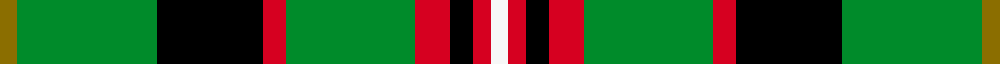

This page is one **sett** — a single exact thread-count. It belongs to the [tartan](/setts/y3g24k18r4g22r6k4r3w3/)
(the same proportion at any scale), whose colour order is pattern [GGKRGRKRW](/stripes/ggkrgrkrw/).

Sourced from register-of-tartans.  It is a [9 stripe tartan](/stripes/stripes9/).

Original link https://www.tartanregister.gov.uk/tartanDetails.aspx?ref=395

2 attestations — the source records this cloth was collapsed from (oldest owns this page)

<ul>
<li>01/01/2002 — Brown, George (register-of-tartans, <a href="https://www.tartanregister.gov.uk/tartanDetails.aspx?ref=395">record</a>)  <em>George Brown (1818-1880) was one of the 'Fathers' of the Confederation. He was born in Alloa, Scotland, established the Toronto Globe newspaper and was MP for Canada West (Ontario). Scottish Tartans Society note the Sainthill-Levine Company who produced a whole range of 'Canadiana tartans'.</em></li>
<li>pre 2002 — Brown, George (Commemorative) (tartans-authority, <a href="http://www.tartansauthority.com/tartan-ferret/display/1853/">record</a>)  <em>1818 - 1880. One of the Fathers of the Confederation. Born in Alloa, Scotland. Formed Toronto Globe newspaper and was MP for Canada West (Ontario). Sample in STA Johnston Collection. STS notes mention Sainthill-Levine Co. who produced this whole range of "Canadiana tartans."</em></li>
</ul>

## Register references

External register numbers recorded for this tartan.

- Scottish Register of Tartans: [395](https://www.tartanregister.gov.uk/tartanDetails.aspx?ref=395)
- Scottish Tartans Authority (ITI): 1853
- Scottish Tartans World Register: 1853

## Thread count
Y/6 G48 K36 R8 G44 R12 K8 R6 W/6

One full sett is **336 threads**.

## Palette
<table><thead><tr><th>Colour</th><th>Shade</th><th>OKLCh</th></tr></thead><tbody><tr><td>G</td><td><code style="background-color:#008B2A;">#008B2A</code> <small style="color:#888">#008B2A</small></td><td><small style="color:#888">oklch(55.4% 0.170 145.9)</small></td></tr><tr><td>K</td><td><code style="background-color:#000000;">#000000</code> <small style="color:#888">#000000</small></td><td><small style="color:#888">oklch(0.0% 0.000 0.0)</small></td></tr><tr><td>R</td><td><code style="background-color:#D60020;">#D60020</code> <small style="color:#888">#D60020</small></td><td><small style="color:#888">oklch(55.2% 0.224 25.5)</small></td></tr><tr><td>W</td><td><code style="background-color:#F7F7F7;">#F7F7F7</code> <small style="color:#888">#F7F7F7</small></td><td><small style="color:#888">oklch(97.6% 0.000 89.9)</small></td></tr><tr><td>Y</td><td><code style="background-color:#8B6E00;">#8B6E00</code> <small style="color:#888">#8B6E00</small></td><td><small style="color:#888">oklch(55.1% 0.113 90.4)</small></td></tr></tbody></table>

# Sample pattern

## Nearest variants

The nearest existing variants by ΔTartan distance, with this cloth at the top so the swatches line up against it.

ΔTartan

Threads

Variant

Sett

—

336

<a href="/variants/s9/y3g24k18r4g22r6k4r3w3~x2/">Brown, George</a>

<a href="/ttd/edit/#slug=db4g17lb3r3lb3k19y2g17r4~x2&amp;base=y3g24k18r4g22r6k4r3w3~x2" title="compare in the TTD">2.57</a>

272

<a href="/variants/s9/db4g17lb3r3lb3k19y2g17r4~x2/">Wilson's, No 33</a>

<a href="/ttd/edit/#slug=db4g17lb3r3lb3k19w2g17r4~x2&amp;base=y3g24k18r4g22r6k4r3w3~x2" title="compare in the TTD">2.57</a>

272

<a href="/variants/s9/db4g17lb3r3lb3k19w2g17r4~x2/">Wilson's, No 2/33</a>

<a href="/ttd/edit/#slug=dr3g32k4g4k11db3k7dr4w3&amp;base=y3g24k18r4g22r6k4r3w3~x2" title="compare in the TTD">2.57</a>

136

<a href="/variants/s9/dr3g32k4g4k11db3k7dr4w3/">Derick Wardrope (Portobello) (Personal)</a>

<a href="/ttd/edit/#slug=r3g24k28g19y3g3y3~x2&amp;base=y3g24k18r4g22r6k4r3w3~x2" title="compare in the TTD">2.61</a>

320

<a href="/variants/s7/r3g24k28g19y3g3y3~x2/">Paton</a>

<a href="/ttd/edit/#slug=k17g48y4r10db12g4&amp;base=y3g24k18r4g22r6k4r3w3~x2" title="compare in the TTD">2.63</a>

169

<a href="/variants/s6/k17g48y4r10db12g4/">Asheville Firefighters, The</a>

<a href="/ttd/edit/#slug=g23r3k9r3db18r3k9r3g23y3~x2~db1406275&amp;base=y3g24k18r4g22r6k4r3w3~x2" title="compare in the TTD">2.75</a>

336

<a href="/variants/s10/g23r3k9r3db18r3k9r3g23y3~x2~db1406275/">Royal College of Physicians Corporate Tartan</a>

<a href="/ttd/edit/#slug=k6r2k2r2k6db7g20ly2g3r2~x2&amp;base=y3g24k18r4g22r6k4r3w3~x2" title="compare in the TTD">2.81</a>

192

<a href="/variants/s10/k6r2k2r2k6db7g20ly2g3r2~x2/">Connolly Hunting (Name)</a>

<a href="/ttd/edit/#slug=k6r2k2r2k6db7g20y2g3r2~x2&amp;base=y3g24k18r4g22r6k4r3w3~x2" title="compare in the TTD">2.81</a>

192

<a href="/variants/s10/k6r2k2r2k6db7g20y2g3r2~x2/">Connolly Hunting</a>

<a href="/ttd/edit/#slug=db5r19k2g8r3g18k2g9k2~x2&amp;base=y3g24k18r4g22r6k4r3w3~x2" title="compare in the TTD">2.84</a>

258

<a href="/variants/s9/db5r19k2g8r3g18k2g9k2~x2/">Hubbard (2016)</a>

<a href="/ttd/edit/#slug=dr3k2dr3g12dr3w1dr1g1~x4&amp;base=y3g24k18r4g22r6k4r3w3~x2" title="compare in the TTD">2.85</a>

192

<a href="/variants/s8/dr3k2dr3g12dr3w1dr1g1~x4/">MacCall/McCall</a>

## Neighbour map

Every grey dot is one of 13620 variants placed by the first two principal components of the ΔTartan feature space (42% of its variance). Red is this tartan; blue dots are its nearest — click one to open its page.

<svg viewBox="0 0 640 380" role="img" style="max-width:100%;height:auto;border:1px solid #e0e0e0;border-radius:4px;display:block" xmlns="http://www.w3.org/2000/svg"><image href="/nn/cloud.v1.png" width="640" height="380"/><a href="/variants/s9/db4g17lb3r3lb3k19y2g17r4~x2/"><circle cx="143.1" cy="150.3" r="4" fill="#3465a4"><title>Wilson's, No 33</title></circle></a><a href="/variants/s9/db4g17lb3r3lb3k19w2g17r4~x2/"><circle cx="149.4" cy="155.9" r="4" fill="#3465a4"><title>Wilson's, No 2/33</title></circle></a><a href="/variants/s9/dr3g32k4g4k11db3k7dr4w3/"><circle cx="204.4" cy="139.4" r="4" fill="#3465a4"><title>Derick Wardrope (Portobello) (Personal)</title></circle></a><a href="/variants/s7/r3g24k28g19y3g3y3~x2/"><circle cx="247.6" cy="185.7" r="4" fill="#3465a4"><title>Paton</title></circle></a><a href="/variants/s6/k17g48y4r10db12g4/"><circle cx="233.1" cy="166.9" r="4" fill="#3465a4"><title>Asheville Firefighters, The</title></circle></a><a href="/variants/s10/g23r3k9r3db18r3k9r3g23y3~x2~db1406275/"><circle cx="158.4" cy="171.4" r="4" fill="#3465a4"><title>Royal College of Physicians Corporate Tartan</title></circle></a><a href="/variants/s10/k6r2k2r2k6db7g20ly2g3r2~x2/"><circle cx="153.0" cy="143.1" r="4" fill="#3465a4"><title>Connolly Hunting (Name)</title></circle></a><a href="/variants/s10/k6r2k2r2k6db7g20y2g3r2~x2/"><circle cx="156.6" cy="144.1" r="4" fill="#3465a4"><title>Connolly Hunting</title></circle></a><a href="/variants/s9/db5r19k2g8r3g18k2g9k2~x2/"><circle cx="233.5" cy="180.0" r="4" fill="#3465a4"><title>Hubbard (2016)</title></circle></a><a href="/variants/s8/dr3k2dr3g12dr3w1dr1g1~x4/"><circle cx="267.2" cy="167.6" r="4" fill="#3465a4"><title>MacCall/McCall</title></circle></a><circle cx="187.7" cy="165.3" r="5" fill="#c00000"/><text x="320" y="376" text-anchor="middle" font-size="11" fill="#999">ground</text><text x="11" y="190" text-anchor="middle" font-size="11" fill="#999" transform="rotate(-90 11 190)">complexity</text></svg>

ID: /variants/s9/y3g24k18r4g22r6k4r3w3~x2/
