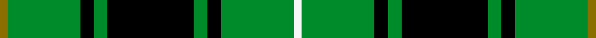
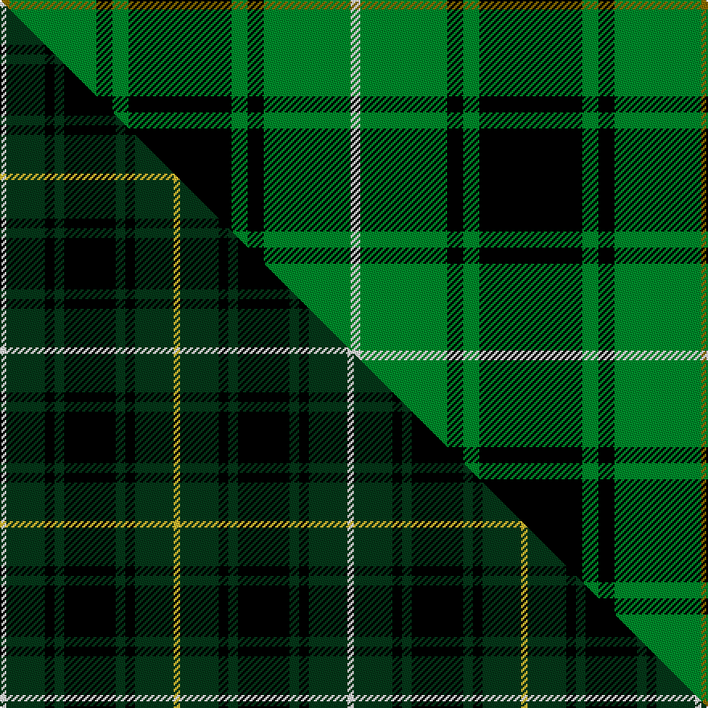

This is one **variant** — a specific cloth: this exact thread count and colourway, with its own
provenance below. It is one weaving of the [sett](/setts/y3g27k5g5k32g5k5g27w3/) (the scale-free proportion — the
same cloth at any scale or shade), whose colour order is pattern [GGKGKGKGW](/stripes/ggkgkgkgw/).

Part of the [MacIver Hunting](/tartans/m/ma/maciver-hunting/) tartan — the named design grouping this sett with its other cloths.

Sourced from weddslist.  It is a [9 stripe tartan](/stripes/stripes9/).

Original link [http://www.weddslist.com/cgi-bin/tartans/pg.pl?source=sts](http://www.weddslist.com/cgi-bin/tartans/pg.pl?source=sts)

Dataset <small>— provenance for this record, inherited from the source manifest</small>

<dl class="dataset-prov">
<dt>source</dt><dd><a href="/sources/weddslist/">Weddslist</a></dd>
<dt>data captured from</dt><dd><a href="https://github.com/thetartan/tartan-database/blob/master/data/weddslist/data.csv">https://github.com/thetartan/tartan-database/blob/master/data/weddslist/data.csv</a></dd>
<dt>data date</dt><dd>2016-11-17 <small>(dataset default)</small></dd>
<dt>licence</dt><dd><a href="https://creativecommons.org/licenses/by-nc-nd/4.0/">CC BY-NC-ND 4.0</a></dd>
</dl>

Capture chain <small>— the hands this data passed through, oldest first; each capture carries its own licence</small>

<ol class="capture-chain">
<li><a href="https://www.weddslist.com/tartans/">Weddslist</a> <small>the living privately compiled reference</small></li>
<li><a href="https://github.com/thetartan/tartan-database">thetartan/tartan-database</a> <small>2016-2017</small> · <a href="https://creativecommons.org/licenses/by-nc-nd/4.0/">CC BY-NC-ND 4.0</a> <small>Levko Kravets's frozen compilation — the capture we vendored, and where its CC licence text came from</small></li>
<li>this dictionary <small>captured 2026-06-10 · commit 5bf86c7566</small> <small>each re-capture is a git commit to data/sources</small></li>
</ol>

## Thread count
Y/6 G54 K10 G10 K64 G10 K10 G54 W/6

One full sett is **436 threads**.

## Palette
<table><thead><tr><th>Colour</th><th>Shade</th><th>OKLCh</th></tr></thead><tbody><tr><td>G</td><td><code style="background-color:#008B2A;">#008B2A</code> <small style="color:#888">#008B2A</small></td><td><small style="color:#888">oklch(55.4% 0.170 145.9)</small></td></tr><tr><td>K</td><td><code style="background-color:#000000;">#000000</code> <small style="color:#888">#000000</small></td><td><small style="color:#888">oklch(0.0% 0.000 0.0)</small></td></tr><tr><td>W</td><td><code style="background-color:#F7F7F7;">#F7F7F7</code> <small style="color:#888">#F7F7F7</small></td><td><small style="color:#888">oklch(97.6% 0.000 89.9)</small></td></tr><tr><td>Y</td><td><code style="background-color:#8B6E00;">#8B6E00</code> <small style="color:#888">#8B6E00</small></td><td><small style="color:#888">oklch(55.1% 0.113 90.4)</small></td></tr></tbody></table>

# Sample pattern

## Compared to the master

This cloth is one sett of its design; the master sett (the exemplar the design is anchored on) is below for comparison.

Its **ΔTartan distance** from the master is **0.49** — the same measure the nearest-tartans table ranks by (0 is identical; a re-scale of the same cloth is near 0, a recolour or a different proportion further).

<figure class="master-compare" style="margin:0">

this sett
master sett ★

<figcaption style="color:#888;font-size:smaller">One weave of this sett against the <a href="/setts/w2dg12k3dg3k16dg3k3dg12ly2/">master sett ★</a>, split on the diagonal: a shared proportion runs seamlessly across it with only the shades shifting; a different proportion breaks on it.</figcaption>
</figure>

## Nearest tartan variants

The nearest existing variants by ΔTartan distance, with this cloth at the top so the swatches line up against it.

ΔTartan

Threads

Variant

Sett

—

436

<a href="/variants/s9/y3g27k5g5k32g5k5g27w3~x2/">MacIver hunting</a>

<a href="/ttd/edit/#slug=dr3g20k20g20lo2g2lo2~x2&amp;base=y3g27k5g5k32g5k5g27w3~x2" title="compare in the TTD">1.56</a>

266

<a href="/variants/s7/dr3g20k20g20lo2g2lo2~x2/">Paton (Personal)</a>

<a href="/ttd/edit/#slug=r3g24k28g19y3g3y3~x2&amp;base=y3g27k5g5k32g5k5g27w3~x2" title="compare in the TTD">1.64</a>

320

<a href="/variants/s7/r3g24k28g19y3g3y3~x2/">Paton Family Tartan</a>

<a href="/ttd/edit/#slug=k8g4r1k2g16ly1k8g2k2g4~x4&amp;base=y3g27k5g5k32g5k5g27w3~x2" title="compare in the TTD">1.85</a>

336

<a href="/variants/s10/k8g4r1k2g16ly1k8g2k2g4~x4/">Manitoba Cue (Corporate)</a>

<a href="/ttd/edit/#slug=k8g4r1k2g16dy1k8g2k2g4~x4&amp;base=y3g27k5g5k32g5k5g27w3~x2" title="compare in the TTD">1.85</a>

336

<a href="/variants/s10/k8g4r1k2g16dy1k8g2k2g4~x4/">Manitoba Cue Sports</a>

<a href="/ttd/edit/#slug=r4g4k2g31k10y3g5k11g6k3~x2&amp;base=y3g27k5g5k32g5k5g27w3~x2" title="compare in the TTD">1.91</a>

302

<a href="/variants/s10/r4g4k2g31k10y3g5k11g6k3~x2/">MacArthur-Fox Green</a>

<a href="/ttd/edit/#slug=g6k16r3k16g28k4g12w3~x2&amp;base=y3g27k5g5k32g5k5g27w3~x2" title="compare in the TTD">1.94</a>

334

<a href="/variants/s8/g6k16r3k16g28k4g12w3~x2/">MacAulay of Lewis</a>

<a href="/ttd/edit/#slug=g5k15g5k15g19r2g13lb4~x2&amp;base=y3g27k5g5k32g5k5g27w3~x2" title="compare in the TTD">2.18</a>

294

<a href="/variants/s8/g5k15g5k15g19r2g13lb4~x2/">Strath Hallidale (Fashion)</a>

<a href="/ttd/edit/#slug=k8w3k8g4k4g32k4g32k4g4k8w3k8lb4~x2&amp;base=y3g27k5g5k32g5k5g27w3~x2" title="compare in the TTD">2.18</a>

480

<a href="/variants/s14/k8w3k8g4k4g32k4g32k4g4k8w3k8lb4~x2/">Hartmann (Personal)</a>

<a href="/ttd/edit/#slug=k3w7g3k16g17w1g8k1~x2&amp;base=y3g27k5g5k32g5k5g27w3~x2" title="compare in the TTD">2.20</a>

216

<a href="/variants/s8/k3w7g3k16g17w1g8k1~x2/">Utah Valley University</a>

<a href="/ttd/edit/#slug=k4g32k4g4k8w3k8lb4~x2&amp;base=y3g27k5g5k32g5k5g27w3~x2" title="compare in the TTD">2.23</a>

252

<a href="/variants/s8/k4g32k4g4k8w3k8lb4~x2/">Hartmann (Personal)</a>

## Neighbour map

Every grey dot is one of 13621 variants placed by the first two principal components of the ΔTartan feature space (42% of its variance). Red is this tartan; blue dots are its nearest — click one to open its page.

<svg viewBox="0 0 640 380" role="img" style="max-width:100%;height:auto;border:1px solid #e0e0e0;border-radius:4px;display:block" xmlns="http://www.w3.org/2000/svg"><image href="/nn/cloud.v1.png" width="640" height="380"/><a href="/variants/s7/dr3g20k20g20lo2g2lo2~x2/"><circle cx="277.2" cy="183.3" r="4" fill="#3465a4"><title>Paton (Personal)</title></circle></a><a href="/variants/s7/r3g24k28g19y3g3y3~x2/"><circle cx="247.7" cy="186.2" r="4" fill="#3465a4"><title>Paton Family Tartan</title></circle></a><a href="/variants/s10/k8g4r1k2g16ly1k8g2k2g4~x4/"><circle cx="261.0" cy="145.6" r="4" fill="#3465a4"><title>Manitoba Cue (Corporate)</title></circle></a><a href="/variants/s10/k8g4r1k2g16dy1k8g2k2g4~x4/"><circle cx="263.3" cy="146.2" r="4" fill="#3465a4"><title>Manitoba Cue Sports</title></circle></a><a href="/variants/s10/r4g4k2g31k10y3g5k11g6k3~x2/"><circle cx="276.7" cy="139.4" r="4" fill="#3465a4"><title>MacArthur-Fox Green</title></circle></a><a href="/variants/s8/g6k16r3k16g28k4g12w3~x2/"><circle cx="219.3" cy="188.3" r="4" fill="#3465a4"><title>MacAulay of Lewis</title></circle></a><a href="/variants/s8/g5k15g5k15g19r2g13lb4~x2/"><circle cx="218.3" cy="204.1" r="4" fill="#3465a4"><title>Strath Hallidale (Fashion)</title></circle></a><a href="/variants/s14/k8w3k8g4k4g32k4g32k4g4k8w3k8lb4~x2/"><circle cx="249.0" cy="138.7" r="4" fill="#3465a4"><title>Hartmann (Personal)</title></circle></a><a href="/variants/s8/k3w7g3k16g17w1g8k1~x2/"><circle cx="229.6" cy="168.3" r="4" fill="#3465a4"><title>Utah Valley University</title></circle></a><a href="/variants/s8/k4g32k4g4k8w3k8lb4~x2/"><circle cx="242.6" cy="158.8" r="4" fill="#3465a4"><title>Hartmann (Personal)</title></circle></a><circle cx="261.1" cy="166.4" r="5" fill="#c00000"/><text x="320" y="376" text-anchor="middle" font-size="11" fill="#999">ground</text><text x="11" y="190" text-anchor="middle" font-size="11" fill="#999" transform="rotate(-90 11 190)">complexity</text></svg>

ID: /variants/s9/y3g27k5g5k32g5k5g27w3~x2/
