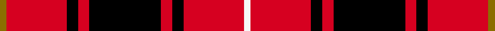
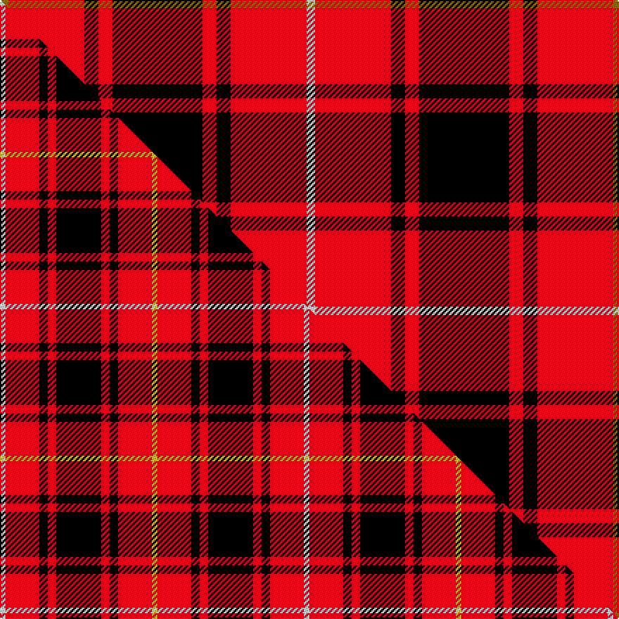

This page is one **sett** — a single exact thread-count. It belongs to the [tartan](/setts/y3r27k5r5k32r5k5r27w3/)
(the same proportion at any scale), whose colour order is pattern [GRKRKRKRW](/stripes/grkrkrkrw/).

Part of the [MacIver](/tartans/maciver/) tartan — the named design grouping this sett with its other cloths.

Sourced from register-of-tartans.  It is a [9 stripe tartan](/stripes/stripes9/).

Original link https://www.tartanregister.gov.uk/tartanDetails.aspx?ref=2490

2 attestations — the source records this cloth was collapsed from (oldest owns this page)

<ul>
<li>undated — MacIver #2 (register-of-tartans, <a href="https://www.tartanregister.gov.uk/tartanDetails.aspx?ref=2490">record</a>)  <em>Recorded in reverse order in error. Similar colours to WRK:YRG. W.& A.K Johnston The Tartans and the Septs of Scotland. 1906.</em></li>
<li>undated — MacIver (weddslist, <a href="http://www.weddslist.com/cgi-bin/tartans/pg.pl?source=sts">record</a>) </li>
</ul>

Dataset <small>— provenance for this record, inherited from the source manifest</small>

<dl class="dataset-prov">
<dt>source</dt><dd><a href="/sources/register-of-tartans/">Scottish Register of Tartans</a></dd>
<dt>data captured from</dt><dd><a href="https://github.com/thetartan/tartan-database/blob/master/data/register-of-tartans/data.csv">https://github.com/thetartan/tartan-database/blob/master/data/register-of-tartans/data.csv</a></dd>
<dt>data date</dt><dd>2017-01-06 <small>(dataset default)</small></dd>
<dt>licence</dt><dd><a href="https://www.tartanregister.gov.uk/copyright">Crown copyright</a></dd>
</dl>

Capture chain <small>— the hands this data passed through, oldest first; each capture carries its own licence</small>

<ol class="capture-chain">
<li><a href="https://www.tartanregister.gov.uk/">Scottish Register of Tartans</a> · <a href="https://www.tartanregister.gov.uk/copyright">Crown copyright</a> <small>the living register — still published by National Records of Scotland</small></li>
<li><a href="https://github.com/thetartan/tartan-database">thetartan/tartan-database</a> <small>2016-2017</small> · <a href="https://creativecommons.org/licenses/by-nc-nd/4.0/">CC BY-NC-ND 4.0</a> <small>Levko Kravets's frozen compilation — the capture we vendored, and where its CC licence text came from</small></li>
<li>this dictionary <small>captured 2026-06-10 · commit 5bf86c7566</small> <small>each re-capture is a git commit to data/sources</small></li>
</ol>

## Register references

External register numbers recorded for this tartan.

- Scottish Register of Tartans: [2490](https://www.tartanregister.gov.uk/tartanDetails.aspx?ref=2490)
- Scottish Tartans World Register: 1203

## Thread count
Y/6 R54 K10 R10 K64 R10 K10 R54 W/6

One full sett is **436 threads**.

## Palette
<table><thead><tr><th>Colour</th><th>Shade</th><th>OKLCh</th></tr></thead><tbody><tr><td>K</td><td><code style="background-color:#000000;">#000000</code> <small style="color:#888">#000000</small></td><td><small style="color:#888">oklch(0.0% 0.000 0.0)</small></td></tr><tr><td>W</td><td><code style="background-color:#F7F7F7;">#F7F7F7</code> <small style="color:#888">#F7F7F7</small></td><td><small style="color:#888">oklch(97.6% 0.000 89.9)</small></td></tr><tr><td>R</td><td><code style="background-color:#D60020;">#D60020</code> <small style="color:#888">#D60020</small></td><td><small style="color:#888">oklch(55.2% 0.224 25.5)</small></td></tr><tr><td>Y</td><td><code style="background-color:#8B6E00;">#8B6E00</code> <small style="color:#888">#8B6E00</small></td><td><small style="color:#888">oklch(55.1% 0.113 90.4)</small></td></tr></tbody></table>

# Sample pattern

## Compared to the master

This cloth is one sett of its design; the master sett (the exemplar the design is anchored on) is below for comparison.

Its **ΔTartan distance** from the master is **0.38** — the same measure the nearest-tartans table ranks by (0 is identical; a re-scale of the same cloth is near 0, a recolour or a different proportion further).

<figure class="master-compare" style="margin:0">

this sett
master sett ★

<figcaption style="color:#888;font-size:smaller">One weave of this sett against the <a href="/setts/w2r12k3r3k16r3k3r12ly2/">master sett ★</a>, split on the diagonal: a shared proportion runs seamlessly across it with only the shades shifting; a different proportion breaks on it.</figcaption>
</figure>

## Nearest tartan variants

The nearest existing variants by ΔTartan distance, with this cloth at the top so the swatches line up against it.

ΔTartan

Threads

Variant

Sett

—

436

<a href="/variants/s9/y3r27k5r5k32r5k5r27w3~x2/">MacIver #2</a>

<a href="/ttd/edit/#slug=y1r9k2r2k12r2k2r9w1~x4&amp;base=y3r27k5r5k32r5k5r27w3~x2" title="compare in the TTD">0.15</a>

312

<a href="/variants/s9/y1r9k2r2k12r2k2r9w1~x4/">MacIver</a>

<a href="/ttd/edit/#slug=y1r12k2r2k16r2k2r12w1&amp;base=y3r27k5r5k32r5k5r27w3~x2" title="compare in the TTD">0.35</a>

98

<a href="/variants/s9/y1r12k2r2k16r2k2r12w1/">MacIvor</a>

<a href="/ttd/edit/#slug=y1r12k2r2k16r2k2r12w1~x2&amp;base=y3r27k5r5k32r5k5r27w3~x2" title="compare in the TTD">0.35</a>

196

<a href="/variants/s9/y1r12k2r2k16r2k2r12w1~x2/">MacIver</a>

<a href="/ttd/edit/#slug=w2r12k3r3k16r3k3r12ly2~x2&amp;base=y3r27k5r5k32r5k5r27w3~x2" title="compare in the TTD">0.38</a>

216

<a href="/variants/s9/w2r12k3r3k16r3k3r12ly2~x2/">MacIver (Clan)</a>

<a href="/ttd/edit/#slug=y1r6k1r1k16r1k1r6w1~x2&amp;base=y3r27k5r5k32r5k5r27w3~x2" title="compare in the TTD">0.71</a>

132

<a href="/variants/s9/y1r6k1r1k16r1k1r6w1~x2/">MacIver</a>

<a href="/ttd/edit/#slug=k4r4k19r9k9r19k2r2w2~x2&amp;base=y3r27k5r5k32r5k5r27w3~x2" title="compare in the TTD">1.79</a>

268

<a href="/variants/s9/k4r4k19r9k9r19k2r2w2~x2/">Pink MacLeod (Personal)</a>

<a href="/ttd/edit/#slug=r4k4r3k8w3r3k20r40w2r4&amp;base=y3r27k5r5k32r5k5r27w3~x2" title="compare in the TTD">1.90</a>

174

<a href="/variants/s10/r4k4r3k8w3r3k20r40w2r4/">University of South Carolina (Corp)</a>

<a href="/ttd/edit/#slug=r6w3r17k3r3k25r3~x2&amp;base=y3r27k5r5k32r5k5r27w3~x2" title="compare in the TTD">1.94</a>

222

<a href="/variants/s7/r6w3r17k3r3k25r3~x2/">Bon Accord</a>

<a href="/ttd/edit/#slug=r4k8r4k8r12k1y1~x2&amp;base=y3r27k5r5k32r5k5r27w3~x2" title="compare in the TTD">1.96</a>

142

<a href="/variants/s7/r4k8r4k8r12k1y1~x2/">MacKeane (Clan?)</a>

<a href="/ttd/edit/#slug=r4k8r4k8r12k1y2~x4&amp;base=y3r27k5r5k32r5k5r27w3~x2" title="compare in the TTD">1.96</a>

288

<a href="/variants/s7/r4k8r4k8r12k1y2~x4/">MacDonald of Ardnamurchan (Clan?)</a>

## Neighbour map

Every grey dot is one of 13620 variants placed by the first two principal components of the ΔTartan feature space (42% of its variance). Red is this tartan; blue dots are its nearest — click one to open its page.

<svg viewBox="0 0 640 380" role="img" style="max-width:100%;height:auto;border:1px solid #e0e0e0;border-radius:4px;display:block" xmlns="http://www.w3.org/2000/svg"><image href="/nn/cloud.v1.png" width="640" height="380"/><a href="/variants/s9/y1r9k2r2k12r2k2r9w1~x4/"><circle cx="267.0" cy="143.5" r="4" fill="#3465a4"><title>MacIver</title></circle></a><a href="/variants/s9/y1r12k2r2k16r2k2r12w1/"><circle cx="289.5" cy="124.8" r="4" fill="#3465a4"><title>MacIvor</title></circle></a><a href="/variants/s9/y1r12k2r2k16r2k2r12w1~x2/"><circle cx="289.5" cy="124.8" r="4" fill="#3465a4"><title>MacIver</title></circle></a><a href="/variants/s9/w2r12k3r3k16r3k3r12ly2~x2/"><circle cx="234.9" cy="164.7" r="4" fill="#3465a4"><title>MacIver (Clan)</title></circle></a><a href="/variants/s9/y1r6k1r1k16r1k1r6w1~x2/"><circle cx="280.4" cy="110.8" r="4" fill="#3465a4"><title>MacIver</title></circle></a><a href="/variants/s9/k4r4k19r9k9r19k2r2w2~x2/"><circle cx="253.2" cy="173.0" r="4" fill="#3465a4"><title>Pink MacLeod (Personal)</title></circle></a><a href="/variants/s10/r4k4r3k8w3r3k20r40w2r4/"><circle cx="332.2" cy="108.3" r="4" fill="#3465a4"><title>University of South Carolina (Corp)</title></circle></a><a href="/variants/s7/r6w3r17k3r3k25r3~x2/"><circle cx="253.2" cy="177.6" r="4" fill="#3465a4"><title>Bon Accord</title></circle></a><a href="/variants/s7/r4k8r4k8r12k1y1~x2/"><circle cx="274.5" cy="187.1" r="4" fill="#3465a4"><title>MacKeane (Clan?)</title></circle></a><a href="/variants/s7/r4k8r4k8r12k1y2~x4/"><circle cx="259.0" cy="192.6" r="4" fill="#3465a4"><title>MacDonald of Ardnamurchan (Clan?)</title></circle></a><circle cx="273.7" cy="145.3" r="5" fill="#c00000"/><text x="320" y="376" text-anchor="middle" font-size="11" fill="#999">ground</text><text x="11" y="190" text-anchor="middle" font-size="11" fill="#999" transform="rotate(-90 11 190)">complexity</text></svg>

ID: /variants/s9/y3r27k5r5k32r5k5r27w3~x2/
