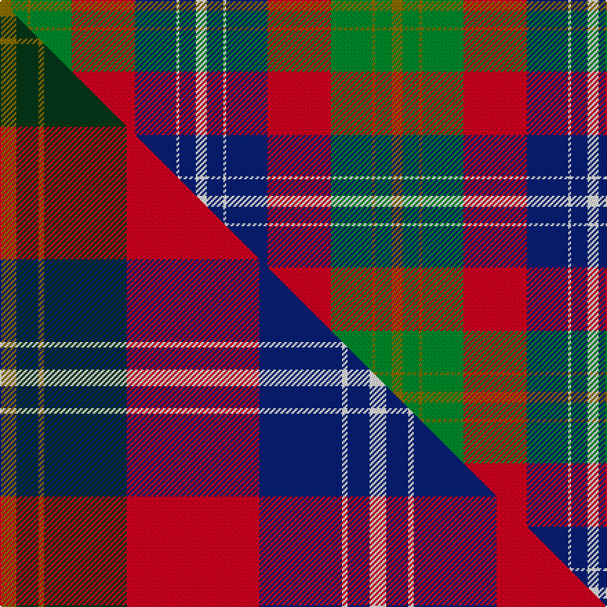

This is one **variant** — a specific cloth: this exact thread count and colourway, with its own
provenance below. It is one weaving of the [sett](/setts/y4g6y1g15r23db15w1db6w4/) (the scale-free proportion — the
same cloth at any scale or shade), whose colour order is pattern [GGGGRBWBW](/stripes/ggggrbwbw/).

Part of the [Forrester](/tartans/forrester/) tartan — the named design grouping this sett with its other cloths.

Sourced from house-of-tartan.  It is a [9 stripe tartan](/stripes/stripes9/).

Original link [http://www.house-of-tartan.scotland.net/house/TartanViewjs.asp?colr=Def&tnam=2384](http://www.house-of-tartan.scotland.net/house/TartanViewjs.asp?colr=Def&tnam=2384)

## Provenance

Earliest known date: 1987 A society that has been in existence since the 1980's. This is a general tartan fully adopted in 1987. Can be worn by all with the name.

2 attestations — the source records this cloth was collapsed from (oldest owns this page)

<ul>
<li>1987 — Forrester Tartan (house-of-tartan, <a href="http://www.house-of-tartan.scotland.net/house/TartanViewjs.asp?colr=Def&tnam=2384">record</a>) </li>
<li>undated — Forrester / Foster (weddslist, <a href="http://www.weddslist.com/cgi-bin/tartans/pg.pl?source=sts">record</a>) </li>
</ul>

Dataset <small>— provenance for this record, inherited from the source manifest</small>

<dl class="dataset-prov">
<dt>source</dt><dd><a href="/sources/house-of-tartan/">House of Tartan</a></dd>
<dt>data captured from</dt><dd><a href="https://github.com/thetartan/tartan-database/blob/master/data/house-of-tartan/data.csv">https://github.com/thetartan/tartan-database/blob/master/data/house-of-tartan/data.csv</a></dd>
<dt>data date</dt><dd>1987 <small>(this record)</small></dd>
<dt>licence</dt><dd><a href="https://creativecommons.org/licenses/by-nc-nd/4.0/">CC BY-NC-ND 4.0</a></dd>
</dl>

Capture chain <small>— the hands this data passed through, oldest first; each capture carries its own licence</small>

<ol class="capture-chain">
<li><a href="http://www.house-of-tartan.scotland.net/">House of Tartan</a> <small>the weaver/retailer's database — the site is now offline; the URL is kept as the ultimate source's identity</small></li>
<li><a href="https://github.com/thetartan/tartan-database">thetartan/tartan-database</a> <small>2016-2017</small> · <a href="https://creativecommons.org/licenses/by-nc-nd/4.0/">CC BY-NC-ND 4.0</a> <small>Levko Kravets's frozen compilation — the capture we vendored, and where its CC licence text came from</small></li>
<li>this dictionary <small>captured 2026-06-10 · commit 5bf86c7566</small> <small>each re-capture is a git commit to data/sources</small></li>
</ol>

## Thread count
Y/8 G12 Y2 G30 R46 DB30 W2 DB12 W/8

One full sett is **284 threads**.

## Palette
<table><thead><tr><th>Colour</th><th>Shade</th><th>OKLCh</th></tr></thead><tbody><tr><td>DB</td><td><code style="background-color:#082077;">#082077</code> <small style="color:#888">#082077</small></td><td><small style="color:#888">oklch(30.0% 0.149 265.1)</small></td></tr><tr><td>G</td><td><code style="background-color:#008B2A;">#008B2A</code> <small style="color:#888">#008B2A</small></td><td><small style="color:#888">oklch(55.4% 0.170 145.9)</small></td></tr><tr><td>W</td><td><code style="background-color:#F7F7F7;">#F7F7F7</code> <small style="color:#888">#F7F7F7</small></td><td><small style="color:#888">oklch(97.6% 0.000 89.9)</small></td></tr><tr><td>R</td><td><code style="background-color:#D60020;">#D60020</code> <small style="color:#888">#D60020</small></td><td><small style="color:#888">oklch(55.2% 0.224 25.5)</small></td></tr><tr><td>Y</td><td><code style="background-color:#8B6E00;">#8B6E00</code> <small style="color:#888">#8B6E00</small></td><td><small style="color:#888">oklch(55.1% 0.113 90.4)</small></td></tr></tbody></table>

# Sample pattern

## Compared to the master

This cloth is one sett of its design; the master sett (the exemplar the design is anchored on) is below for comparison.

Its **ΔTartan distance** from the master is **0.31** — the same measure the nearest-tartans table ranks by (0 is identical; a re-scale of the same cloth is near 0, a recolour or a different proportion further).

<figure class="master-compare" style="margin:0">

this sett
master sett ★

<figcaption style="color:#888;font-size:smaller">One weave of this sett against the <a href="/setts/y3dg4y1dg15r24db15w1db4w3/">master sett ★</a>, split on the diagonal: a shared proportion runs seamlessly across it with only the shades shifting; a different proportion breaks on it.</figcaption>
</figure>

## Nearest tartan variants

The nearest existing variants by ΔTartan distance, with this cloth at the top so the swatches line up against it.

ΔTartan

Threads

Variant

Sett

—

284

<a href="/variants/s9/y4g6y1g15r23db15w1db6w4~x2/">Forrester Tartan</a>

<a href="/ttd/edit/#slug=y3dg4y1dg15r24db15w1db4w3~x4&amp;base=y4g6y1g15r23db15w1db6w4~x2" title="compare in the TTD">0.31</a>

536

<a href="/variants/s9/y3dg4y1dg15r24db15w1db4w3~x4/">Forrester (Clan)</a>

<a href="/ttd/edit/#slug=db5lb2db11g2db2g6r17ly9db1r1~x2&amp;base=y4g6y1g15r23db15w1db6w4~x2" title="compare in the TTD">1.56</a>

212

<a href="/variants/s10/db5lb2db11g2db2g6r17ly9db1r1~x2/">Clarks No. 1 (Fashion)</a>

<a href="/ttd/edit/#slug=db5lb2db11g2db2g6r17y9db1r1~x2&amp;base=y4g6y1g15r23db15w1db6w4~x2" title="compare in the TTD">1.98</a>

212

<a href="/variants/s10/db5lb2db11g2db2g6r17y9db1r1~x2/">Clarks No.1</a>

<a href="/ttd/edit/#slug=w1db4dy8r4w1r4w1r4g16db2w1~x2&amp;base=y4g6y1g15r23db15w1db6w4~x2" title="compare in the TTD">2.33</a>

180

<a href="/variants/s11/w1db4dy8r4w1r4w1r4g16db2w1~x2/">Stuart/Stewart Riding Cloak</a>

<a href="/ttd/edit/#slug=ly2db6r5db18g18lg6g6r28w1g3ly2~x2&amp;base=y4g6y1g15r23db15w1db6w4~x2" title="compare in the TTD">2.40</a>

372

<a href="/variants/s11/ly2db6r5db18g18lg6g6r28w1g3ly2~x2/">Carr (Personal)</a>

<a href="/ttd/edit/#slug=ly3dy12do14r4do1lb26do2dy1~x2&amp;base=y4g6y1g15r23db15w1db6w4~x2" title="compare in the TTD">2.49</a>

244

<a href="/variants/s8/ly3dy12do14r4do1lb26do2dy1~x2/">Turnberry</a>

<a href="/ttd/edit/#slug=g30db2n7r14n7r7w1db14~x2&amp;base=y4g6y1g15r23db15w1db6w4~x2" title="compare in the TTD">2.57</a>

240

<a href="/variants/s8/g30db2n7r14n7r7w1db14~x2/">Harding Personal Tartan</a>

<a href="/ttd/edit/#slug=db24r27g20y6g20r2lb3~x2&amp;base=y4g6y1g15r23db15w1db6w4~x2" title="compare in the TTD">2.64</a>

354

<a href="/variants/s7/db24r27g20y6g20r2lb3~x2/">Buchanhaven Heritage</a>

<a href="/ttd/edit/#slug=r4w2r1w18dp18o18g3o4~x2&amp;base=y4g6y1g15r23db15w1db6w4~x2" title="compare in the TTD">2.70</a>

256

<a href="/variants/s8/r4w2r1w18dp18o18g3o4~x2/">Gigha Lilac Fashion Tartan</a>

<a href="/ttd/edit/#slug=y1db14r28dg14r1g14y1~x2&amp;base=y4g6y1g15r23db15w1db6w4~x2" title="compare in the TTD">2.72</a>

288

<a href="/variants/s7/y1db14r28dg14r1g14y1~x2/">Abernethy (Colerain, USA)</a>

## Neighbour map

Every grey dot is one of 13621 variants placed by the first two principal components of the ΔTartan feature space (42% of its variance). Red is this tartan; blue dots are its nearest — click one to open its page.

<svg viewBox="0 0 640 380" role="img" style="max-width:100%;height:auto;border:1px solid #e0e0e0;border-radius:4px;display:block" xmlns="http://www.w3.org/2000/svg"><image href="/nn/cloud.v1.png" width="640" height="380"/><a href="/variants/s9/y3dg4y1dg15r24db15w1db4w3~x4/"><circle cx="198.6" cy="137.2" r="4" fill="#3465a4"><title>Forrester (Clan)</title></circle></a><a href="/variants/s10/db5lb2db11g2db2g6r17ly9db1r1~x2/"><circle cx="167.2" cy="151.6" r="4" fill="#3465a4"><title>Clarks No. 1 (Fashion)</title></circle></a><a href="/variants/s10/db5lb2db11g2db2g6r17y9db1r1~x2/"><circle cx="188.7" cy="158.3" r="4" fill="#3465a4"><title>Clarks No.1</title></circle></a><a href="/variants/s11/w1db4dy8r4w1r4w1r4g16db2w1~x2/"><circle cx="167.7" cy="145.8" r="4" fill="#3465a4"><title>Stuart/Stewart Riding Cloak</title></circle></a><a href="/variants/s11/ly2db6r5db18g18lg6g6r28w1g3ly2~x2/"><circle cx="177.7" cy="115.1" r="4" fill="#3465a4"><title>Carr (Personal)</title></circle></a><a href="/variants/s8/ly3dy12do14r4do1lb26do2dy1~x2/"><circle cx="227.5" cy="135.3" r="4" fill="#3465a4"><title>Turnberry</title></circle></a><a href="/variants/s8/g30db2n7r14n7r7w1db14~x2/"><circle cx="228.8" cy="160.1" r="4" fill="#3465a4"><title>Harding Personal Tartan</title></circle></a><a href="/variants/s7/db24r27g20y6g20r2lb3~x2/"><circle cx="195.8" cy="203.8" r="4" fill="#3465a4"><title>Buchanhaven Heritage</title></circle></a><a href="/variants/s8/r4w2r1w18dp18o18g3o4~x2/"><circle cx="156.1" cy="153.9" r="4" fill="#3465a4"><title>Gigha Lilac Fashion Tartan</title></circle></a><a href="/variants/s7/y1db14r28dg14r1g14y1~x2/"><circle cx="233.3" cy="152.7" r="4" fill="#3465a4"><title>Abernethy (Colerain, USA)</title></circle></a><circle cx="167.5" cy="151.8" r="5" fill="#c00000"/><text x="320" y="376" text-anchor="middle" font-size="11" fill="#999">ground</text><text x="11" y="190" text-anchor="middle" font-size="11" fill="#999" transform="rotate(-90 11 190)">complexity</text></svg>

ID: /variants/s9/y4g6y1g15r23db15w1db6w4~x2/
