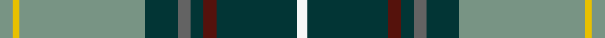

This is one **variant** — a specific cloth: this exact thread count and colourway, with its own
provenance below. It is one weaving of the [sett](/tartans/b/bl/blue-blas-alba/) (the scale-free proportion — the
same cloth at any scale or shade), whose colour order is pattern [GYGBBBBBW](/stripes/gygbbbbbw/).

Part of the [Blue Blas Alba](/tartans/b/bl/blue-blas-alba/) tartan — the named design grouping this sett with its other cloths.

Sourced from register-of-tartans.  It is a [9 stripe tartan](/stripes/stripes9/).

Original link [https://www.tartanregister.gov.uk/tartanDetails.aspx?ref=302](https://www.tartanregister.gov.uk/tartanDetails.aspx?ref=302)

2 attestations — the source records this cloth was collapsed from (oldest owns this page)

<ul>
<li>01/01/2004 — Blue Blas Alba (register-of-tartans, <a href="https://www.tartanregister.gov.uk/tartanDetails.aspx?ref=302">record</a>)  <em>Woven by Lochcarron of Scotland for ACS Kilt Hire in Glasgow.</em></li>
<li>2004 — Blue Blas Alba (Fashion) (tartans-authority, <a href="https://web.archive.org/web/*/http://www.tartansauthority.com/tartan-ferret/display/6892/*">record</a>)  <em>Woven by Lochcarron for ACS Kilt Hire in Glasgow as part of a house collection by Lochcarron.</em></li>
</ul>

Dataset <small>— provenance for this record, inherited from the source manifest</small>

<dl class="dataset-prov">
<dt>source</dt><dd><a href="/sources/register-of-tartans/">Scottish Register of Tartans</a></dd>
<dt>data captured from</dt><dd><a href="https://github.com/thetartan/tartan-database/blob/master/data/register-of-tartans/data.csv">https://github.com/thetartan/tartan-database/blob/master/data/register-of-tartans/data.csv</a></dd>
<dt>data date</dt><dd>2004 <small>(this record)</small></dd>
<dt>licence</dt><dd><a href="https://www.tartanregister.gov.uk/copyright">Crown copyright</a></dd>
</dl>

Capture chain <small>— the hands this data passed through, oldest first; each capture carries its own licence</small>

<ol class="capture-chain">
<li><a href="https://www.tartanregister.gov.uk/">Scottish Register of Tartans</a> · <a href="https://www.tartanregister.gov.uk/copyright">Crown copyright</a> <small>the living register — still published by National Records of Scotland</small></li>
<li><a href="https://github.com/thetartan/tartan-database">thetartan/tartan-database</a> <small>2016-2017</small> · <a href="https://creativecommons.org/licenses/by-nc-nd/4.0/">CC BY-NC-ND 4.0</a> <small>Levko Kravets's frozen compilation — the capture we vendored, and where its CC licence text came from</small></li>
<li>this dictionary <small>captured 2026-06-10 · commit 5bf86c7566</small> <small>each re-capture is a git commit to data/sources</small></li>
</ol>

## Register references

External register numbers recorded for this tartan.

- Scottish Register of Tartans: [302](https://www.tartanregister.gov.uk/tartanDetails.aspx?ref=302)
- Scottish Tartans Authority (ITI): 6892

## Thread count
Y/8 LY4 Y78 DT20 N8 DT8 DR8 DT50 W/6

One full sett is **366 threads**.

## Palette
<table><thead><tr><th>Colour</th><th>Shade</th><th>OKLCh</th></tr></thead><tbody><tr><td>DT</td><td><code style="background-color:#023535;">#023535</code> <small style="color:#888">#023535</small></td><td><small style="color:#888">oklch(29.8% 0.050 194.8)</small></td></tr><tr><td>DR</td><td><code style="background-color:#55120C;">#55120C</code> <small style="color:#888">#55120C</small></td><td><small style="color:#888">oklch(30.0% 0.099 29.3)</small></td></tr><tr><td>Y</td><td><code style="background-color:#789484;">#789484</code> <small style="color:#888">#789484</small></td><td><small style="color:#888">oklch(64.0% 0.040 160.0)</small></td></tr><tr><td>N</td><td><code style="background-color:#636363;">#636363</code> <small style="color:#888">#636363</small></td><td><small style="color:#888">oklch(50.0% 0.000 89.9)</small></td></tr><tr><td>W</td><td><code style="background-color:#F7F7F7;">#F7F7F7</code> <small style="color:#888">#F7F7F7</small></td><td><small style="color:#888">oklch(97.6% 0.000 89.9)</small></td></tr><tr><td>LY</td><td><code style="background-color:#E8C000;">#E8C000</code> <small style="color:#888">#E8C000</small></td><td><small style="color:#888">oklch(81.9% 0.168 93.7)</small></td></tr></tbody></table>

# Sample pattern

## Nearest tartan variants

The nearest existing variants by ΔTartan distance, with this cloth at the top so the swatches line up against it.

ΔTartan

Threads

Variant

Sett

—

366

<a href="/variants/s9/y4ly2y39dt10n4dt4dr4dt25w3~x2~y2602166-ly3307090/">Blue Blas Alba</a>

<a href="/ttd/edit/#slug=n18y1n2y1n2db6w4dy1g6~x2&amp;base=y4ly2y39dt10n4dt4dr4dt25w3~x2~y2602166-ly3307090" title="compare in the TTD">1.98</a>

116

<a href="/variants/s9/n18y1n2y1n2db6w4dy1g6~x2/">Nickel Lodge Centennial Corporate Tartan</a>

<a href="/ttd/edit/#slug=n16y1n2y1n2db6w4dy1dg6~x2&amp;base=y4ly2y39dt10n4dt4dr4dt25w3~x2~y2602166-ly3307090" title="compare in the TTD">2.20</a>

112

<a href="/variants/s9/n16y1n2y1n2db6w4dy1dg6~x2/">Nickel Lodge Centennial</a>

<a href="/ttd/edit/#slug=db3dbi3db1g26db10dt1db3dp5dbi4ly2~x2~db1004274-dbi1406275&amp;base=y4ly2y39dt10n4dt4dr4dt25w3~x2~y2602166-ly3307090" title="compare in the TTD">2.24</a>

222

<a href="/variants/s10/db3dbi3db1g26db10dt1db3dp5dbi4ly2~x2~db1004274-dbi1406275/">Rikaco Heirloom (Fashion)</a>

<a href="/ttd/edit/#slug=dr3lb2g18lo2g18dp34dr3dp3~x2&amp;base=y4ly2y39dt10n4dt4dr4dt25w3~x2~y2602166-ly3307090" title="compare in the TTD">2.60</a>

320

<a href="/variants/s8/dr3lb2g18lo2g18dp34dr3dp3~x2/">Singh</a>

<a href="/ttd/edit/#slug=n36y2n1y2n4db12w8dy2g12~x2&amp;base=y4ly2y39dt10n4dt4dr4dt25w3~x2~y2602166-ly3307090" title="compare in the TTD">2.71</a>

220

<a href="/variants/s9/n36y2n1y2n4db12w8dy2g12~x2/">Nickel Lodge Centennial (Corporate)</a>

<a href="/ttd/edit/#slug=db60o3db5ly5db9do20o4g32w4~x2~o2503076-ly2705081&amp;base=y4ly2y39dt10n4dt4dr4dt25w3~x2~y2602166-ly3307090" title="compare in the TTD">2.90</a>

440

<a href="/variants/s9/db60ly3db5lyi5db9do20ly4g32w4~x2~ly2503076-lyi2705081/">State Seal of Ohio (Fashion)</a>

<a href="/ttd/edit/#slug=dg1n8lb5n23lb5db3lb5dp3lb5dg5lb3w1~x2&amp;base=y4ly2y39dt10n4dt4dr4dt25w3~x2~y2602166-ly3307090" title="compare in the TTD">2.91</a>

264

<a href="/variants/s12/dg1n8lb5n23lb5db3lb5dp3lb5dg5lb3w1~x2/">Hand Name Tartan</a>

<a href="/ttd/edit/#slug=g1n8lb5n23lb5db3lb5dp3lb5g5lb3w1~x2&amp;base=y4ly2y39dt10n4dt4dr4dt25w3~x2~y2602166-ly3307090" title="compare in the TTD">2.98</a>

264

<a href="/variants/s12/g1n8lb5n23lb5db3lb5dp3lb5g5lb3w1~x2/">Hand, Edinburgh</a>

<a href="/ttd/edit/#slug=dy2b4y3dg28b28w2b4n2~x2&amp;base=y4ly2y39dt10n4dt4dr4dt25w3~x2~y2602166-ly3307090" title="compare in the TTD">3.16</a>

284

<a href="/variants/s8/dy2b4y3dg28b28w2b4n2~x2/">Laurentian University</a>

<a href="/ttd/edit/#slug=db23w1r3w1db12y9g40dp3~x2&amp;base=y4ly2y39dt10n4dt4dr4dt25w3~x2~y2602166-ly3307090" title="compare in the TTD">3.26</a>

316

<a href="/variants/s8/db23w1r3w1db12y9g40dp3~x2/">Pictou County</a>

## Neighbour map

Every grey dot is one of 13657 variants placed by the first two principal components of the ΔTartan feature space (42% of its variance). Red is this tartan; blue dots are its nearest — click one to open its page. The map is a flat projection of a many-dimensional space — [how to read it](/posts/neighbourhood-maps/).

<svg viewBox="0 0 640 380" role="img" style="max-width:100%;height:auto;border:1px solid #e0e0e0;border-radius:4px;display:block" xmlns="http://www.w3.org/2000/svg"><image href="/nn/cloud.v1.png" width="640" height="380"/><a href="/variants/s9/n18y1n2y1n2db6w4dy1g6~x2/"><circle cx="310.8" cy="153.1" r="4" fill="#3465a4"><title>Nickel Lodge Centennial Corporate Tartan</title></circle></a><a href="/variants/s9/n16y1n2y1n2db6w4dy1dg6~x2/"><circle cx="281.6" cy="158.7" r="4" fill="#3465a4"><title>Nickel Lodge Centennial</title></circle></a><a href="/variants/s10/db3dbi3db1g26db10dt1db3dp5dbi4ly2~x2~db1004274-dbi1406275/"><circle cx="280.1" cy="131.8" r="4" fill="#3465a4"><title>Rikaco Heirloom (Fashion)</title></circle></a><a href="/variants/s8/dr3lb2g18lo2g18dp34dr3dp3~x2/"><circle cx="302.0" cy="171.9" r="4" fill="#3465a4"><title>Singh</title></circle></a><a href="/variants/s9/n36y2n1y2n4db12w8dy2g12~x2/"><circle cx="322.4" cy="123.3" r="4" fill="#3465a4"><title>Nickel Lodge Centennial (Corporate)</title></circle></a><a href="/variants/s9/db60ly3db5lyi5db9do20ly4g32w4~x2~ly2503076-lyi2705081/"><circle cx="300.6" cy="146.4" r="4" fill="#3465a4"><title>State Seal of Ohio (Fashion)</title></circle></a><a href="/variants/s12/dg1n8lb5n23lb5db3lb5dp3lb5dg5lb3w1~x2/"><circle cx="282.0" cy="142.0" r="4" fill="#3465a4"><title>Hand Name Tartan</title></circle></a><a href="/variants/s12/g1n8lb5n23lb5db3lb5dp3lb5g5lb3w1~x2/"><circle cx="293.5" cy="147.0" r="4" fill="#3465a4"><title>Hand, Edinburgh</title></circle></a><a href="/variants/s8/dy2b4y3dg28b28w2b4n2~x2/"><circle cx="319.5" cy="165.4" r="4" fill="#3465a4"><title>Laurentian University</title></circle></a><a href="/variants/s8/db23w1r3w1db12y9g40dp3~x2/"><circle cx="278.2" cy="121.0" r="4" fill="#3465a4"><title>Pictou County</title></circle></a><circle cx="295.5" cy="150.2" r="5" fill="#c00000"/><text x="320" y="376" text-anchor="middle" font-size="11" fill="#999">ground</text><text x="11" y="190" text-anchor="middle" font-size="11" fill="#999" transform="rotate(-90 11 190)">complexity</text></svg>

ID: /variants/s9/y4ly2y39dt10n4dt4dr4dt25w3~x2~y2602166-ly3307090/
