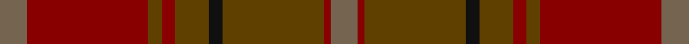

This page is one **sett** — a single exact thread-count. It belongs to the [tartan](/setts/y4r18dy2r2dy5k2dy15r1y4/)
(the same proportion at any scale), whose colour order is pattern [GRGKGRGRG](/stripes/grgkgrgrg/).

Sourced from register-of-tartans.  It is a [9 stripe tartan](/stripes/stripes9/).

Original link https://www.tartanregister.gov.uk/tartanDetails.aspx?ref=3484

2 attestations — the source records this cloth was collapsed from (oldest owns this page)

<ul>
<li>01/01/1972 — Redwoods (register-of-tartans, <a href="https://www.tartanregister.gov.uk/tartanDetails.aspx?ref=3484">record</a>)</li>
<li>pre 1972 — Redwoods (Fashion) (tartans-authority, <a href="http://www.tartansauthority.com/tartan-ferret/display/5422/">record</a>)</li>
</ul>

## Register references

External register numbers recorded for this tartan.

- Scottish Register of Tartans: [3484](https://www.tartanregister.gov.uk/tartanDetails.aspx?ref=3484)
- Scottish Tartans Authority (ITI): 5422

## Thread count
N/8 DR36 T4 DR4 T10 K4 T30 DR2 N/8

One full sett is **196 threads**.

## Palette

Palette: <strong>Tartan Register</strong> <small style="color:#888">(3 of 4 colours)</small>
<table><thead><tr><th>Colour</th><th>Threads</th><th>Shade</th><th>Base</th><th>OKLCh</th></tr></thead><tbody><tr><td>N/</td><td style="text-align:right;font-variant-numeric:tabular-nums">8</td><td><code style="background-color:#746450;">#746450</code> <small style="color:#888">#746450</small></td><td>G <code style="background-color:#006100;">#006100</code></td><td><small style="color:#888">oklch(51.3% 0.036 73.1)</small></td></tr><tr><td>DR</td><td style="text-align:right;font-variant-numeric:tabular-nums">36</td><td><code style="background-color:#880000;">#880000</code> <small style="color:#888">#880000</small></td><td>R <code style="background-color:#CC0000;">#CC0000</code></td><td><small style="color:#888">oklch(39.4% 0.162 29.2)</small></td></tr><tr><td>T</td><td style="text-align:right;font-variant-numeric:tabular-nums">4</td><td><code style="background-color:#604000;">#604000</code> <small style="color:#888">#604000</small></td><td>G <code style="background-color:#006100;">#006100</code></td><td><small style="color:#888">oklch(39.8% 0.083 76.8)</small></td></tr><tr><td>DR</td><td style="text-align:right;font-variant-numeric:tabular-nums">4</td><td><code style="background-color:#880000;">#880000</code> <small style="color:#888">#880000</small></td><td>R <code style="background-color:#CC0000;">#CC0000</code></td><td><small style="color:#888">oklch(39.4% 0.162 29.2)</small></td></tr><tr><td>T</td><td style="text-align:right;font-variant-numeric:tabular-nums">10</td><td><code style="background-color:#604000;">#604000</code> <small style="color:#888">#604000</small></td><td>G <code style="background-color:#006100;">#006100</code></td><td><small style="color:#888">oklch(39.8% 0.083 76.8)</small></td></tr><tr><td>K</td><td style="text-align:right;font-variant-numeric:tabular-nums">4</td><td><code style="background-color:#101010;">#101010</code> <small style="color:#888">#101010</small></td><td>K <code style="background-color:#000000;">#000000</code></td><td><small style="color:#888">oklch(17.3% 0.000 89.9)</small></td></tr><tr><td>T</td><td style="text-align:right;font-variant-numeric:tabular-nums">30</td><td><code style="background-color:#604000;">#604000</code> <small style="color:#888">#604000</small></td><td>G <code style="background-color:#006100;">#006100</code></td><td><small style="color:#888">oklch(39.8% 0.083 76.8)</small></td></tr><tr><td>DR</td><td style="text-align:right;font-variant-numeric:tabular-nums">2</td><td><code style="background-color:#880000;">#880000</code> <small style="color:#888">#880000</small></td><td>R <code style="background-color:#CC0000;">#CC0000</code></td><td><small style="color:#888">oklch(39.4% 0.162 29.2)</small></td></tr><tr><td>N/</td><td style="text-align:right;font-variant-numeric:tabular-nums">8</td><td><code style="background-color:#746450;">#746450</code> <small style="color:#888">#746450</small></td><td>G <code style="background-color:#006100;">#006100</code></td><td><small style="color:#888">oklch(51.3% 0.036 73.1)</small></td></tr></tbody></table>

## Nearest tartans

The nearest existing variants by ΔTartan distance, with this tartan at the top so the swatches line up against it.

ΔTartan

Tartan

Sett

—

<a href="/ttd/edit/#slug=y4r18dy2r2dy5k2dy15r1y4~x2">Redwoods</a> <a class="nn-out" href="/variants/s9/y4r18dy2r2dy5k2dy15r1y4~x2/" title="open its dictionary page">↗</a>

1.41

<a href="/ttd/edit/#slug=dy31do3dy3do3dy3do22y26r4~x2&amp;base=y4r18dy2r2dy5k2dy15r1y4~x2">Devarr (Fashion)</a> <a class="nn-out" href="/variants/s8/dy31do3dy3do3dy3do22y26r4~x2/" title="open its dictionary page">↗</a>

1.56

<a href="/variants/s14/r3dy2r26dy4do6dy29do2lo3~x2/">Hyland Day (Personal)</a>

1.68

<a href="/ttd/edit/#slug=r3dy2r26dy4do6dy29do2lo3~x2&amp;base=y4r18dy2r2dy5k2dy15r1y4~x2">Hyland Day (Personal)</a> <a class="nn-out" href="/variants/s8/r3dy2r26dy4do6dy29do2lo3~x2/" title="open its dictionary page">↗</a>

1.71

<a href="/ttd/edit/#slug=do10y24r3y3r24dg3y6do6~x2&amp;base=y4r18dy2r2dy5k2dy15r1y4~x2">Earle's Flame (Fashion)</a> <a class="nn-out" href="/variants/s8/do10y24r3y3r24dg3y6do6~x2/" title="open its dictionary page">↗</a>

1.83

<a href="/ttd/edit/#slug=do22y26r4y26do22dy3do3dy3do3dy31do3dy3do3dy3~x2&amp;base=y4r18dy2r2dy5k2dy15r1y4~x2">Devarr</a> <a class="nn-out" href="/variants/s14/do22y26r4y26do22dy3do3dy3do3dy31do3dy3do3dy3~x2/" title="open its dictionary page">↗</a>

1.97

<a href="/ttd/edit/#slug=k2y7k1y9dy21o2dy1o1dy2~x2&amp;base=y4r18dy2r2dy5k2dy15r1y4~x2">Historic Scotland Corporate Tartan</a> <a class="nn-out" href="/variants/s9/k2y7k1y9dy21o2dy1o1dy2~x2/" title="open its dictionary page">↗</a>

1.98

<a href="/ttd/edit/#slug=y28k2y28k2y2k2dy29k2r2k2~x2&amp;base=y4r18dy2r2dy5k2dy15r1y4~x2">Ulster (Peat) (District</a> <a class="nn-out" href="/variants/s10/y28k2y28k2y2k2dy29k2r2k2~x2/" title="open its dictionary page">↗</a>

2.06

<a href="/ttd/edit/#slug=dg1r1dgi22dy21dg12r11dgi22r1dg1~x2&amp;base=y4r18dy2r2dy5k2dy15r1y4~x2">MacNaughton Htg</a> <a class="nn-out" href="/variants/s9/dg1r1dgi22dy21dg12r11dgi22r1dg1~x2/" title="open its dictionary page">↗</a>

2.22

<a href="/ttd/edit/#slug=n9o9y9r1yi1o9yi1r1~x4&amp;base=y4r18dy2r2dy5k2dy15r1y4~x2">Jardine</a> <a class="nn-out" href="/variants/s8/n9o9y9r1yi1o9yi1r1~x4/" title="open its dictionary page">↗</a>

2.22

<a href="/variants/s12/y23o4dy6g6y4lb1y4~x4/">Tricor</a>

## Neighbour map

Every grey dot is one of 14360 variants placed by the first two principal components of the ΔTartan feature space (44% of its variance). Red is this tartan; blue dots are its nearest — click one to open its page.

<svg viewBox="0 0 640 380" role="img" style="max-width:100%;height:auto;border:1px solid #e0e0e0;border-radius:4px;display:block" xmlns="http://www.w3.org/2000/svg"><image href="/nn/cloud.v1.png" width="640" height="380"/><a href="/variants/s8/dy31do3dy3do3dy3do22y26r4~x2/"><circle cx="364.6" cy="266.2" r="4" fill="#3465a4"><title>Devarr (Fashion)</title></circle></a><a href="/variants/s14/r3dy2r26dy4do6dy29do2lo3~x2/"><circle cx="348.8" cy="187.5" r="4" fill="#3465a4"><title>Hyland Day (Personal)</title></circle></a><a href="/variants/s8/r3dy2r26dy4do6dy29do2lo3~x2/"><circle cx="341.7" cy="198.9" r="4" fill="#3465a4"><title>Hyland Day (Personal)</title></circle></a><a href="/variants/s8/do10y24r3y3r24dg3y6do6~x2/"><circle cx="341.5" cy="261.9" r="4" fill="#3465a4"><title>Earle's Flame (Fashion)</title></circle></a><a href="/variants/s14/do22y26r4y26do22dy3do3dy3do3dy31do3dy3do3dy3~x2/"><circle cx="330.3" cy="232.5" r="4" fill="#3465a4"><title>Devarr</title></circle></a><a href="/variants/s9/k2y7k1y9dy21o2dy1o1dy2~x2/"><circle cx="457.2" cy="212.8" r="4" fill="#3465a4"><title>Historic Scotland Corporate Tartan</title></circle></a><a href="/variants/s10/y28k2y28k2y2k2dy29k2r2k2~x2/"><circle cx="480.7" cy="219.8" r="4" fill="#3465a4"><title>Ulster (Peat) (District</title></circle></a><a href="/variants/s9/dg1r1dgi22dy21dg12r11dgi22r1dg1~x2/"><circle cx="402.1" cy="242.5" r="4" fill="#3465a4"><title>MacNaughton Htg</title></circle></a><a href="/variants/s8/n9o9y9r1yi1o9yi1r1~x4/"><circle cx="357.2" cy="266.1" r="4" fill="#3465a4"><title>Jardine</title></circle></a><a href="/variants/s12/y23o4dy6g6y4lb1y4~x4/"><circle cx="384.8" cy="190.3" r="4" fill="#3465a4"><title>Tricor</title></circle></a><circle cx="412.1" cy="233.4" r="5" fill="#c00000"/></svg>

ID: /variants/s9/y4r18dy2r2dy5k2dy15r1y4~x2/
