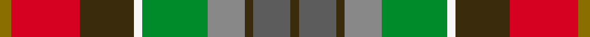
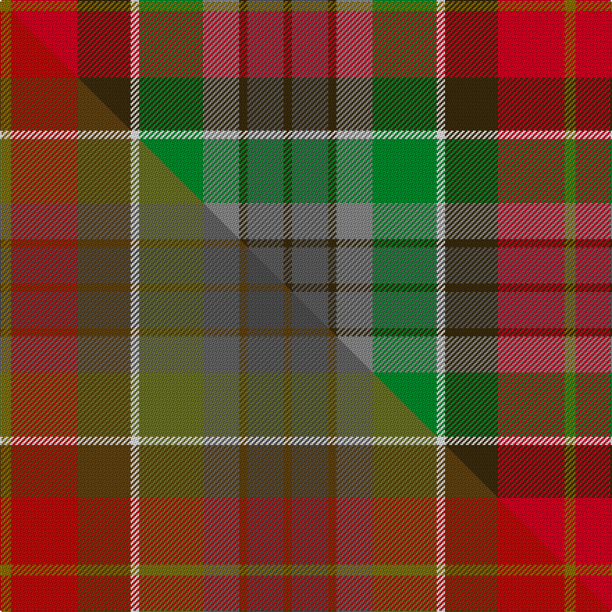

This is one **variant** — a specific cloth: this exact thread count and colourway, with its own
provenance below. It is one weaving of the [sett](/tartans/t/te/teallach/) (the scale-free proportion — the
same cloth at any scale or shade), whose colour order is pattern [GBGRGWGRG](/stripes/gbgrgwgrg/).

Part of the [Teallach](/tartans/t/te/teallach/) tartan — the named design grouping this sett with its other cloths.

Sourced from house-of-tartan.  It is a [9 stripe tartan](/stripes/stripes9/).

Original link [http://www.house-of-tartan.scotland.net/house/TartanViewjs.asp?colr=Def&tnam=832](http://www.house-of-tartan.scotland.net/house/TartanViewjs.asp?colr=Def&tnam=832)

## Provenance

Earliest known date: pre 2003 The tartan of the present chairman of the Scottish Tartans Society, Dr Gordon Teall of Teallach.

Dataset <small>— provenance for this record, inherited from the source manifest</small>

<dl class="dataset-prov">
<dt>source</dt><dd><a href="/sources/house-of-tartan/">House of Tartan</a></dd>
<dt>data captured from</dt><dd><a href="https://github.com/thetartan/tartan-database/blob/master/data/house-of-tartan/data.csv">https://github.com/thetartan/tartan-database/blob/master/data/house-of-tartan/data.csv</a></dd>
<dt>data date</dt><dd>pre 2003 <small>(this record)</small></dd>
<dt>licence</dt><dd><a href="https://creativecommons.org/licenses/by-nc-nd/4.0/">CC BY-NC-ND 4.0</a></dd>
</dl>

Capture chain <small>— the hands this data passed through, oldest first; each capture carries its own licence</small>

<ol class="capture-chain">
<li><a href="http://www.house-of-tartan.scotland.net/">House of Tartan</a> <small>the weaver/retailer's database — the site is now offline; the URL is kept as the ultimate source's identity</small></li>
<li><a href="https://github.com/thetartan/tartan-database">thetartan/tartan-database</a> <small>2016-2017</small> · <a href="https://creativecommons.org/licenses/by-nc-nd/4.0/">CC BY-NC-ND 4.0</a> <small>Levko Kravets's frozen compilation — the capture we vendored, and where its CC licence text came from</small></li>
<li>this dictionary <small>captured 2026-06-10 · commit 5bf86c7566</small> <small>each re-capture is a git commit to data/sources</small></li>
</ol>

## Thread count
Y/8 R48 DY38 W6 G46 O26 DY6 N26 DY/6

One full sett is **406 threads**.

## Palette
<table><thead><tr><th>Colour</th><th>Shade</th><th>OKLCh</th></tr></thead><tbody><tr><td>G</td><td><code style="background-color:#008B2A;">#008B2A</code> <small style="color:#888">#008B2A</small></td><td><small style="color:#888">oklch(55.4% 0.170 145.9)</small></td></tr><tr><td>W</td><td><code style="background-color:#F7F7F7;">#F7F7F7</code> <small style="color:#888">#F7F7F7</small></td><td><small style="color:#888">oklch(97.6% 0.000 89.9)</small></td></tr><tr><td>N</td><td><code style="background-color:#5C5C5C;">#5C5C5C</code> <small style="color:#888">#5C5C5C</small></td><td><small style="color:#888">oklch(47.5% 0.000 89.9)</small></td></tr><tr><td>O</td><td><code style="background-color:#888888;">#888888</code> <small style="color:#888">#888888</small></td><td><small style="color:#888">oklch(62.7% 0.000 89.9)</small></td></tr><tr><td>R</td><td><code style="background-color:#D60020;">#D60020</code> <small style="color:#888">#D60020</small></td><td><small style="color:#888">oklch(55.2% 0.224 25.5)</small></td></tr><tr><td>DY</td><td><code style="background-color:#3A2B0D;">#3A2B0D</code> <small style="color:#888">#3A2B0D</small></td><td><small style="color:#888">oklch(30.0% 0.049 82.0)</small></td></tr><tr><td>Y</td><td><code style="background-color:#8B6E00;">#8B6E00</code> <small style="color:#888">#8B6E00</small></td><td><small style="color:#888">oklch(55.1% 0.113 90.4)</small></td></tr></tbody></table>

# Sample pattern

## Compared to the master

This cloth is one sett of its design; the master sett (the exemplar the design is anchored on) is below for comparison.

Its **ΔTartan distance** from the master is **6.87** — the same measure the nearest-tartans table ranks by (0 is identical; a re-scale of the same cloth is near 0, a recolour or a different proportion further).

<figure class="master-compare" style="margin:0">

this sett
master sett ★

<figcaption style="color:#888;font-size:smaller">One weave of this sett against the <a href="/setts/y4r24dy19w3g23n13dy3ni13dy3/">master sett ★</a>, split on the diagonal: a shared proportion runs seamlessly across it with only the shades shifting; a different proportion breaks on it.</figcaption>
</figure>

## Nearest tartan variants

The nearest existing variants by ΔTartan distance, with this cloth at the top so the swatches line up against it.

ΔTartan

Threads

Variant

Sett

—

406

<a href="/variants/s9/y4r24dy19w3g23o13dy3n13dy3~x2~o2500000-n1900000/">Teallach Family Tartan</a>

<a href="/ttd/edit/#slug=ly4o24dy19w3g23n13dy3oi13dy3~x2~n1900000-oi2500000&amp;base=y4r24dy19w3g23o13dy3n13dy3~x2~o2500000-n1900000" title="compare in the TTD">2.00</a>

406

<a href="/variants/s9/ly4o24dy19w3g23n13dy3oi13dy3~x2~n1900000-oi2500000/">Teallach (Personal)</a>

<a href="/ttd/edit/#slug=y12lo12o12g2r2y2dp12db12g12dp2r2db1~x2&amp;base=y4r24dy19w3g23o13dy3n13dy3~x2~o2500000-n1900000" title="compare in the TTD">2.75</a>

306

<a href="/variants/s12/y12lo12o12g2r2y2dp12db12g12dp2r2db1~x2/">Rainbow Kilt (Fashion)</a>

<a href="/ttd/edit/#slug=k2ly12dr3ly3dr12g12n12y12g1lb2~x2~n1900000-y2302111&amp;base=y4r24dy19w3g23o13dy3n13dy3~x2~o2500000-n1900000" title="compare in the TTD">2.95</a>

276

<a href="/variants/s10/k2ly12dr3ly3dr12g12n12y12g1lb2~x2~n1900000-y2302111/">Auld Scotland Weavers Tartan</a>

<a href="/ttd/edit/#slug=w3ri10dy6y8lb8g32r8ri10r6w3~x4~ri2209032-r2208029&amp;base=y4r24dy19w3g23o13dy3n13dy3~x2~o2500000-n1900000" title="compare in the TTD">2.95</a>

728

<a href="/variants/s10/w3ri10dy6y8lb8g32r8ri10r6w3~x4~ri2209032-r2208029/">Unidentified Silk scarf</a>

<a href="/ttd/edit/#slug=r2ly12r3ly3r12g12n12y12g1lb2~x2~n1900000-y2302111&amp;base=y4r24dy19w3g23o13dy3n13dy3~x2~o2500000-n1900000" title="compare in the TTD">3.00</a>

276

<a href="/variants/s10/r2ly12r3ly3r12g12n12y12g1lb2~x2~n1900000-y2302111/">Auld Scotland</a>

<a href="/ttd/edit/#slug=w3r10o6y8lb8g32b8r10b6w3~x4&amp;base=y4r24dy19w3g23o13dy3n13dy3~x2~o2500000-n1900000" title="compare in the TTD">3.05</a>

728

<a href="/variants/s10/w3r10o6y8lb8g32b8r10b6w3~x4/">Unidentified, Silk scarf</a>

<a href="/ttd/edit/#slug=db21dp21y21o2r21lo21y21db2r2dp2o21~x2&amp;base=y4r24dy19w3g23o13dy3n13dy3~x2~o2500000-n1900000" title="compare in the TTD">3.20</a>

536

<a href="/variants/s11/db21dp21y21o2r21lo21y21db2r2dp2o21~x2/">Watret (Artefact)</a>

<a href="/ttd/edit/#slug=db2lo10lb1o8g7dr10lb2~x2&amp;base=y4r24dy19w3g23o13dy3n13dy3~x2~o2500000-n1900000" title="compare in the TTD">3.32</a>

152

<a href="/variants/s7/db2lo10lb1o8g7dr10lb2~x2/">Kipp (Personal)</a>

<a href="/ttd/edit/#slug=n1r1n3ly1n1do8y7g1n1lb1w1~x2&amp;base=y4r24dy19w3g23o13dy3n13dy3~x2~o2500000-n1900000" title="compare in the TTD">3.47</a>

100

<a href="/variants/s11/n1r1n3ly1n1do8y7g1n1lb1w1~x2/">Porcupine Fancy Tartan</a>

<a href="/ttd/edit/#slug=o10n3db1lb8db1lo2g5~x4&amp;base=y4r24dy19w3g23o13dy3n13dy3~x2~o2500000-n1900000" title="compare in the TTD">3.48</a>

180

<a href="/variants/s7/o10n3db1lb8db1lo2g5~x4/">Porcupine City of</a>

## Neighbour map

Every grey dot is one of 13657 variants placed by the first two principal components of the ΔTartan feature space (42% of its variance). Red is this tartan; blue dots are its nearest — click one to open its page. The map is a flat projection of a many-dimensional space — [how to read it](/posts/neighbourhood-maps/).

<svg viewBox="0 0 640 380" role="img" style="max-width:100%;height:auto;border:1px solid #e0e0e0;border-radius:4px;display:block" xmlns="http://www.w3.org/2000/svg"><image href="/nn/cloud.v1.png" width="640" height="380"/><a href="/variants/s9/ly4o24dy19w3g23n13dy3oi13dy3~x2~n1900000-oi2500000/"><circle cx="109.7" cy="205.0" r="4" fill="#3465a4"><title>Teallach (Personal)</title></circle></a><a href="/variants/s12/y12lo12o12g2r2y2dp12db12g12dp2r2db1~x2/"><circle cx="46.7" cy="160.3" r="4" fill="#3465a4"><title>Rainbow Kilt (Fashion)</title></circle></a><a href="/variants/s10/k2ly12dr3ly3dr12g12n12y12g1lb2~x2~n1900000-y2302111/"><circle cx="52.8" cy="165.2" r="4" fill="#3465a4"><title>Auld Scotland Weavers Tartan</title></circle></a><a href="/variants/s10/w3ri10dy6y8lb8g32r8ri10r6w3~x4~ri2209032-r2208029/"><circle cx="124.4" cy="157.5" r="4" fill="#3465a4"><title>Unidentified Silk scarf</title></circle></a><a href="/variants/s10/r2ly12r3ly3r12g12n12y12g1lb2~x2~n1900000-y2302111/"><circle cx="136.0" cy="197.8" r="4" fill="#3465a4"><title>Auld Scotland</title></circle></a><a href="/variants/s10/w3r10o6y8lb8g32b8r10b6w3~x4/"><circle cx="127.6" cy="162.1" r="4" fill="#3465a4"><title>Unidentified, Silk scarf</title></circle></a><a href="/variants/s11/db21dp21y21o2r21lo21y21db2r2dp2o21~x2/"><circle cx="105.3" cy="186.4" r="4" fill="#3465a4"><title>Watret (Artefact)</title></circle></a><a href="/variants/s7/db2lo10lb1o8g7dr10lb2~x2/"><circle cx="95.1" cy="205.2" r="4" fill="#3465a4"><title>Kipp (Personal)</title></circle></a><a href="/variants/s11/n1r1n3ly1n1do8y7g1n1lb1w1~x2/"><circle cx="137.2" cy="149.2" r="4" fill="#3465a4"><title>Porcupine Fancy Tartan</title></circle></a><a href="/variants/s7/o10n3db1lb8db1lo2g5~x4/"><circle cx="170.1" cy="205.7" r="4" fill="#3465a4"><title>Porcupine City of</title></circle></a><circle cx="94.1" cy="194.9" r="5" fill="#c00000"/><text x="320" y="376" text-anchor="middle" font-size="11" fill="#999">ground</text><text x="11" y="190" text-anchor="middle" font-size="11" fill="#999" transform="rotate(-90 11 190)">complexity</text></svg>

ID: /variants/s9/y4r24dy19w3g23o13dy3n13dy3~x2~o2500000-n1900000/
