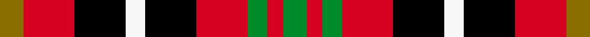

This page is one **sett** — a single exact thread-count. It belongs to the [tartan](/setts/y6r13k13w5k13r13g5r4g6/)
(the same proportion at any scale), whose colour order is pattern [GRGRKWKRG](/stripes/grgrkwkrg/).

Sourced from register-of-tartans.  It is a [9 stripe tartan](/stripes/stripes9/).

Original link https://www.tartanregister.gov.uk/tartanDetails.aspx?ref=32

## Provenance

Earliest known date: 1986 .

4 attestations — the source records this cloth was collapsed from (oldest owns this page)

<ul>
<li>01/01/1986 — Akins Red Dress (register-of-tartans, <a href="https://www.tartanregister.gov.uk/tartanDetails.aspx?ref=32">record</a>)  <em>The colours of this Dress sett are derived from the Akins coat of arms.</em></li>
<li>1986 — Akins Dress (Clan) (tartans-authority, <a href="http://www.tartansauthority.com/tartan-ferret/display/997/">record</a>)  <em>Originally named Akins Family this is now regarded as the Dress Akins. Designed by Steven L. Akins of Alabama who is/was the Founder & President of the Clan Akins Society. Sindex card has the designer coming from Jasper, Alberta, Canada - error! There is no Akins Chief but the three Akins tartans seem to have been approved by the Clan Akins Society and are therefore categorised as 'Clan/Family'</em></li>
<li>undated — Akins, Red (weddslist, <a href="http://www.weddslist.com/cgi-bin/tartans/pg.pl?source=sts">record</a>) </li>
<li>undated — Akins Red Family Tartan (house-of-tartan, <a href="http://www.house-of-tartan.scotland.net/house/TartanViewjs.asp?colr=Def&tnam=997">record</a>) </li>
</ul>

## Register references

External register numbers recorded for this tartan.

- Scottish Register of Tartans: [32](https://www.tartanregister.gov.uk/tartanDetails.aspx?ref=32)
- Scottish Tartans Authority (ITI): 997
- Scottish Tartans World Register: 997

## Thread count
Y/12 R26 K26 W10 K26 R26 G10 R8 G/12

One full sett is **288 threads**.

## Palette
<table><thead><tr><th>Colour</th><th>Shade</th><th>OKLCh</th></tr></thead><tbody><tr><td>G</td><td><code style="background-color:#008B2A;">#008B2A</code> <small style="color:#888">#008B2A</small></td><td><small style="color:#888">oklch(55.4% 0.170 145.9)</small></td></tr><tr><td>K</td><td><code style="background-color:#000000;">#000000</code> <small style="color:#888">#000000</small></td><td><small style="color:#888">oklch(0.0% 0.000 0.0)</small></td></tr><tr><td>R</td><td><code style="background-color:#D60020;">#D60020</code> <small style="color:#888">#D60020</small></td><td><small style="color:#888">oklch(55.2% 0.224 25.5)</small></td></tr><tr><td>W</td><td><code style="background-color:#F7F7F7;">#F7F7F7</code> <small style="color:#888">#F7F7F7</small></td><td><small style="color:#888">oklch(97.6% 0.000 89.9)</small></td></tr><tr><td>Y</td><td><code style="background-color:#8B6E00;">#8B6E00</code> <small style="color:#888">#8B6E00</small></td><td><small style="color:#888">oklch(55.1% 0.113 90.4)</small></td></tr></tbody></table>

# Sample pattern

## Nearest variants

The nearest existing variants by ΔTartan distance, with this cloth at the top so the swatches line up against it.

ΔTartan

Threads

Variant

Sett

—

288

<a href="/variants/s9/y6r13k13w5k13r13g5r4g6~x2/">Akins Red Dress</a>

<a href="/ttd/edit/#slug=r3lb4k11r11g11do3r3~x4&amp;base=y6r13k13w5k13r13g5r4g6~x2" title="compare in the TTD">2.77</a>

344

<a href="/variants/s7/r3lb4k11r11g11do3r3~x4/">Stewart /Stuart- Fragment Cf 1452 &amp; 1445</a>

<a href="/ttd/edit/#slug=r10db6k8g10r6g3r6~x2&amp;base=y6r13k13w5k13r13g5r4g6~x2" title="compare in the TTD">2.90</a>

164

<a href="/variants/s7/r10db6k8g10r6g3r6~x2/">MacDuff #3</a>

## Neighbour map

Every grey dot is one of 13620 variants placed by the first two principal components of the ΔTartan feature space (42% of its variance). Red is this tartan; blue dots are its nearest — click one to open its page.

<svg viewBox="0 0 640 380" role="img" style="max-width:100%;height:auto;border:1px solid #e0e0e0;border-radius:4px;display:block" xmlns="http://www.w3.org/2000/svg"><image href="/nn/cloud.v1.png" width="640" height="380"/><a href="/variants/s7/r3lb4k11r11g11do3r3~x4/"><circle cx="72.1" cy="227.5" r="4" fill="#3465a4"><title>Stewart /Stuart- Fragment Cf 1452 &amp; 1445</title></circle></a><a href="/variants/s7/r10db6k8g10r6g3r6~x2/"><circle cx="111.4" cy="281.1" r="4" fill="#3465a4"><title>MacDuff #3</title></circle></a><circle cx="56.4" cy="234.6" r="5" fill="#c00000"/><text x="320" y="376" text-anchor="middle" font-size="11" fill="#999">ground</text><text x="11" y="190" text-anchor="middle" font-size="11" fill="#999" transform="rotate(-90 11 190)">complexity</text></svg>

ID: /variants/s9/y6r13k13w5k13r13g5r4g6~x2/
