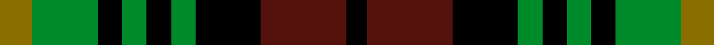
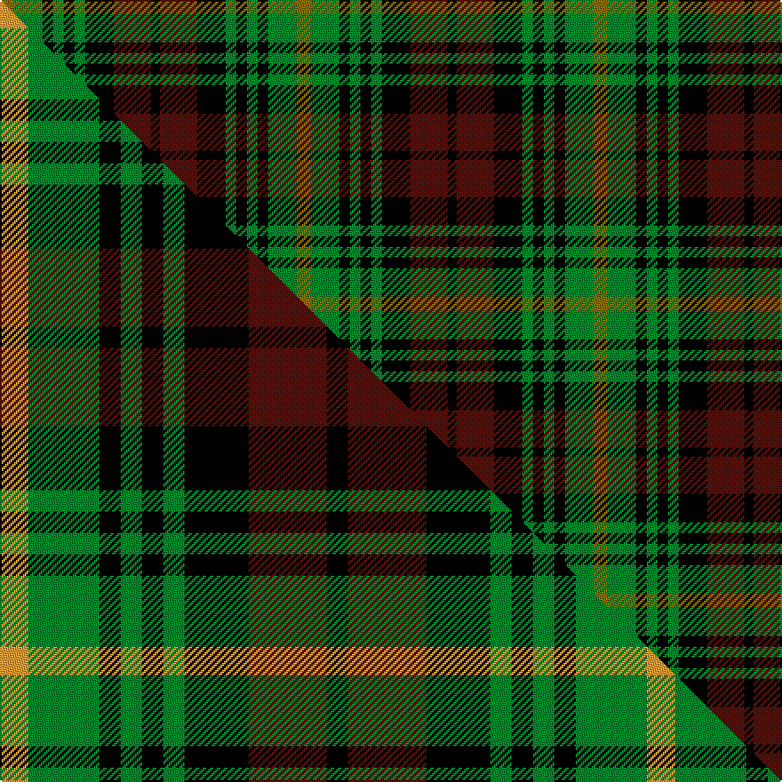

This is one **variant** — a specific cloth: this exact thread count and colourway, with its own
provenance below. It is one weaving of the [sett](/setts/y8g16k6g6k6g6k16dr21k5/) (the scale-free proportion — the
same cloth at any scale or shade), whose colour order is pattern [GGKGKGKBK](/stripes/ggkgkgkbk/).

Part of the [Martin](/tartans/martin/) tartan — the named design grouping this sett with its other cloths.

Sourced from house-of-tartan.  It is a [9 stripe tartan](/stripes/stripes9/).

Original link [http://www.house-of-tartan.scotland.net/house/TartanViewjs.asp?colr=Def&tnam=1207](http://www.house-of-tartan.scotland.net/house/TartanViewjs.asp?colr=Def&tnam=1207)

## Provenance

Earliest known date: 1977 In 1993 Kiltmaker & kilt historian Bob Martin explained that years ago when he first became interested in Scottish tartan (circa 1976) , he bought this J.P. Stevens (a weaver in Burlington North Carolina) fashion fabric from a local outlet in Greenville SC and made himself a kilt from it. He remembered the price being about $2/yd and he bought the last piece of 15yds. He wore the kilt to the Charleston Games and when Scotty Thompson asked him what it was, he replied "Martin" and SC immediately registered it with the Scottish Tartans Society and so it has remained to this day. The thread count is as given by Bob Martin -- he names the second colour as "purple" but says it is more like maroon or claret. However he suggests a more pleasing sett would have a narrower yellow stripe.

Dataset <small>— provenance for this record, inherited from the source manifest</small>

<dl class="dataset-prov">
<dt>source</dt><dd><a href="/sources/house-of-tartan/">House of Tartan</a></dd>
<dt>data captured from</dt><dd><a href="https://github.com/thetartan/tartan-database/blob/master/data/house-of-tartan/data.csv">https://github.com/thetartan/tartan-database/blob/master/data/house-of-tartan/data.csv</a></dd>
<dt>data date</dt><dd>1977 <small>(this record)</small></dd>
<dt>licence</dt><dd><a href="https://creativecommons.org/licenses/by-nc-nd/4.0/">CC BY-NC-ND 4.0</a></dd>
</dl>

Capture chain <small>— the hands this data passed through, oldest first; each capture carries its own licence</small>

<ol class="capture-chain">
<li><a href="http://www.house-of-tartan.scotland.net/">House of Tartan</a> <small>the weaver/retailer's database — the site is now offline; the URL is kept as the ultimate source's identity</small></li>
<li><a href="https://github.com/thetartan/tartan-database">thetartan/tartan-database</a> <small>2016-2017</small> · <a href="https://creativecommons.org/licenses/by-nc-nd/4.0/">CC BY-NC-ND 4.0</a> <small>Levko Kravets's frozen compilation — the capture we vendored, and where its CC licence text came from</small></li>
<li>this dictionary <small>captured 2026-06-10 · commit 5bf86c7566</small> <small>each re-capture is a git commit to data/sources</small></li>
</ol>

## Thread count
Y/8 G16 K6 G6 K6 G6 K16 DR21 K/5

One full sett is **167 threads**.

## Palette
<table><thead><tr><th>Colour</th><th>Shade</th><th>OKLCh</th></tr></thead><tbody><tr><td>DR</td><td><code style="background-color:#55120C;">#55120C</code> <small style="color:#888">#55120C</small></td><td><small style="color:#888">oklch(30.0% 0.099 29.3)</small></td></tr><tr><td>G</td><td><code style="background-color:#008B2A;">#008B2A</code> <small style="color:#888">#008B2A</small></td><td><small style="color:#888">oklch(55.4% 0.170 145.9)</small></td></tr><tr><td>K</td><td><code style="background-color:#000000;">#000000</code> <small style="color:#888">#000000</small></td><td><small style="color:#888">oklch(0.0% 0.000 0.0)</small></td></tr><tr><td>Y</td><td><code style="background-color:#8B6E00;">#8B6E00</code> <small style="color:#888">#8B6E00</small></td><td><small style="color:#888">oklch(55.1% 0.113 90.4)</small></td></tr></tbody></table>

# Sample pattern

## Compared to the master

This cloth is one sett of its design; the master sett (the exemplar the design is anchored on) is below for comparison.

Its **ΔTartan distance** from the master is **0.46** — the same measure the nearest-tartans table ranks by (0 is identical; a re-scale of the same cloth is near 0, a recolour or a different proportion further).

<figure class="master-compare" style="margin:0">

this sett
master sett ★

<figcaption style="color:#888;font-size:smaller">One weave of this sett against the <a href="/setts/lo4g10k3g3k3g3k9dr11k3/">master sett ★</a>, split on the diagonal: a shared proportion runs seamlessly across it with only the shades shifting; a different proportion breaks on it.</figcaption>
</figure>

## Nearest tartan variants

The nearest existing variants by ΔTartan distance, with this cloth at the top so the swatches line up against it.

ΔTartan

Threads

Variant

Sett

—

167

<a href="/variants/s9/y8g16k6g6k6g6k16dr21k5/">Martin Family Tartan</a>

<a href="/ttd/edit/#slug=y8g16k6g6k6g6k16r21k5&amp;base=y8g16k6g6k6g6k16dr21k5" title="compare in the TTD">0.12</a>

167

<a href="/variants/s9/y8g16k6g6k6g6k16r21k5/">Martin</a>

<a href="/ttd/edit/#slug=lo4g10k3g3k3g3k9dr11k3~x4&amp;base=y8g16k6g6k6g6k16dr21k5" title="compare in the TTD">0.46</a>

364

<a href="/variants/s9/lo4g10k3g3k3g3k9dr11k3~x4/">Martin</a>

<a href="/ttd/edit/#slug=dg12k14y11dr3y3dr3y11k14dg12y3~x2~dg1605139&amp;base=y8g16k6g6k6g6k16dr21k5" title="compare in the TTD">1.35</a>

314

<a href="/variants/s10/dg12k14y11dr3y3dr3y11k14dg12y3~x2~dg1605139/">Wilson's No.112 (Light Blue)</a>

<a href="/ttd/edit/#slug=k4dy9k13g6dy3g9w4~x2&amp;base=y8g16k6g6k6g6k16dr21k5" title="compare in the TTD">1.97</a>

176

<a href="/variants/s7/k4dy9k13g6dy3g9w4~x2/">Ramsay Hunting Family Tartan</a>

<a href="/ttd/edit/#slug=r1k2g4k1g1k2db3k1w1~x6&amp;base=y8g16k6g6k6g6k16dr21k5" title="compare in the TTD">2.09</a>

180

<a href="/variants/s9/r1k2g4k1g1k2db3k1w1~x6/">MacKean Dress (Personal)</a>

<a href="/ttd/edit/#slug=r1k2dg4k1dg1k2db3k1w1~x6&amp;base=y8g16k6g6k6g6k16dr21k5" title="compare in the TTD">2.09</a>

180

<a href="/variants/s9/r1k2dg4k1dg1k2db3k1w1~x6/">MacKean dress</a>

<a href="/ttd/edit/#slug=y3dg6k6y4r1y1~x2&amp;base=y8g16k6g6k6g6k16dr21k5" title="compare in the TTD">2.38</a>

76

<a href="/variants/s6/y3dg6k6y4r1y1~x2/">Waterloo</a>

<a href="/ttd/edit/#slug=k6g6y1g6k6dp6k1~x4&amp;base=y8g16k6g6k6g6k16dr21k5" title="compare in the TTD">2.54</a>

228

<a href="/variants/s7/k6g6y1g6k6dp6k1~x4/">Abercrombie (Wilsons No 2/64)</a>

<a href="/ttd/edit/#slug=dp11y2k10g10lo2~x2~dp1607327&amp;base=y8g16k6g6k6g6k16dr21k5" title="compare in the TTD">2.54</a>

114

<a href="/variants/s5/dp11y2k10g10lo2~x2~dp1607327/">Selkirk (Personal) Original</a>

<a href="/ttd/edit/#slug=k1db3k3g3r1g3k3g1r1~x2&amp;base=y8g16k6g6k6g6k16dr21k5" title="compare in the TTD">2.57</a>

72

<a href="/variants/s9/k1db3k3g3r1g3k3g1r1~x2/">Unidentified No 30</a>

## Neighbour map

Every grey dot is one of 13621 variants placed by the first two principal components of the ΔTartan feature space (42% of its variance). Red is this tartan; blue dots are its nearest — click one to open its page.

<svg viewBox="0 0 640 380" role="img" style="max-width:100%;height:auto;border:1px solid #e0e0e0;border-radius:4px;display:block" xmlns="http://www.w3.org/2000/svg"><image href="/nn/cloud.v1.png" width="640" height="380"/><a href="/variants/s9/y8g16k6g6k6g6k16r21k5/"><circle cx="88.9" cy="231.3" r="4" fill="#3465a4"><title>Martin</title></circle></a><a href="/variants/s9/lo4g10k3g3k3g3k9dr11k3~x4/"><circle cx="94.3" cy="236.9" r="4" fill="#3465a4"><title>Martin</title></circle></a><a href="/variants/s10/dg12k14y11dr3y3dr3y11k14dg12y3~x2~dg1605139/"><circle cx="103.1" cy="239.7" r="4" fill="#3465a4"><title>Wilson's No.112 (Light Blue)</title></circle></a><a href="/variants/s7/k4dy9k13g6dy3g9w4~x2/"><circle cx="81.9" cy="255.2" r="4" fill="#3465a4"><title>Ramsay Hunting Family Tartan</title></circle></a><a href="/variants/s9/r1k2g4k1g1k2db3k1w1~x6/"><circle cx="65.6" cy="221.2" r="4" fill="#3465a4"><title>MacKean Dress (Personal)</title></circle></a><a href="/variants/s9/r1k2dg4k1dg1k2db3k1w1~x6/"><circle cx="84.9" cy="224.2" r="4" fill="#3465a4"><title>MacKean dress</title></circle></a><a href="/variants/s6/y3dg6k6y4r1y1~x2/"><circle cx="147.8" cy="241.7" r="4" fill="#3465a4"><title>Waterloo</title></circle></a><a href="/variants/s7/k6g6y1g6k6dp6k1~x4/"><circle cx="129.3" cy="239.3" r="4" fill="#3465a4"><title>Abercrombie (Wilsons No 2/64)</title></circle></a><a href="/variants/s5/dp11y2k10g10lo2~x2~dp1607327/"><circle cx="82.6" cy="219.3" r="4" fill="#3465a4"><title>Selkirk (Personal) Original</title></circle></a><a href="/variants/s9/k1db3k3g3r1g3k3g1r1~x2/"><circle cx="76.0" cy="260.1" r="4" fill="#3465a4"><title>Unidentified No 30</title></circle></a><circle cx="103.4" cy="239.8" r="5" fill="#c00000"/><text x="320" y="376" text-anchor="middle" font-size="11" fill="#999">ground</text><text x="11" y="190" text-anchor="middle" font-size="11" fill="#999" transform="rotate(-90 11 190)">complexity</text></svg>

ID: /variants/s9/y8g16k6g6k6g6k16dr21k5/
