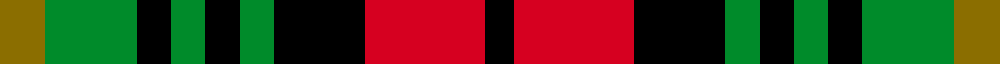
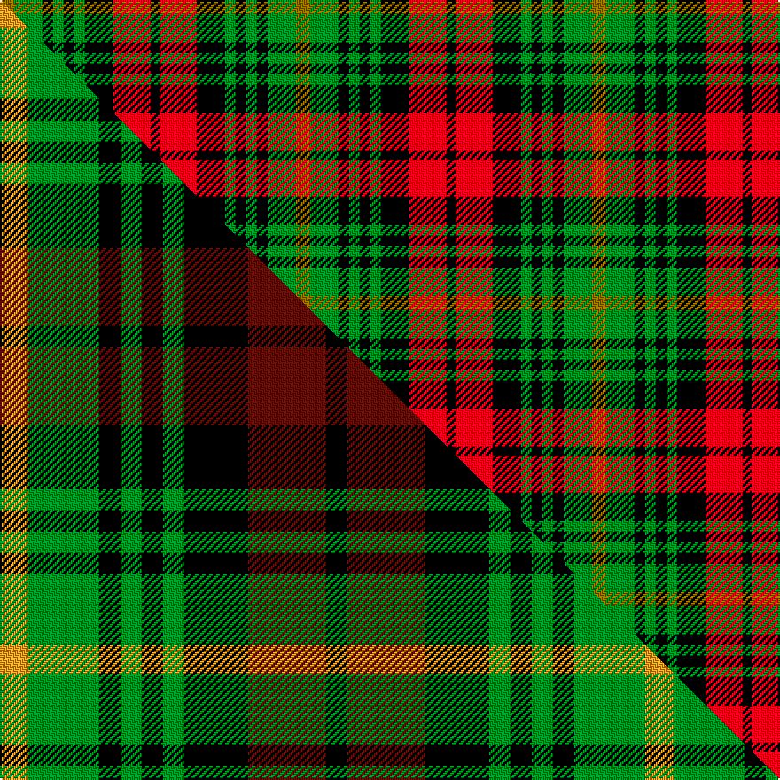

This page is one **sett** — a single exact thread-count. It belongs to the [tartan](/setts/y8g16k6g6k6g6k16r21k5/)
(the same proportion at any scale), whose colour order is pattern [GGKGKGKRK](/stripes/ggkgkgkrk/).

Part of the [Martin](/tartans/martin/) tartan — the named design grouping this sett with its other cloths.

Sourced from weddslist.  It is a [9 stripe tartan](/stripes/stripes9/).

Original link http://www.weddslist.com/cgi-bin/tartans/pg.pl?source=sts

## Thread count
Y/8 G16 K6 G6 K6 G6 K16 R21 K/5

One full sett is **167 threads**.

## Palette
<table><thead><tr><th>Colour</th><th>Shade</th><th>OKLCh</th></tr></thead><tbody><tr><td>R</td><td><code style="background-color:#D60020;">#D60020</code> <small style="color:#888">#D60020</small></td><td><small style="color:#888">oklch(55.2% 0.224 25.5)</small></td></tr><tr><td>G</td><td><code style="background-color:#008B2A;">#008B2A</code> <small style="color:#888">#008B2A</small></td><td><small style="color:#888">oklch(55.4% 0.170 145.9)</small></td></tr><tr><td>K</td><td><code style="background-color:#000000;">#000000</code> <small style="color:#888">#000000</small></td><td><small style="color:#888">oklch(0.0% 0.000 0.0)</small></td></tr><tr><td>Y</td><td><code style="background-color:#8B6E00;">#8B6E00</code> <small style="color:#888">#8B6E00</small></td><td><small style="color:#888">oklch(55.1% 0.113 90.4)</small></td></tr></tbody></table>

# Sample pattern

## Compared to the master

This cloth is one sett of its design; the master sett (the exemplar the design is anchored on) is below for comparison.

Its **ΔTartan distance** from the master is **0.68** — the same measure the nearest-tartans table ranks by (0 is identical; a re-scale of the same cloth is near 0, a recolour or a different proportion further).

<figure class="master-compare" style="margin:0">

this sett
master sett ★

<figcaption style="color:#888;font-size:smaller">One weave of this sett against the <a href="/setts/lo4g10k3g3k3g3k9dr11k3/">master sett ★</a>, split on the diagonal: a shared proportion runs seamlessly across it with only the shades shifting; a different proportion breaks on it.</figcaption>
</figure>

## Nearest variants

The nearest existing variants by ΔTartan distance, with this cloth at the top so the swatches line up against it.

ΔTartan

Threads

Variant

Sett

—

167

<a href="/variants/s9/y8g16k6g6k6g6k16r21k5/">Martin</a>

<a href="/ttd/edit/#slug=y8g16k6g6k6g6k16dr21k5&amp;base=y8g16k6g6k6g6k16r21k5" title="compare in the TTD">0.00</a>

167

<a href="/variants/s9/y8g16k6g6k6g6k16dr21k5/">Martin Family Tartan</a>

<a href="/ttd/edit/#slug=lo4g10k3g3k3g3k9dr11k3~x4&amp;base=y8g16k6g6k6g6k16r21k5" title="compare in the TTD">0.47</a>

364

<a href="/variants/s9/lo4g10k3g3k3g3k9dr11k3~x4/">Martin</a>

<a href="/ttd/edit/#slug=k1db3k3g3r1g3k3g1r1~x2&amp;base=y8g16k6g6k6g6k16r21k5" title="compare in the TTD">2.87</a>

72

<a href="/variants/s9/k1db3k3g3r1g3k3g1r1~x2/">Unidentified No 30</a>

## Neighbour map

Every grey dot is one of 13620 variants placed by the first two principal components of the ΔTartan feature space (42% of its variance). Red is this tartan; blue dots are its nearest — click one to open its page.

<svg viewBox="0 0 640 380" role="img" style="max-width:100%;height:auto;border:1px solid #e0e0e0;border-radius:4px;display:block" xmlns="http://www.w3.org/2000/svg"><image href="/nn/cloud.v1.png" width="640" height="380"/><a href="/variants/s9/y8g16k6g6k6g6k16dr21k5/"><circle cx="103.3" cy="239.2" r="4" fill="#3465a4"><title>Martin Family Tartan</title></circle></a><a href="/variants/s9/lo4g10k3g3k3g3k9dr11k3~x4/"><circle cx="94.2" cy="236.3" r="4" fill="#3465a4"><title>Martin</title></circle></a><a href="/variants/s9/k1db3k3g3r1g3k3g1r1~x2/"><circle cx="75.8" cy="259.5" r="4" fill="#3465a4"><title>Unidentified No 30</title></circle></a><circle cx="88.8" cy="230.6" r="5" fill="#c00000"/><text x="320" y="376" text-anchor="middle" font-size="11" fill="#999">ground</text><text x="11" y="190" text-anchor="middle" font-size="11" fill="#999" transform="rotate(-90 11 190)">complexity</text></svg>

ID: /variants/s9/y8g16k6g6k6g6k16r21k5/
