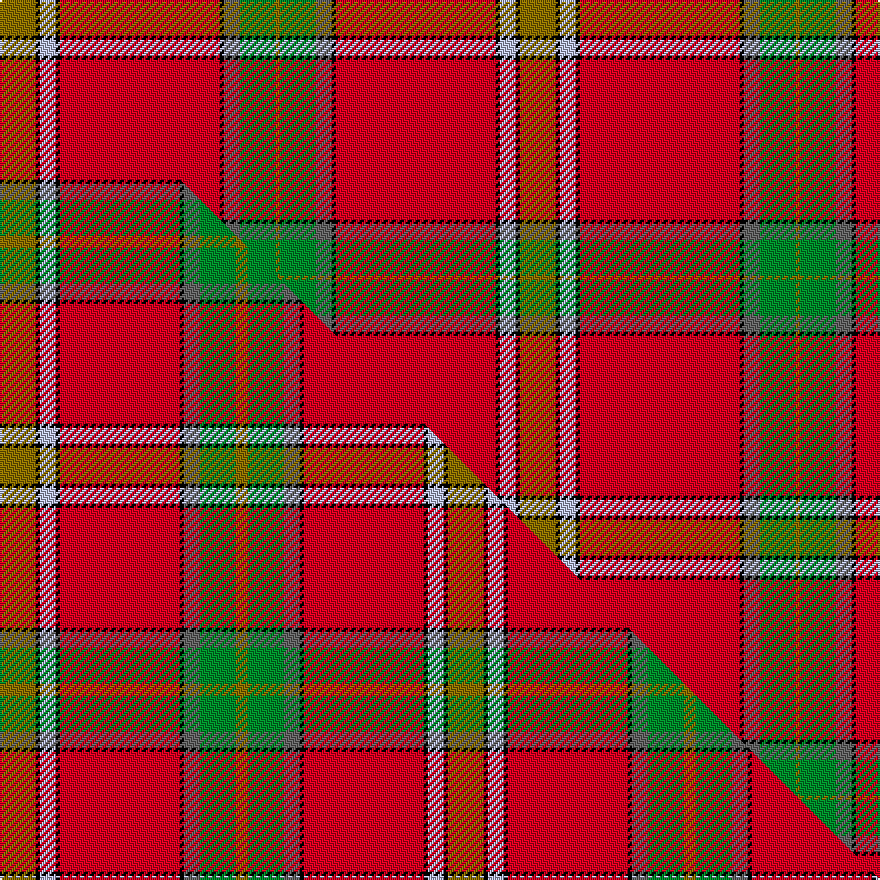

This page is one **sett** — a single exact thread-count. It belongs to the [tartan](/setts/y9k1lb4k1r40k1n4g9y1/)
(the same proportion at any scale), whose colour order is pattern [GGBKRKWKG](/stripes/ggbkrkwkg/).

Part of the [Kings Mountain 1780](/tartans/kings-mountain-1780/) tartan — the named design grouping this sett with its other cloths.

Sourced from tartans-authority.  It is a [9 stripe tartan](/stripes/stripes9/).

Original link http://www.tartansauthority.com/tartan-ferret/display/10285/

## Register references

External register numbers recorded for this tartan.

- Scottish Register of Tartans: [10285](https://www.tartanregister.gov.uk/tartanDetails?ref=10285)
- Scottish Tartans Authority (ITI): 10285

## Thread count
Y/18 K2 LB8 K2 R80 K2 N8 G18 Y/2

One full sett is **260 threads**.

## Palette
<table><thead><tr><th>Colour</th><th>Shade</th><th>OKLCh</th></tr></thead><tbody><tr><td>G</td><td><code style="background-color:#008B2A;">#008B2A</code> <small style="color:#888">#008B2A</small></td><td><small style="color:#888">oklch(55.4% 0.170 145.9)</small></td></tr><tr><td>K</td><td><code style="background-color:#000000;">#000000</code> <small style="color:#888">#000000</small></td><td><small style="color:#888">oklch(0.0% 0.000 0.0)</small></td></tr><tr><td>LB</td><td><code style="background-color:#B5BBDE;">#B5BBDE</code> <small style="color:#888">#B5BBDE</small></td><td><small style="color:#888">oklch(79.9% 0.050 277.6)</small></td></tr><tr><td>N</td><td><code style="background-color:#636363;">#636363</code> <small style="color:#888">#636363</small></td><td><small style="color:#888">oklch(50.0% 0.000 89.9)</small></td></tr><tr><td>R</td><td><code style="background-color:#D60020;">#D60020</code> <small style="color:#888">#D60020</small></td><td><small style="color:#888">oklch(55.2% 0.224 25.5)</small></td></tr><tr><td>Y</td><td><code style="background-color:#8B6E00;">#8B6E00</code> <small style="color:#888">#8B6E00</small></td><td><small style="color:#888">oklch(55.1% 0.113 90.4)</small></td></tr></tbody></table>

# Sample pattern

## Compared to the master

This cloth is one sett of its design; the master sett (the exemplar the design is anchored on) is below for comparison.

Its **ΔTartan distance** from the master is **0.34** — the same measure the nearest-tartans table ranks by (0 is identical; a re-scale of the same cloth is near 0, a recolour or a different proportion further).

<figure class="master-compare" style="margin:0">

this sett
master sett ★

<figcaption style="color:#888;font-size:smaller">One weave of this sett against the <a href="/setts/y9k1lb4k1r30k1n4g9y3/">master sett ★</a>, split on the diagonal: a shared proportion runs seamlessly across it with only the shades shifting; a different proportion breaks on it.</figcaption>
</figure>

## Nearest tartan variants

The nearest existing variants by ΔTartan distance, with this cloth at the top so the swatches line up against it.

ΔTartan

Threads

Variant

Sett

—

260

<a href="/variants/s9/y9k1lb4k1r40k1n4g9y1~x2/">Kings Mountain 1780 (Commemorative)</a>

<a href="/ttd/edit/#slug=y9k1lb4k1r30k1n4g9y3~x2&amp;base=y9k1lb4k1r40k1n4g9y1~x2" title="compare in the TTD">0.34</a>

224

<a href="/variants/s9/y9k1lb4k1r30k1n4g9y3~x2/">Kings Mountain 1780</a>

<a href="/ttd/edit/#slug=y1k1dt2w1y1t3r31k2y5k2t1~x2~dt1204274-t2205244&amp;base=y9k1lb4k1r40k1n4g9y1~x2" title="compare in the TTD">2.24</a>

196

<a href="/variants/s11/y1k1db2w1y1t3r31k2y5k2t1~x2~db1204274-t2205244/">Scottish Banner, The</a>

<a href="/ttd/edit/#slug=r40g16lyi2k8ly4w1db5w2~x2~lyi3307090-ly2602166&amp;base=y9k1lb4k1r40k1n4g9y1~x2" title="compare in the TTD">2.30</a>

228

<a href="/variants/s8/r40g16ly2k8y4w1db5w2~x2~ly3307090-y2602166/">Caledonian Soc., Ancient (Artefact)</a>

<a href="/ttd/edit/#slug=r40g16y2k8lb4w1db5w2~x2&amp;base=y9k1lb4k1r40k1n4g9y1~x2" title="compare in the TTD">2.30</a>

228

<a href="/variants/s8/r40g16y2k8lb4w1db5w2~x2/">Ancient Caledonian Society</a>

<a href="/ttd/edit/#slug=w2r16k1lb2k1y43k1lb2k1g16lb1~x2&amp;base=y9k1lb4k1r40k1n4g9y1~x2" title="compare in the TTD">2.34</a>

338

<a href="/variants/s11/w2r16k1lb2k1y43k1lb2k1g16lb1~x2/">Baxter Clan Tartan</a>

<a href="/ttd/edit/#slug=r36w1db3y1g16r8db3w5&amp;base=y9k1lb4k1r40k1n4g9y1~x2" title="compare in the TTD">2.47</a>

105

<a href="/variants/s8/r36w1db3y1g16r8db3w5/">Drummond of Perth</a>

<a href="/ttd/edit/#slug=r51y2k4w2g21r10k4lb4w2~x2&amp;base=y9k1lb4k1r40k1n4g9y1~x2" title="compare in the TTD">2.51</a>

294

<a href="/variants/s9/r51y2k4w2g21r10k4lb4w2~x2/">Drummond of Perth</a>

<a href="/ttd/edit/#slug=r68k1g6lb4g1lb12w1g6dy1g24dy1g2dy3~x2~g2203152&amp;base=y9k1lb4k1r40k1n4g9y1~x2" title="compare in the TTD">2.58</a>

378

<a href="/variants/s13/r68k1g6lb4g1lb12w1g6dy1g24dy1g2dy3~x2~g2203152/">Ellis Island American District Tartan</a>

<a href="/ttd/edit/#slug=r68k1g6lb4g1lb12w1g6dy1g24dy1g2dy3~x2&amp;base=y9k1lb4k1r40k1n4g9y1~x2" title="compare in the TTD">2.87</a>

378

<a href="/variants/s13/r68k1g6lb4g1lb12w1g6dy1g24dy1g2dy3~x2/">Ellis Island (District)</a>

<a href="/ttd/edit/#slug=r33w1k3w1g13r7k3dp3w1~x2&amp;base=y9k1lb4k1r40k1n4g9y1~x2" title="compare in the TTD">2.92</a>

192

<a href="/variants/s9/r33w1k3w1g13r7k3dp3w1~x2/">Leach, Leech, Leitch, dress</a>

## Neighbour map

Every grey dot is one of 13620 variants placed by the first two principal components of the ΔTartan feature space (42% of its variance). Red is this tartan; blue dots are its nearest — click one to open its page.

<svg viewBox="0 0 640 380" role="img" style="max-width:100%;height:auto;border:1px solid #e0e0e0;border-radius:4px;display:block" xmlns="http://www.w3.org/2000/svg"><image href="/nn/cloud.v1.png" width="640" height="380"/><a href="/variants/s9/y9k1lb4k1r30k1n4g9y3~x2/"><circle cx="265.4" cy="87.3" r="4" fill="#3465a4"><title>Kings Mountain 1780</title></circle></a><a href="/variants/s11/y1k1db2w1y1t3r31k2y5k2t1~x2~db1204274-t2205244/"><circle cx="341.5" cy="34.6" r="4" fill="#3465a4"><title>Scottish Banner, The</title></circle></a><a href="/variants/s8/r40g16ly2k8y4w1db5w2~x2~ly3307090-y2602166/"><circle cx="235.8" cy="55.3" r="4" fill="#3465a4"><title>Caledonian Soc., Ancient (Artefact)</title></circle></a><a href="/variants/s8/r40g16y2k8lb4w1db5w2~x2/"><circle cx="233.4" cy="53.7" r="4" fill="#3465a4"><title>Ancient Caledonian Society</title></circle></a><a href="/variants/s11/w2r16k1lb2k1y43k1lb2k1g16lb1~x2/"><circle cx="301.9" cy="60.6" r="4" fill="#3465a4"><title>Baxter Clan Tartan</title></circle></a><a href="/variants/s8/r36w1db3y1g16r8db3w5/"><circle cx="366.2" cy="104.0" r="4" fill="#3465a4"><title>Drummond of Perth</title></circle></a><a href="/variants/s9/r51y2k4w2g21r10k4lb4w2~x2/"><circle cx="310.1" cy="70.0" r="4" fill="#3465a4"><title>Drummond of Perth</title></circle></a><a href="/variants/s13/r68k1g6lb4g1lb12w1g6dy1g24dy1g2dy3~x2~g2203152/"><circle cx="336.7" cy="30.9" r="4" fill="#3465a4"><title>Ellis Island American District Tartan</title></circle></a><a href="/variants/s13/r68k1g6lb4g1lb12w1g6dy1g24dy1g2dy3~x2/"><circle cx="317.7" cy="26.5" r="4" fill="#3465a4"><title>Ellis Island (District)</title></circle></a><a href="/variants/s9/r33w1k3w1g13r7k3dp3w1~x2/"><circle cx="334.2" cy="72.4" r="4" fill="#3465a4"><title>Leach, Leech, Leitch, dress</title></circle></a><circle cx="338.8" cy="60.4" r="5" fill="#c00000"/><text x="320" y="376" text-anchor="middle" font-size="11" fill="#999">ground</text><text x="11" y="190" text-anchor="middle" font-size="11" fill="#999" transform="rotate(-90 11 190)">complexity</text></svg>

ID: /variants/s9/y9k1lb4k1r40k1n4g9y1~x2/
