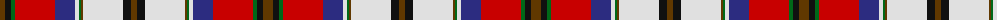

The parent of this is [MacCulloch Dress (Name)](/tartans/t/10/k6/g4/r40/db20/ln4/g2/t2/ln40/k8/t/6/)

This was sourced from tartans-authority.  It is a [11 stripes tartan](/stripes/stripes11/).

Original link http://www.tartansauthority.com/tartan-ferret/display/3346/

## Thread count
T/10 K6 G4 R40 DB20 LN4 G2 T2 LN40 K8 T/6

## Palette
Each colour and its ΔE from the base-6 reference it is a variant of.

| Colour | Shade | Base | ΔE (OKLab) |
|---|---|---|---|
| DB |  `#2C2C80` | B  | 0.05 |
| G |  `#006818` | G  | 0.02 |
| K |  `#101010` | K  | 0.17 |
| LN |  `#E0E0E0` | W  | 0.06 |
| R |  `#C80000` | R  | 0.00 |
| T |  `#603800` | G  | 0.16 |

ID: /variants/t/10/k6/g4/r40/db20/ln4/g2/t2/ln40/k8/t/6-db2c2c80-g006818-k101010-lne0e0e0-rc80000-t603800/
