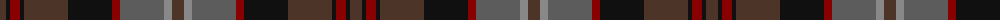

The parent of this is [Lochaber (Ingles Buchan)](/tartans/t/12/k4/dr10/k4/t44/k44/dr8/n44/na8/t/12/)

This was sourced from register-of-tartans.  It is a [10 stripes tartan](/stripes/stripes10/).

Original link https://www.tartanregister.gov.uk/tartanDetails.aspx?ref=2163

## Thread count
T/12 K4 DR10 K4 T44 K44 DR8 N44 Na8 T/12

## Palette
Each colour and its ΔE from the base-6 reference it is a variant of.

| Colour | Shade | Base | ΔE (OKLab) |
|---|---|---|---|
| DR |  `#880000` | R  | 0.14 |
| K |  `#101010` | K  | 0.17 |
| N |  `#5C5C5C` | B  | 0.14 |
| Na |  `#888888` | R  | 0.24 |
| T |  `#4C3428` | B  | 0.16 |

ID: /variants/t/12/k4/dr10/k4/t44/k44/dr8/n44/na8/t/12-dr880000-k101010-n5c5c5c-na888888-t4c3428/
