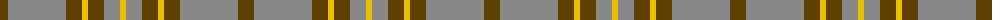
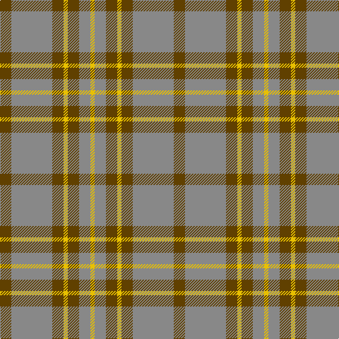

The parent of this is [Lister (Name)](/tartans/t/16/n58/t16/y6/t16/n16/y/6/)

This was sourced from tartans-authority.  It is a [7 stripes tartan](/stripes/stripes7/).

Original link http://www.tartansauthority.com/tartan-ferret/display/10650/

## Thread count
T/16 N58 T16 Y6 T16 N16 Y/6

## Palette
Each colour and its ΔE from the base-6 reference it is a variant of.

| Colour | Shade | Base | ΔE (OKLab) |
|---|---|---|---|
| N |  `#888888` | R  | 0.24 |
| T |  `#604000` | G  | 0.14 |
| Y |  `#E8C000` | Y  | 0.00 |

# Sample pattern

ID: /variants/t/16/n58/t16/y6/t16/n16/y/6-n888888-t604000-ye8c000/
