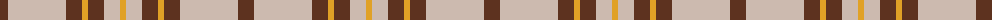

The parent of this is [Lister (Misty Mountain) Name Tartan Tartan Number: 10650. Earliest known date: 07/07/2012 Inspired by a sponsored challenge to wear kilts for a year, David Lister designed this tartan for his family. Colours: grey represents mountain mists; brown represents the matriarchal line and mountains; gold represents the first rays of the morning sun. There are no restrictions as to who can wear this tartan. See products available Copyright © Blair Urquhart, Comrie, 2015](/tartans/t/16/n58/t16/y6/t16/n16/y/6/)

This was sourced from house-of-tartan.  It is a [7 stripes tartan](/stripes/stripes7/).

Original link http://www.house-of-tartan.scotland.net/house/TartanViewjs.asp?colr=Def&tnam=10650

## Thread count
T/16 N58 T16 Y6 T16 N16 Y/6

## Palette
Each colour and its ΔE from the base-6 reference it is a variant of.

| Colour | Shade | Base | ΔE (OKLab) |
|---|---|---|---|
| N |  `#CCBAAF` | Y  | 0.15 |
| T |  `#5D321F` | B  | 0.18 |
| Y |  `#E0A126` | Y  | 0.08 |

# Sample pattern

ID: /variants/t/16/n58/t16/y6/t16/n16/y/6-nccbaaf-t5d321f-ye0a126/
