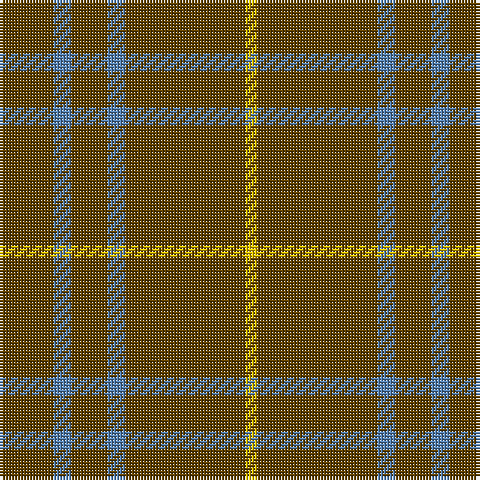

The parent of this is [Oman, Sultanate of..](/tartans/t/18/b6/t12/b6/t40/y/4/)

This was sourced from weddslist.  It is a [6 stripes tartan](/stripes/stripes6/).

Original link http://www.weddslist.com/cgi-bin/tartans/pg.pl?source=sts

## Thread count
T/18 B6 T12 B6 T40 Y/4

## Palette
Each colour and its ΔE from the base-6 reference it is a variant of.

| Colour | Shade | Base | ΔE (OKLab) |
|---|---|---|---|
| B |  `#5480B0` | B  | 0.20 |
| T |  `#604000` | G  | 0.14 |
| Y |  `#F0C000` | Y  | 0.01 |

# Sample pattern

ID: /variants/t/18/b6/t12/b6/t40/y/4-b5480b0-t604000-yf0c000/
