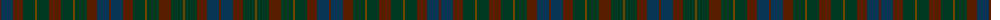
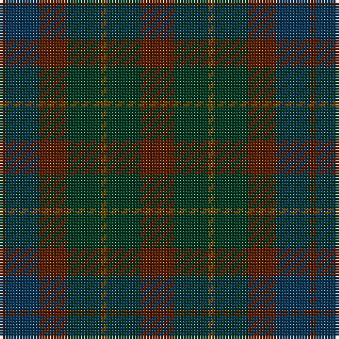

The parent of this is [Gleneagles (Corporate)](/tartans/t/2/db12/t10/dg12/ta2/dg12/t/12/)

This was sourced from tartans-authority.  It is a [7 stripes tartan](/stripes/stripes7/).

Original link http://www.tartansauthority.com/tartan-ferret/display/2107/

## Thread count
T/2 DB12 T10 DG12 Ta2 DG12 T/12

## Palette
Each colour and its ΔE from the base-6 reference it is a variant of.

| Colour | Shade | Base | ΔE (OKLab) |
|---|---|---|---|
| DB |  `#083454` | B  | 0.10 |
| DG |  `#003820` | G  | 0.16 |
| T |  `#581C00` | B  | 0.21 |
| Ta |  `#684800` | G  | 0.13 |

# Sample pattern

ID: /variants/t/2/db12/t10/dg12/ta2/dg12/t/12-db083454-dg003820-t581c00-ta684800/
