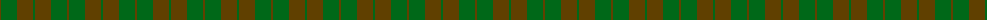
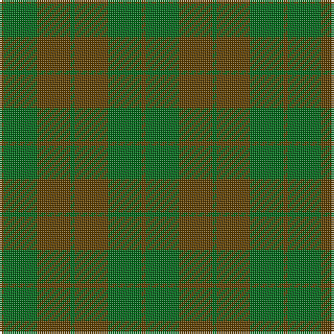

The parent of this is [MacKinnon Htg (Clan)](/tartans/t/2/ga16/ta16/g2/ta16/ga16/ta/2/)

This was sourced from tartans-authority.  It is a [7 stripes tartan](/stripes/stripes7/).

Original link http://www.tartansauthority.com/tartan-ferret/display/1641/

## Thread count
T/2 Ga16 Ta16 G2 Ta16 Ga16 Ta/2

## Palette
Each colour and its ΔE from the base-6 reference it is a variant of.

| Colour | Shade | Base | ΔE (OKLab) |
|---|---|---|---|
| G |  `#006818` | G  | 0.02 |
| Ga |  `#006818` | G  | 0.02 |
| T |  `#604000` | G  | 0.14 |
| Ta |  `#604000` | G  | 0.14 |

# Sample pattern

ID: /variants/t/2/ga16/ta16/g2/ta16/ga16/ta/2-g006818-ga006818-t604000-ta604000/
