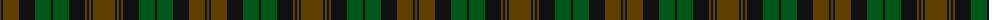

The parent of this is [Brown Watch Trade Tartan Tartan Number: 1739. Earliest known date: pre 1986 Product of J & D Paton of Tillicoultry, one of many samples presented to the Scottish Tartan Society sometime before 1986 See products available Copyright © Blair Urquhart, Comrie, 2015](/tartans/t/2/k2/t16/k16/g16/k2/g16/k16/t2/k2/t2/k2/t/22/)

This was sourced from house-of-tartan.  It is a [13 stripes tartan](/stripes/stripes13/).

Original link http://www.house-of-tartan.scotland.net/house/TartanViewjs.asp?colr=Def&tnam=1739

## Thread count
T/2 K2 T16 K16 G16 K2 G16 K16 T2 K2 T2 K2 T/22

## Palette
Each colour and its ΔE from the base-6 reference it is a variant of.

| Colour | Shade | Base | ΔE (OKLab) |
|---|---|---|---|
| G |  `#005818` | G  | 0.04 |
| K |  `#101010` | K  | 0.17 |
| T |  `#604000` | G  | 0.14 |

ID: /variants/t/2/k2/t16/k16/g16/k2/g16/k16/t2/k2/t2/k2/t/22-g005818-k101010-t604000/
