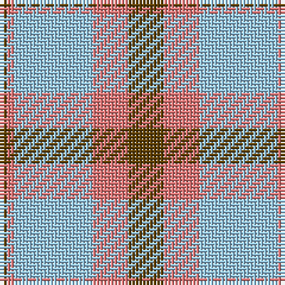

The parent of this is [O'Connor Dress](/tartans/t/2/lr2/lb22/lr10/t/10/)

This was sourced from register-of-tartans.  It is a [5 stripes tartan](/stripes/stripes5/).

Original link https://www.tartanregister.gov.uk/tartanDetails.aspx?ref=3218

## Thread count
T/2 LR2 LB22 LR10 T/10

## Palette
Each colour and its ΔE from the base-6 reference it is a variant of.

| Colour | Shade | Base | ΔE (OKLab) |
|---|---|---|---|
| B |  `#5C8CA8` | B  | 0.23 |
| Ba |  `#48A4C0` | Y  | 0.28 |
| DO |  `#B84C00` | R  | 0.08 |
| LB |  `#98C8E8` | W  | 0.17 |
| LR |  `#E87878` | R  | 0.19 |
| LRa |  `#E08070` | Y  | 0.20 |
| T |  `#604000` | G  | 0.14 |

# Sample pattern

ID: /variants/t/2/lr2/lb22/lr10/t/10-b5c8ca8-ba48a4c0-dob84c00-lb98c8e8-lre87878-lrae08070-t604000/
