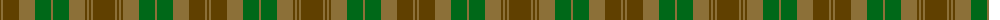

The parent of this is [Tyneside Scottish (Green) (District)](/tartans/t/2/lt2/t16/lt16/g16/lt2/g16/lt16/t2/lt2/t2/lt2/t/22/)

This was sourced from tartans-authority.  It is a [13 stripes tartan](/stripes/stripes13/).

Original link http://www.tartansauthority.com/tartan-ferret/display/5084/

## Thread count
T/2 LT2 T16 LT16 G16 LT2 G16 LT16 T2 LT2 T2 LT2 T/22

## Palette
Each colour and its ΔE from the base-6 reference it is a variant of.

| Colour | Shade | Base | ΔE (OKLab) |
|---|---|---|---|
| G |  `#006818` | G  | 0.02 |
| LT |  `#8C7038` | G  | 0.18 |
| T |  `#604000` | G  | 0.14 |

ID: /variants/t/2/lt2/t16/lt16/g16/lt2/g16/lt16/t2/lt2/t2/lt2/t/22-g006818-lt8c7038-t604000/
