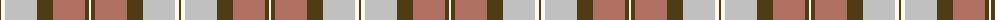

The parent of this is [Jones (2016)](/tartans/t/2/w4/n32/t16/lt32/t4/w/2/)

This was sourced from register-of-tartans.  It is a [7 stripes tartan](/stripes/stripes7/).

Original link https://www.tartanregister.gov.uk/tartanDetails.aspx?ref=11568

## Thread count
T/2 W4 N32 T16 LT32 T4 W/2

## Palette
Each colour and its ΔE from the base-6 reference it is a variant of.

| Colour | Shade | Base | ΔE (OKLab) |
|---|---|---|---|
| LT |  `#B07064` | R  | 0.16 |
| N |  `#C0C0C0` | W  | 0.16 |
| T |  `#503C14` | G  | 0.15 |
| W |  `#F8F8EC` | W  | 0.01 |

# Sample pattern

ID: /variants/t/2/w4/n32/t16/lt32/t4/w/2-ltb07064-nc0c0c0-t503c14-wf8f8ec/
