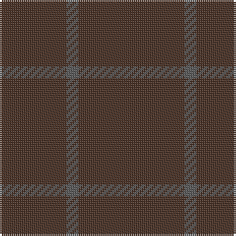

The parent of this is [Outlander #4](/tartans/t/34/n6/t/54/)

This was sourced from register-of-tartans.  It is a [3 stripes tartan](/stripes/stripes3/).

Original link https://www.tartanregister.gov.uk/tartanDetails.aspx?ref=11116

## Thread count
T/34 N6 T/54

## Palette
Each colour and its ΔE from the base-6 reference it is a variant of.

| Colour | Shade | Base | ΔE (OKLab) |
|---|---|---|---|
| N |  `#5C5C5C` | B  | 0.14 |
| T |  `#4C3428` | B  | 0.16 |

# Sample pattern

ID: /variants/t/34/n6/t/54-n5c5c5c-t4c3428/
