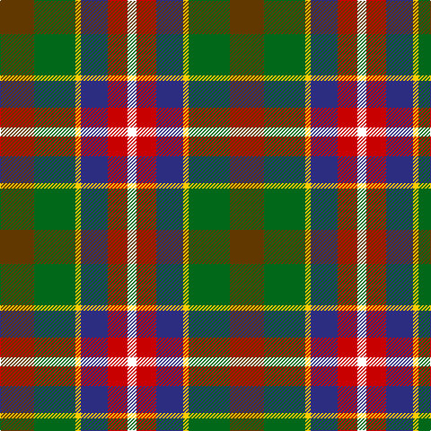

The parent of this is [Mekos, The](/tartans/t/38/g46/y6/db30/r22/w/10/)

This was sourced from tartans-authority.  It is a [6 stripes tartan](/stripes/stripes6/).

Original link http://www.tartansauthority.com/tartan-ferret/display/11072/

## Thread count
T/38 G46 Y6 DB30 R22 W/10

## Palette
Each colour and its ΔE from the base-6 reference it is a variant of.

| Colour | Shade | Base | ΔE (OKLab) |
|---|---|---|---|
| DB |  `#2C2C80` | B  | 0.05 |
| G |  `#006818` | G  | 0.02 |
| R |  `#C80000` | R  | 0.00 |
| T |  `#603800` | G  | 0.16 |
| W |  `#FCFCFC` | W  | 0.03 |
| Y |  `#FCCC00` | Y  | 0.04 |

# Sample pattern

ID: /variants/t/38/g46/y6/db30/r22/w/10-db2c2c80-g006818-rc80000-t603800-wfcfcfc-yfccc00/
