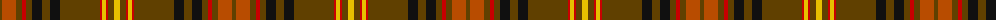

The parent of this is [Balnagown (Corporate)](/tartans/t/4/do14/t6/r4/t6/k10/t8/k10/t40/r2/y4/r2/t6/y/6/)

This was sourced from tartans-authority.  It is a [14 stripes tartan](/stripes/stripes14/).

Original link http://www.tartansauthority.com/tartan-ferret/display/5824/

## Thread count
T/4 DO14 T6 R4 T6 K10 T8 K10 T40 R2 Y4 R2 T6 Y/6

## Palette
Each colour and its ΔE from the base-6 reference it is a variant of.

| Colour | Shade | Base | ΔE (OKLab) |
|---|---|---|---|
| DO |  `#B84C00` | R  | 0.08 |
| K |  `#101010` | K  | 0.17 |
| R |  `#C80000` | R  | 0.00 |
| T |  `#604000` | G  | 0.14 |
| Y |  `#E8C000` | Y  | 0.00 |

ID: /variants/t/4/do14/t6/r4/t6/k10/t8/k10/t40/r2/y4/r2/t6/y/6-dob84c00-k101010-rc80000-t604000-ye8c000/
