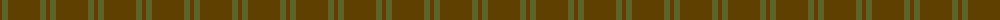
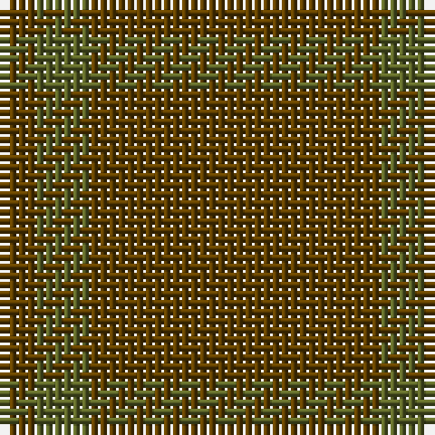

The parent of this is [Hallstatt (Artefact)](/tartans/t/4/g6/t/32/)

This was sourced from tartans-authority.  It is a [3 stripes tartan](/stripes/stripes3/).

Original link http://www.tartansauthority.com/tartan-ferret/display/5987/

## Thread count
T/4 G6 T/32

## Palette
Each colour and its ΔE from the base-6 reference it is a variant of.

| Colour | Shade | Base | ΔE (OKLab) |
|---|---|---|---|
| G |  `#5C6428` | G  | 0.09 |
| T |  `#604000` | G  | 0.14 |

# Sample pattern

ID: /variants/t/4/g6/t/32-g5c6428-t604000/
