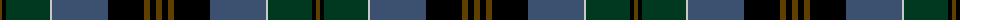

The parent of this is [Black Gold (Corporate)](/tartans/t/4/k4/dg44/n2/b56/k36/t6/k6/t/6/)

This was sourced from tartans-authority.  It is a [9 stripes tartan](/stripes/stripes9/).

Original link http://www.tartansauthority.com/tartan-ferret/display/4253/

## Thread count
T/4 K4 DG44 N2 B56 K36 T6 K6 T/6

## Palette
Each colour and its ΔE from the base-6 reference it is a variant of.

| Colour | Shade | Base | ΔE (OKLab) |
|---|---|---|---|
| B |  `#3C5070` | B  | 0.07 |
| DG |  `#003820` | G  | 0.16 |
| K |  `#000000` | K  | 0.00 |
| N |  `#C8C8C8` | W  | 0.13 |
| T |  `#604000` | G  | 0.14 |

ID: /variants/t/4/k4/dg44/n2/b56/k36/t6/k6/t/6-b3c5070-dg003820-k000000-nc8c8c8-t604000/
