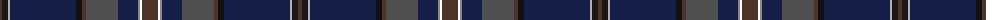

The parent of this is [Arran Mist](/tartans/t/4/ka6/nb2/db66/k6/t4/n32/db20/na2/w2/t/16/)

This was sourced from register-of-tartans.  It is a [11 stripes tartan](/stripes/stripes11/).

Original link https://www.tartanregister.gov.uk/tartanDetails.aspx?ref=11544

## Thread count
T/4 Ka6 Nb2 DB66 K6 T4 N32 DB20 Na2 W2 T/16

## Palette
Each colour and its ΔE from the base-6 reference it is a variant of.

| Colour | Shade | Base | ΔE (OKLab) |
|---|---|---|---|
| DB |  `#141E46` | B  | 0.15 |
| K |  `#101010` | K  | 0.17 |
| Ka |  `#1C1714` | K  | 0.21 |
| N |  `#505050` | B  | 0.12 |
| Na |  `#888888` | R  | 0.24 |
| Nb |  `#B0B0B0` | Y  | 0.18 |
| T |  `#4C3428` | B  | 0.16 |
| W |  `#FFFFFF` | W  | 0.03 |

ID: /variants/t/4/ka6/nb2/db66/k6/t4/n32/db20/na2/w2/t/16-db141e46-k101010-ka1c1714-n505050-na888888-nbb0b0b0-t4c3428-wffffff/
