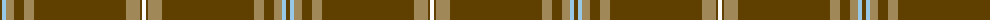

The parent of this is [KIltwalk, The (Corporate)](/tartans/t/4/lb4/lt8/t10/lt10/t92/lt14/t2/w/4/)

This was sourced from tartans-authority.  It is a [9 stripes tartan](/stripes/stripes9/).

Original link http://www.tartansauthority.com/tartan-ferret/display/8529/

## Thread count
T/4 LB4 LT8 T10 LT10 T92 LT14 T2 W/4

## Palette
Each colour and its ΔE from the base-6 reference it is a variant of.

| Colour | Shade | Base | ΔE (OKLab) |
|---|---|---|---|
| LB |  `#98C8E8` | W  | 0.17 |
| LT |  `#A08858` | Y  | 0.21 |
| T |  `#604000` | G  | 0.14 |
| W |  `#FCFCFC` | W  | 0.03 |

ID: /variants/t/4/lb4/lt8/t10/lt10/t92/lt14/t2/w/4-lb98c8e8-lta08858-t604000-wfcfcfc/
