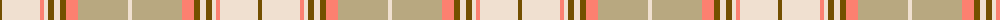

The parent of this is [Llama (Fashion)](/tartans/t/4/w38/lr4/w4/t6/w6/t6/lr12/lg50/w/4/)

This was sourced from tartans-authority.  It is a [10 stripes tartan](/stripes/stripes10/).

Original link http://www.tartansauthority.com/tartan-ferret/display/8165/

## Thread count
T/4 W38 LR4 W4 T6 W6 T6 LR12 LG50 W/4

## Palette
Each colour and its ΔE from the base-6 reference it is a variant of.

| Colour | Shade | Base | ΔE (OKLab) |
|---|---|---|---|
| LG |  `#B8A880` | Y  | 0.14 |
| LR |  `#FC8070` | Y  | 0.19 |
| T |  `#745000` | G  | 0.14 |
| W |  `#F0E0D0` | W  | 0.06 |

ID: /variants/t/4/w38/lr4/w4/t6/w6/t6/lr12/lg50/w/4-lgb8a880-lrfc8070-t745000-wf0e0d0/
