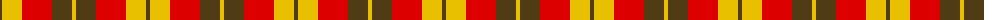
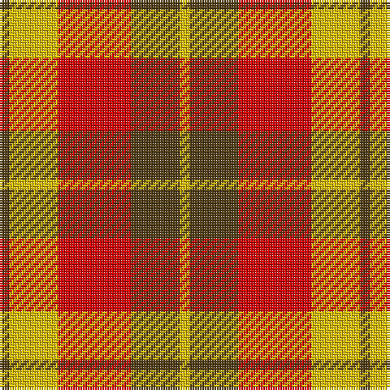

The parent of this is [Harmony 9](/tartans/t/4/y20/r30/t20/y/4/)

This was sourced from register-of-tartans.  It is a [5 stripes tartan](/stripes/stripes5/).

Original link https://www.tartanregister.gov.uk/tartanDetails.aspx?ref=1613

## Thread count
T/4 Y20 R30 T20 Y/4

## Palette
Each colour and its ΔE from the base-6 reference it is a variant of.

| Colour | Shade | Base | ΔE (OKLab) |
|---|---|---|---|
| R |  `#DC0000` | R  | 0.04 |
| T |  `#503C14` | G  | 0.15 |
| Y |  `#E8C000` | Y  | 0.00 |

# Sample pattern

ID: /variants/t/4/y20/r30/t20/y/4-rdc0000-t503c14-ye8c000/
