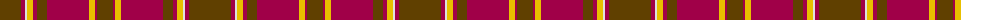

The parent of this is [Glendronach Corporate Tartan Tartan Number: 2293. Earliest known date: 1989 A copyright design created for the Glendronach Company. See products available Copyright © Blair Urquhart, Comrie, 2015](/tartans/t/42/r4/ln2/y6/r4/t10/r42/y2/ya2/y2/r2/t/16/)

This was sourced from house-of-tartan.  It is a [12 stripes tartan](/stripes/stripes12/).

Original link http://www.house-of-tartan.scotland.net/house/TartanViewjs.asp?colr=Def&tnam=2293

## Thread count
T/42 R4 LN2 Y6 R4 T10 R42 Y2 Ya2 Y2 R2 T/16

## Palette
Each colour and its ΔE from the base-6 reference it is a variant of.

| Colour | Shade | Base | ΔE (OKLab) |
|---|---|---|---|
| LN |  `#E0E0E0` | W  | 0.06 |
| R |  `#A00048` | R  | 0.11 |
| T |  `#604000` | G  | 0.14 |
| Y |  `#E8C000` | Y  | 0.00 |
| Ya |  `#E8C000` | Y  | 0.00 |

ID: /variants/t/42/r4/ln2/y6/r4/t10/r42/y2/ya2/y2/r2/t/16-lne0e0e0-ra00048-t604000-ye8c000-yae8c000/
