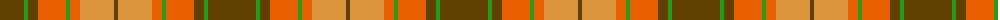

The parent of this is [Loch Rannoch (District)](/tartans/t/48/g4/t10/oa28/g4/oa10/o34/t/4/)

This was sourced from tartans-authority.  It is a [8 stripes tartan](/stripes/stripes8/).

Original link http://www.tartansauthority.com/tartan-ferret/display/1735/

## Thread count
T/48 G4 T10 Oa28 G4 Oa10 O34 T/4

## Palette
Each colour and its ΔE from the base-6 reference it is a variant of.

| Colour | Shade | Base | ΔE (OKLab) |
|---|---|---|---|
| G |  `#289C18` | G  | 0.18 |
| O |  `#DC943C` | Y  | 0.12 |
| Oa |  `#E86000` | R  | 0.14 |
| T |  `#604000` | G  | 0.14 |

# Sample pattern

ID: /variants/t/48/g4/t10/oa28/g4/oa10/o34/t/4-g289c18-odc943c-oae86000-t604000/
