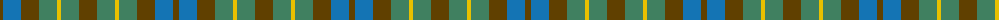
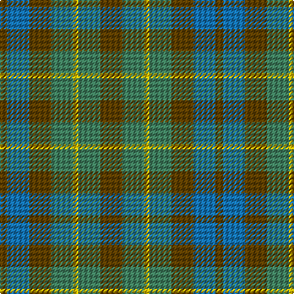

The parent of this is [MacKay - 1800 (Reay Coat) (Artefact)](/tartans/t/6/b18/t18/g18/y4/g18/t/18/)

This was sourced from tartans-authority.  It is a [7 stripes tartan](/stripes/stripes7/).

Original link http://www.tartansauthority.com/tartan-ferret/display/1047/

## Thread count
T/6 B18 T18 G18 Y4 G18 T/18

## Palette
Each colour and its ΔE from the base-6 reference it is a variant of.

| Colour | Shade | Base | ΔE (OKLab) |
|---|---|---|---|
| B |  `#1474B4` | B  | 0.15 |
| G |  `#408060` | G  | 0.13 |
| T |  `#604000` | G  | 0.14 |
| Y |  `#E8C000` | Y  | 0.00 |

# Sample pattern

ID: /variants/t/6/b18/t18/g18/y4/g18/t/18-b1474b4-g408060-t604000-ye8c000/
