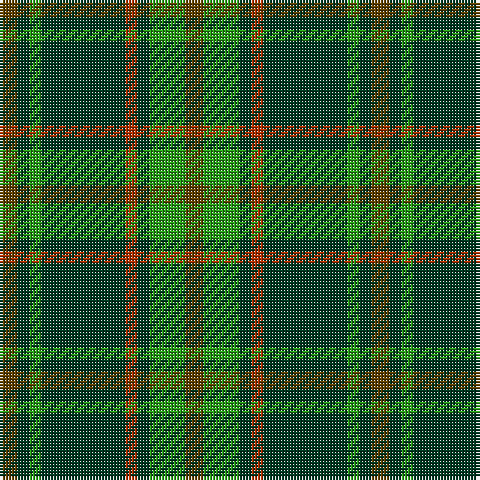

The parent of this is [Daks (Muted Loden)](/tartans/t/6/dg4/g4/dg28/r4/dg4/g12/t/6/)

This was sourced from register-of-tartans.  It is a [8 stripes tartan](/stripes/stripes8/).

Original link https://www.tartanregister.gov.uk/tartanDetails.aspx?ref=872

## Thread count
T/6 DG4 G4 DG28 R4 DG4 G12 T/6

## Palette
Each colour and its ΔE from the base-6 reference it is a variant of.

| Colour | Shade | Base | ΔE (OKLab) |
|---|---|---|---|
| DG |  `#003820` | G  | 0.16 |
| G |  `#289C18` | G  | 0.18 |
| R |  `#B03000` | R  | 0.05 |
| T |  `#604000` | G  | 0.14 |

# Sample pattern

ID: /variants/t/6/dg4/g4/dg28/r4/dg4/g12/t/6-dg003820-g289c18-rb03000-t604000/
