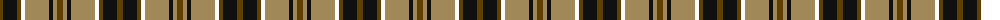

The parent of this is [Daks (Brown)](/tartans/t/6/k14/t4/w4/lt24/k4/lt4/t/6/)

This was sourced from register-of-tartans.  It is a [8 stripes tartan](/stripes/stripes8/).

Original link https://www.tartanregister.gov.uk/tartanDetails.aspx?ref=867

## Thread count
T/6 K14 T4 W4 LT24 K4 LT4 T/6

## Palette
Each colour and its ΔE from the base-6 reference it is a variant of.

| Colour | Shade | Base | ΔE (OKLab) |
|---|---|---|---|
| K |  `#101010` | K  | 0.17 |
| LT |  `#A08858` | Y  | 0.21 |
| T |  `#604000` | G  | 0.14 |
| W |  `#FCFCFC` | W  | 0.03 |

# Sample pattern

ID: /variants/t/6/k14/t4/w4/lt24/k4/lt4/t/6-k101010-lta08858-t604000-wfcfcfc/
