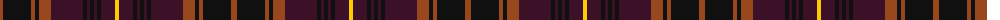

The parent of this is [Etihad Airways](/tartans/t/6/k28/t4/k4/t12/dp32/k4/dp3/k4/dp3/k4/dp14/y/4/)

This was sourced from register-of-tartans.  It is a [13 stripes tartan](/stripes/stripes13/).

Original link https://www.tartanregister.gov.uk/tartanDetails.aspx?ref=11290

## Thread count
T/6 K28 T4 K4 T12 DP32 K4 DP3 K4 DP3 K4 DP14 Y/4

## Palette
Each colour and its ΔE from the base-6 reference it is a variant of.

| Colour | Shade | Base | ΔE (OKLab) |
|---|---|---|---|
| DP |  `#3C1026` | B  | 0.19 |
| K |  `#101010` | K  | 0.17 |
| T |  `#98481C` | R  | 0.11 |
| Y |  `#FCCC00` | Y  | 0.04 |

ID: /variants/t/6/k28/t4/k4/t12/dp32/k4/dp3/k4/dp3/k4/dp14/y/4-dp3c1026-k101010-t98481c-yfccc00/
