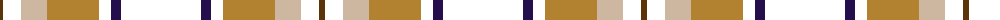

The parent of this is [de Meuron (Neuchâtel) Dress, The](/tartans/t/6/w18/n26/lt52/w12/db10/w/80/)

This was sourced from register-of-tartans.  It is a [7 stripes tartan](/stripes/stripes7/).

Original link https://www.tartanregister.gov.uk/tartanDetails.aspx?ref=10577

## Thread count
T/6 W18 N26 LT52 W12 DB10 W/80

## Palette
Each colour and its ΔE from the base-6 reference it is a variant of.

| Colour | Shade | Base | ΔE (OKLab) |
|---|---|---|---|
| DB |  `#240F4C` | B  | 0.16 |
| LT |  `#B28230` | Y  | 0.19 |
| N |  `#CEB7A1` | Y  | 0.14 |
| T |  `#5B340A` | G  | 0.17 |

# Sample pattern

ID: /variants/t/6/w18/n26/lt52/w12/db10/w/80-db240f4c-ltb28230-nceb7a1-t5b340a/
