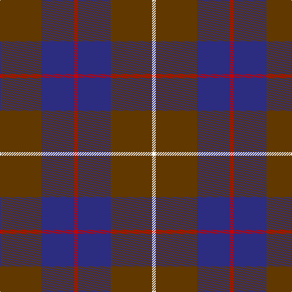

The parent of this is [London Regiment](/tartans/t/68/db54/r6/db54/t68/w/6/)

This was sourced from register-of-tartans.  It is a [6 stripes tartan](/stripes/stripes6/).

Original link https://www.tartanregister.gov.uk/tartanDetails.aspx?ref=2198

## Thread count
T/68 DB54 R6 DB54 T68 W/6

## Palette
Each colour and its ΔE from the base-6 reference it is a variant of.

| Colour | Shade | Base | ΔE (OKLab) |
|---|---|---|---|
| DB |  `#2C2C80` | B  | 0.05 |
| R |  `#C80000` | R  | 0.00 |
| T |  `#603800` | G  | 0.16 |
| W |  `#FCFCFC` | W  | 0.03 |

# Sample pattern

ID: /variants/t/68/db54/r6/db54/t68/w/6-db2c2c80-rc80000-t603800-wfcfcfc/
