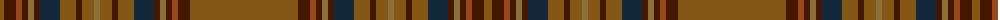

The parent of this is [Williams #2](/tartans/t/8/dr12/ta6/dr6/lt6/dr6/dn20/t16/dr6/t12/lt6/t12/dr6/t16/dn20/dr6/lt6/dr6/ta6/dr12/t8/t/92/)

This was sourced from register-of-tartans.  It is a [22 stripes tartan](/stripes/stripes22/).

Original link https://www.tartanregister.gov.uk/tartanDetails.aspx?ref=4627

## Thread count
T/8 DR12 Ta6 DR6 LT6 DR6 DN20 T16 DR6 T12 LT6 T12 DR6 T16 DN20 DR6 LT6 DR6 Ta6 DR12 T8 T/92

## Palette
Each colour and its ΔE from the base-6 reference it is a variant of.

| Colour | Shade | Base | ΔE (OKLab) |
|---|---|---|---|
| DN |  `#14283C` | B  | 0.14 |
| DR |  `#441800` | B  | 0.22 |
| LT |  `#8C7038` | G  | 0.18 |
| T |  `#845814` | G  | 0.16 |
| Ta |  `#98481C` | R  | 0.11 |

ID: /variants/t/8/dr12/ta6/dr6/lt6/dr6/dn20/t16/dr6/t12/lt6/t12/dr6/t16/dn20/dr6/lt6/dr6/ta6/dr12/t8/t/92-dn14283c-dr441800-lt8c7038-t845814-ta98481c/
